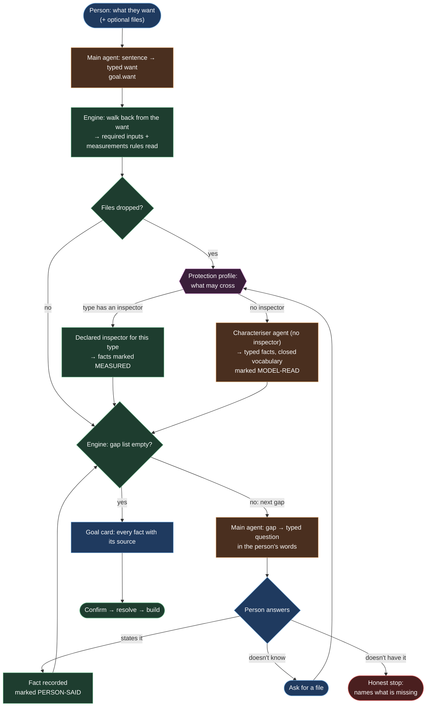

# The authoring protocol — from a sentence to a goal that builds

**A living document.** It grows as the walk finds what the protocol gets wrong, and every change
names the issue that caused it. It describes the *protocol* (who asks what, in what order, and
what is allowed to cross) rather than the code. The code follows it, and where the two disagree,
this page is what gets argued about.

Started 2026-09-28 from #105 and #114, during Living Pipeline Plan 2.

---

## The loop

**Colour is authorship.** Green is deterministic (the engine proves it, and the same inputs give
the same answer). Orange is a model (typed output, closed vocabulary, always marked). Blue is the
person. Purple is the protection profile deciding what crosses.

## The rules the diagram encodes

1. **The engine decides "enough?", never a model.** The gap list is computed: every leaf input
   the resolver reaches walking back from the want, and every measurement a matching rule reads.
   A model judging sufficiency would sometimes say *yes* with the genome missing, which is what
   #114 was.
2. **A model phrases questions and reads answers; it never decides what is asked.** The gaps come
   from the engine, and the agent turns each into words and turns the reply back into a typed fact.
3. **Every fact carries its source:** `MEASURED` (an inspector), `MODEL-READ` (the characteriser),
   `PERSON-SAID` (an answer). The goal card shows all three, the same way the tiers show who settled
   a value.
4. **No data type is refused for lacking an inspector.** It gets the characteriser, and a weaker
   label. Which types have an inspector is **declared data**, so the lost flexibility is visible.
5. **Nothing is guessed. A fact comes from the person or from a file** (decided 2026-09-28). A
   *don't know* is always answered by asking for a file, never by a model proposing a likely
   value. The MVP has no setting for this.
6. **"Don't have it" is an honest stop**, naming the missing input, never a pipeline built around
   the gap.

## Protection profiles: what may cross, per node

The profile is a variable the engine carries through the whole loop. **Level 0 is the MVP**, and
everything is open. The other rows are recorded so the loop is built with the switch in place, and
tightening is filling in a row, not rewiring.

| Node | **0 (MVP)** | `guarded` (later) | `sealed` (later) |
|---|---|---|---|
| files | uploaded, stored with the session | read in the browser, facts only | none |
| characteriser receives | the sample's head | derived facts, after confirmation | not run |
| main agent receives | typed facts + the conversation | same | typed goal only |
| a fact's sample reaches a provider | yes | no | no |

## Loosenings, recorded (2026-09-28, operator's decision)

- **Invariant 15, *Mendel does not receive patient data*, does not hold at level 0.** A sample
  file is uploaded and a model may read it. It holds at `guarded` and `sealed`. Safety is added
  as levels *after* the loop works, not before.
- **Invariant 3, *three runtime AI points*, gains a fourth: characterisation.** It is declared,
  typed and recorded like the others (an `AiPoint`, a door, a prompt file, an `ai_invocation` row).
- **The typed payload stays.** Every agent answers in a declared shape. What loosens is *what the
  input may contain*, never the output's type.

## Open questions

- Where do uploaded samples live, how big may one be, and when are they deleted?
- Does a per-sample fact (`read_length` differs between two files) become a per-sample measurement
  or a question?
- #113: should *New pipeline* open this loop rather than the manual canvas?

## Changelog

| Date | Change | Why |
|---|---|---|
| 2026-09-28 | first version | #105 (no place for *paired-end*), #114 (nobody asked for the genome) |
