# The authoring protocol — from a sentence to a goal that builds

**A living document.** It grows as the walk finds what the protocol gets wrong, and every change
names the issue that caused it. It describes the *protocol* (who asks what, in what order, and
what is allowed to cross) rather than the code. The code follows it, and where the two disagree,
this page is what gets argued about.

Started 2026-09-28 from #105 and #114, during Living Pipeline Plan 2.

---

## The loop

```mermaid
flowchart LR
    classDef you fill:#1f3a5f,stroke:#6fa8dc,color:#fff
    classDef engine fill:#1e3d2f,stroke:#6fbf8f,color:#fff
    classDef ai fill:#4a2f1f,stroke:#e0a060,color:#fff
    classDef safety fill:#3a1f3a,stroke:#c080c0,color:#fff
    classDef stop fill:#4a1f1f,stroke:#e06060,color:#fff
    classDef tier12 fill:#1e3d2f,stroke:#6fbf8f,color:#fff
    classDef tier3 fill:#1e3d2f,stroke:#f0d040,stroke-width:4px,color:#fff
    classDef tier4 fill:#1f3a5f,stroke:#ff5050,stroke-width:4px,color:#fff

    subgraph S1 ["① You describe it"]
        direction TB
        SAY(["You: “gene counts from my<br/>paired-end RNA-seq”<br/>(files optional)"]):::you
        TARGET["AI turns it into a target:<br/>a gene-counts table"]:::ai
        SAY --> TARGET
    end

    subgraph S2 ["② The engine gathers what it needs"]
        direction TB
        NEEDS["Engine lists what the target needs<br/>inputs: reads, genome, annotation<br/>facts: read length, paired or not"]:::engine
        MISSING{"Anything on the<br/>list still unknown?"}:::engine
        ASK["AI asks you about it,<br/>in plain words"]:::ai
        REPLY{"You answer"}:::you
        FILE(["You upload a file"]):::you
        SAFETY{{"Safety level decides<br/>what the AI may see"}}:::safety
        READ_ENGINE["Engine reads it exactly<br/>(FASTQ, …)<br/>→ “measured”"]:::engine
        READ_AI["AI reads it<br/>(types the engine can't)<br/>→ “read by AI”"]:::ai
        SAID["→ “you said”"]:::engine
        OPEN["Left open → you'll choose<br/>during the build"]:::engine
        STOP(["Stop: can't build without it<br/>(e.g. no genome)"]):::stop
        TICK["Added to the list"]:::engine

        NEEDS --> MISSING
        MISSING -- "yes" --> ASK --> REPLY
        REPLY -- "I know it" --> SAID
        REPLY -- "not sure" --> FILE
        REPLY -- "I don't have that input" --> STOP
        FILE -- "uploaded" --> SAFETY
        SAFETY -- "engine knows the type" --> READ_ENGINE
        SAFETY -- "it doesn't" --> READ_AI
        FILE -- "can't share it" --> OPEN
        SAID --> TICK
        READ_ENGINE --> TICK
        READ_AI --> TICK
        OPEN --> TICK
        TICK --> MISSING
    end

    subgraph S3 ["③ You check the goal"]
        direction TB
        CARD["Goal card: every fact<br/>and where it came from"]:::you
    end

    subgraph S4 ["④ Your consultant builds it with you"]
        direction TB
        PLAN["The plan, in plain stages<br/>clean reads → align → count → QC report<br/>(engine resolves it, AI tells it)"]:::ai
        PACE{"“Go through it together, or set it up<br/>and stop only where I need you?”<br/>(together: every step waits for “continue”)"}:::you
        NEXT{"Next step:<br/>does it need you?"}:::engine
        SETTLED["Tier 1–2 · placed, one obvious answer<br/>what it does and why, one tap away"]:::tier12
        RULE["Tier 3 · placed by a rule<br/>“this rests on your read length — check it”"]:::tier3
        CHOOSE["Tier 4 · you choose<br/>options with trade-offs, in biology terms"]:::tier4
        WRAP(["Wrap-up: what you'll get,<br/>what you need to run it, who decided what"]):::ai
        PLAN --> PACE --> NEXT
        NEXT -- "settled" --> SETTLED
        NEXT -- "a rule decided" --> RULE
        NEXT -- "no rule could decide" --> CHOOSE
        SETTLED --> NEXT
        RULE --> NEXT
        CHOOSE -- "you choose" --> NEXT
        NEXT -- "nothing left" --> WRAP
    end

    ASKANY(["Ask anything, any time:<br/>why? what if? what's a BAM?"]):::you
    EXPLAIN["AI answers only from sources<br/>tool docs, citations, glossary, and shows them<br/>(“I don't have a source for that” otherwise)"]:::ai
    ASKANY --> EXPLAIN
    EXPLAIN -.-> S4

    TARGET --> NEEDS
    MISSING -- "no, all known<br/>or left open" --> CARD
    CARD -- "that's right" --> PLAN

    subgraph KEY ["Key — fill is who acts, border is the tier"]
        direction TB
        K1(["Blue fill · you"]):::you
        K2["Green fill · engine: same input, same answer"]:::engine
        K3["Orange fill · AI: typed answers only, always marked"]:::ai
        K4{{"Purple fill · safety level: what the AI may see"}}:::safety
        K5(["Red fill · stop: can't continue"]):::stop
        K6["Yellow border · tier 3: a rule decided, check its fact"]:::tier3
        K7["Red border · tier 4: no rule could, you decide"]:::tier4
    end

    style S1 fill:transparent,stroke:#555
    style S2 fill:transparent,stroke:#555
    style S3 fill:transparent,stroke:#555
    style S4 fill:transparent,stroke:#555
    style KEY fill:transparent,stroke:#333
```

**Fill is who acts, border is the tier**, and every colour is named in the diagram's key. Red
*fill* means only one thing (a stop); a tier-4 choice is the person's, so it is blue with a red
*border*. In the rules below, *engine* means
deterministic code, *AI* means a model answering in a typed shape, and the safety level is the
protection profile. The facts' labels in the diagram (*you said*, *measured*, *read by AI*) are
`PERSON-SAID`, `MEASURED` and `MODEL-READ` below.

## The rules the diagram encodes

1. **The engine decides what is missing, never a model.** The gap list is computed: every leaf
   **input** the resolver reaches walking back from the want, and every **measurement** a rule
   or a module's `meta` reads on the way. A model judging sufficiency would sometimes say *yes*
   with the genome missing, which is what #114 was.
2. **A model phrases questions and reads answers; it never decides what is asked.** The gaps come
   from the engine, and the agent turns each into words and the reply back into a typed fact.
3. **Every fact carries its source:** `MEASURED` (an inspector), `MODEL-READ` (the characteriser),
   `PERSON-SAID` (an answer). The goal card shows all three.
4. **No data type is refused for lacking an inspector.** It gets the characteriser, and a weaker
   label. Which types have an inspector is declared, so the lost flexibility is visible.
5. **Nothing is guessed. A fact comes from the person or from a file** (decided 2026-09-28).
   *Don't know* is always answered by asking for a file, never by a model proposing a likely
   value. There is no setting for this in the MVP.
6. **An unknown measurement stays open, and the tiers carry it** (decided 2026-09-28). It is not a
   failure: a rule that reads an open fact does not match, so the decision falls to **tier 4**,
   always flagged, answered by a person when the build reaches it (invariants 4 and 6, unchanged).
   The loop never blocks on a measurement.
7. **A missing input is different, because nothing can be left open.** No genome means nothing
   aligns. *I have it but won't upload it* records it as `PERSON-SAID`; *I don't have one* is an
   honest stop naming the input, never a pipeline built around the gap.

## The build, as a consultant (stage ④)

> **Provisional, and knowingly optimistic** (operator, 2026-09-28). Stage ② came from what the
> walk actually broke; stage ④ was designed before a model has walked it. Expect it to expand
> and change more than any other part of this page, and treat every rule below as a first guess
> to be tested, not a settled one.

The person is a researcher, not a pipeline engineer. They know their experiment and not
necessarily what a BAM is. Stage ④ is written for them.

8. **Overview before detail.** The engine resolves the whole pipeline before offering anything,
   so the build opens with its shape **in stages, not tools**: *clean the reads, line them up
   against the genome, count reads per gene, a quality report. Four stages; two need you.*
9. **Then the pacing question, asked, not set** (decided 2026-09-28): *go through it together, or
   set it up and stop only where I need you?* A settings menu for this is deferred (#117), so
   the MVP gets no extra UI.
10. **Stops are paced by tier.** Tiers 1–2 are placed with their reason one tap away. Tier 3 is
    placed with the fact it rests on shown (yellow border). **Tier 4 always stops** (red border, the
    person's own blue) and is posed as a
    choice with trade-offs in biology terms. Going through together, every step waits for
    *continue*.
11. **Every step carries four things:** what it does, why it is here, what it makes, and what to
    check. The engine supplies the facts (tier, rule, citation, inputs and outputs), and the AI
    only puts them in the researcher's words.
12. **The AI explains only from sources it is handed**: the tool's declared description, the rule's
    citation, a glossary entry. It shows the source, and it says *I don't have a source for that*
    rather than answering from memory. That needs declared descriptions per tool or role (#78):
    the forge drafts them and a person approves (invariant 2, unchanged).
13. **Ask anything, any time.** *Why? What if? What's a BAM?* A structural question (*what feeds
    what*) is answered by the engine; the AI phrases it.
14. **It ends with a wrap-up**: what you'll get, what you need to run it, and who decided what.

## How a fact's source reaches the tiers

The four tiers are unchanged. What this protocol adds is **where the premise came from**, which
the tier-3 colour already asks a reader to check.

| The fact a rule reads | Tier of the decision | What the reader sees |
|---|---|---|
| `MEASURED`: an inspector read the file | 3, data-profiled | yellow border: check the premise (a measurement) |
| `PERSON-SAID`: the person stated it | 3, data-profiled | yellow border, premise marked *asserted* |
| `MODEL-READ`: the characteriser read it | 3, data-profiled | yellow border, premise marked *read by AI* (decided 2026-09-28) |
| open: nobody knows | **4**, ambiguous | red border: always flagged, a person answers |
| no rule reads it | 1 or 2 as today | — |

## The protocol is code (planned)

This page's diagram is **generated, not drawn**, once the rework lands. One declarative object in
the code (`mendel_api/authoring/protocol.py`) holds the stages, every node (who acts: *you*,
*engine*, *AI*, *safety*) and every edge (with its label and, where it moves the session, its
state-machine event). Three things are derived from it:

- **the Mermaid diagram above**, written between markers by a generator, with `make docs` failing
  when the page is stale, the same arrangement as `diagnostics.md`;
- **a test that the running state machine is the diagram**: every phase transition in
  `authoring/state.py` must be an edge here and every event-carrying edge a transition, so the
  picture cannot drift from the code;
- later, **the agents' wiring**: which prompt a node sends and what evidence it receives, per
  protection level, read from the same object instead of scattered through services.

## Protection profiles: what may cross, per node

The profile is a variable the engine carries through the whole loop. **Level 0 is the MVP**, and
everything is open. The other rows are recorded so the loop is built with the switch in place, and
tightening is filling in a row, not rewiring.

| Node | **0 (MVP)** | `guarded` (later) | `sealed` (later) |
|---|---|---|---|
| files | uploaded, stored with the session | read in the browser, facts only | none |
| characteriser receives | the sample's head | derived facts, after confirmation | not run |
| main agent receives | typed facts + the conversation | same | typed goal only |
| a fact's sample reaches a provider | yes | no | no |

## Loosenings, recorded (2026-09-28, operator's decision)

- **Invariant 15, *Mendel does not receive patient data*, does not hold at level 0.** A sample
  file is uploaded and a model may read it. It holds at `guarded` and `sealed`. Safety is added
  as levels *after* the loop works, not before.
- **Invariant 3, *three runtime AI points*, gains a fourth: characterisation.** It is declared,
  typed and recorded like the others (an `AiPoint`, a door, a prompt file, an `ai_invocation` row).
- **The typed payload stays.** Every agent answers in a declared shape. What loosens is *what the
  input may contain*, never the output's type.

## Open questions

- Where do uploaded samples live, how big may one be, and when are they deleted?
- Does a per-sample fact (`read_length` differs between two files) become a per-sample measurement
  or a question?
- #113: should *New pipeline* open this loop rather than the manual canvas?

## Changelog

| Date | Change | Why |
|---|---|---|
| 2026-09-28 | first version | #105 (no place for *paired-end*), #114 (nobody asked for the genome) |
| 2026-09-28 | stage ④ marked provisional and optimistic | operator: *during testing the protocol will probably expand and change* |
| 2026-09-28 | a rule may decide on a model-read fact: tier 3, premise marked *read by AI* | operator: *that is why we have tier 3* |
| 2026-09-28 | fill is who acts, border is the tier; every colour labelled in the key | operator: red meant both *stop* and *tier 4* |
| 2026-09-28 | stage ④ as a consultant: overview, pacing asked at the start, stops by tier, grounded explanations, wrap-up; the protocol to become code that generates this diagram | operator: *the builder is a consultant guiding a biology researcher*; settings deferred to #117 |
| 2026-09-28 | diagram reorganised into four stages with plain-language labels and a key | operator: *make the text more intuitive, and the organisation* |
| 2026-09-28 | nothing is guessed; an open measurement falls to tier 4 rather than blocking; inputs and measurements split; the tier table | operator, during the #105/#114 brainstorm: *the model can keep that param open as a tier-4 question* |
