<!-- generated by tools/generate_protocol_doc.py — do not edit -->

# The authoring protocol

**Generated from `mendel_api/authoring/protocol.py`**, which is also where the running state machine comes from, so this picture is the machine. Solid is built; dashed is designed and not built yet. The rules, the argument and the changelog are on [the protocol page](../authoring-protocol.md).

```mermaid
flowchart LR
    classDef you fill:#1f3a5f,stroke:#6fa8dc,color:#fff
    classDef engine fill:#1e3d2f,stroke:#6fbf8f,color:#fff
    classDef ai fill:#4a2f1f,stroke:#e0a060,color:#fff
    classDef safety fill:#3a1f3a,stroke:#c080c0,color:#fff
    classDef stop fill:#4a1f1f,stroke:#e06060,color:#fff
    subgraph describe ["① You describe it"]
        direction TB
        say(["You say what you want<br/>(files optional)"]):::you
        family["AI picks the kind of result<br/>from a short list"]:::ai
        read_goal["AI reads it into a typed goal,<br/>from each chosen family whole"]:::ai
    end
    style describe fill:transparent,stroke:#555
    subgraph gather ["② The engine gathers what it needs"]
        direction TB
        list_needs["Engine lists what the target needs<br/>inputs, and facts rules will read"]:::engine
        next_gap{"Anything on the list<br/>still unknown?"}:::engine
        ask["AI phrases each question<br/>in plain words"]:::ai
        reply{"You answer"}:::you
        suggest["AI reads your words<br/>into a suggestion you confirm"]:::ai
        upload(["You upload a file"]):::you
        safety{{"Safety level decides<br/>what the AI may see"}}:::safety
        read_engine["Engine reads it exactly<br/>→ measured"]:::engine
        read_ai["AI reads it<br/>(types the engine can't)<br/>→ read by AI"]:::ai
        said["→ you said"]:::engine
        left_open["Left open<br/>→ you choose in the build"]:::engine
        stopped(["Stop: can't build without it<br/>(e.g. no genome)"]):::stop
    end
    style gather fill:transparent,stroke:#555
    subgraph check ["③ You check the goal"]
        direction TB
        card["Goal card: every fact<br/>and where it came from"]:::you
        readback["AI reads the goal back<br/>in its own words"]:::ai
    end
    style check fill:transparent,stroke:#555
    subgraph build ["④ Your consultant builds it with you"]
        direction TB
        resolve["Engine resolves the pipeline"]:::engine
        offer{"Next step:<br/>does it need you?"}:::engine
        step_settled["Tier 1–2 · placed, one obvious answer"]:::engine
        step_rule["Tier 3 · placed by a rule<br/>check its fact"]:::engine
        step_choice["Tier 4 · you choose"]:::you
        done(["Pipeline complete"]):::engine
        plan["The plan, in plain stages"]:::ai
        pace{"Go through it together,<br/>or stop only where I need you?"}:::you
        wrap(["Wrap-up: what you get,<br/>what you need, who decided what"]):::ai
    end
    style build fill:transparent,stroke:#555
    subgraph anytime ["Any time"]
        direction TB
        ask_any(["Ask anything:<br/>why? what if? what's a BAM?"]):::you
        explain["AI answers only from sources,<br/>and shows them"]:::ai
    end
    style anytime fill:transparent,stroke:#555
    subgraph wrong ["When it goes wrong"]
        direction TB
        failed(["Failed: say why,<br/>offer a retry"]):::stop
    end
    style wrong fill:transparent,stroke:#555
    say --> family
    family -- "each family, whole" --> read_goal
    family -- "none fits: it asks you" --> say
    family -- "model failed" --> failed
    read_goal -- "model failed" --> failed
    readback -- "in the AI's words" --> card
    card -- "that's right" --> resolve
    card -- "not quite" --> family
    resolve --> offer
    resolve -- "can't build it" --> failed
    resolve -- "model failed" --> failed
    offer -- "settled" --> step_settled
    offer -- "a rule decided" --> step_rule
    offer -- "no rule could" --> step_choice
    step_settled --> offer
    step_rule --> offer
    step_choice -- "you choose" --> offer
    offer -- "nothing left" --> done
    offer -- "the goal changed" --> resolve
    done -- "the goal changed" --> resolve
    failed -- "retry" --> family
    failed -- "retry" --> resolve
    read_goal --> list_needs
    list_needs --> next_gap
    next_gap -- "yes" --> ask
    ask --> reply
    read_goal -- "you mentioned it" --> suggest
    reply -- "typed in your words" --> suggest
    suggest -- "you confirm with a click" --> reply
    reply -- "I know it" --> said
    reply -- "can't share it" --> left_open
    reply -- "I don't have that input" --> stopped
    said --> next_gap
    left_open --> next_gap
    next_gap -- "nothing unknown" --> card
    list_needs -- "nothing makes it: it asks you" --> say
    reply -. "not sure" .-> upload
    upload -. "uploaded" .-> safety
    safety -. "engine knows the type" .-> read_engine
    safety -. "it doesn't" .-> read_ai
    read_engine -.-> next_gap
    read_ai -.-> next_gap
    resolve -.-> plan
    plan -.-> pace
    pace -.-> offer
    done -.-> wrap
    ask_any -.-> explain
    style upload stroke-dasharray:6 4,opacity:0.55
    style safety stroke-dasharray:6 4,opacity:0.55
    style read_engine stroke-dasharray:6 4,opacity:0.55
    style read_ai stroke-dasharray:6 4,opacity:0.55
    style step_settled stroke:#6fbf8f
    style step_rule stroke:#f0d040,stroke-width:4px
    style step_choice stroke:#ff5050,stroke-width:4px
    style plan stroke-dasharray:6 4,opacity:0.55
    style pace stroke-dasharray:6 4,opacity:0.55
    style wrap stroke-dasharray:6 4,opacity:0.55
    style ask_any stroke-dasharray:6 4,opacity:0.55
    style explain stroke-dasharray:6 4,opacity:0.55
    subgraph KEY ["Key: fill is who acts, border is the tier, dashed is planned"]
        direction TB
        key_you["Blue fill · you"]:::you
        key_engine["Green fill · engine: same input, same answer"]:::engine
        key_ai["Orange fill · AI: typed answers only, always marked"]:::ai
        key_safety["Purple fill · safety level: what the AI may see"]:::safety
        key_stop["Red fill · stop: can't continue"]:::stop
        key_tier12["Green border · tier 1–2: settled"]:::engine
        key_tier3["Yellow border · tier 3: a rule decided, check its fact"]:::engine
        key_tier4["Red border · tier 4: no rule could, you decide"]:::engine
        key_planned["Dashed · designed, not built yet"]:::engine
    end
    style key_tier12 stroke:#6fbf8f
    style key_tier3 stroke:#f0d040,stroke-width:4px
    style key_tier4 stroke:#ff5050,stroke-width:4px
    style key_planned stroke-dasharray:6 4,opacity:0.55
    style KEY fill:transparent,stroke:#333
```

