<!-- generated by tools/generate_protocol_doc.py — do not edit -->

# Inspecting a sample

**Generated from `mendel_api/authoring/protocol.py`**, which is also where the running state machine comes from, so this picture is the machine. Solid is built; dashed is designed and not built yet. The rules, the argument and the changelog are on [the protocol page](../authoring-protocol.md).

A detail of [the authoring protocol](authoring-protocol.md). Everything here happens on our server.

```mermaid
flowchart LR
    classDef you fill:#1f3a5f,stroke:#6fa8dc,color:#fff
    classDef engine fill:#1e3d2f,stroke:#6fbf8f,color:#fff
    classDef ai fill:#4a2f1f,stroke:#e0a060,color:#fff
    classDef safety fill:#3a1f3a,stroke:#c080c0,color:#fff
    classDef stop fill:#4a1f1f,stroke:#e06060,color:#fff
    subgraph receiving ["On our server: receiving it"]
        direction TB
        got(["You upload one file or a pair"]):::you
        level{{"Does the protection level<br/>allow an upload?"}}:::safety
        refused["Refused, and says why"]:::stop
        head["Keep the first 4 MB of each, in memory<br/>(longer files are cut, never refused)"]:::engine
        claim{"Which formats claim<br/>the extension?"}:::engine
        nothing["Nothing reads this type yet:<br/>the question stays"]:::stop
        characterise["The characteriser reads it<br/>(14.7.7)"]:::ai
    end
    style receiving fill:transparent,stroke:#555
    subgraph processing ["On our server: in its own process, with limits"]
        direction TB
        unpack["Unpack, up to 16 MB"]:::engine
        confirm{"Does the content<br/>confirm the format?"}:::engine
        unreadable["Unreadable, with the reason<br/>(a bomb, too slow, not this format)"]:::stop
        tie{"Several formats confirm:<br/>you choose"}:::you
        measure["Measure: one pass,<br/>every measure fed"]:::engine
    end
    style processing fill:transparent,stroke:#555
    subgraph admitting ["On our server: admitting what it measured"]
        direction TB
        undetermined["Below its threshold:<br/>undetermined, left open"]:::engine
        admit["Admit each value<br/>against the registry"]:::engine
        kept["Already said: your word stands,<br/>a difference is shown"]:::engine
        stamped["Stamped: measured by<br/>its pieces and versions"]:::engine
        back(["Back to the questions"]):::engine
    end
    style admitting fill:transparent,stroke:#555
    got --> level
    level -- "above level 0" --> refused
    level -- "level 0" --> head
    head -- "one file or a pair" --> claim
    head -- "any other count" --> refused
    claim -- "none" --> nothing
    claim -. "none, at 14.7.7" .-> characterise
    claim -- "one or more" --> unpack
    unpack -- "a bomb" --> unreadable
    unpack --> confirm
    confirm -- "no" --> unreadable
    confirm -. "several" .-> tie
    confirm -- "exactly one" --> measure
    measure -- "took too long" --> unreadable
    measure -- "not enough to say" --> undetermined
    measure -- "decided" --> admit
    admit -- "you already said it" --> kept
    admit -- "new" --> stamped
    stamped --> back
    kept --> back
    undetermined --> back
    nothing --> back
    style characterise stroke-dasharray:6 4,opacity:0.55
    style tie stroke:#ff5050,stroke-width:4px,stroke-dasharray:6 4,opacity:0.55
    style undetermined stroke:#ff5050,stroke-width:4px
    style stamped stroke:#f0d040,stroke-width:4px
    subgraph KEY ["Key: fill is who acts, border is the tier, dashed is planned"]
        direction TB
        key_you["Blue fill · you"]:::you
        key_engine["Green fill · engine: same input, same answer"]:::engine
        key_ai["Orange fill · AI: typed answers only, always marked"]:::ai
        key_safety["Purple fill · safety level: what the AI may see"]:::safety
        key_stop["Red fill · stop: can't continue"]:::stop
        key_tier12["Green border · tier 1–2: settled"]:::engine
        key_tier3["Yellow border · tier 3: a rule decided, check its fact"]:::engine
        key_tier4["Red border · tier 4: no rule could, you decide"]:::engine
        key_planned["Dashed · designed, not built yet"]:::engine
    end
    style key_tier12 stroke:#6fbf8f
    style key_tier3 stroke:#f0d040,stroke-width:4px
    style key_tier4 stroke:#ff5050,stroke-width:4px
    style key_planned stroke-dasharray:6 4,opacity:0.55
    style KEY fill:transparent,stroke:#333
```

