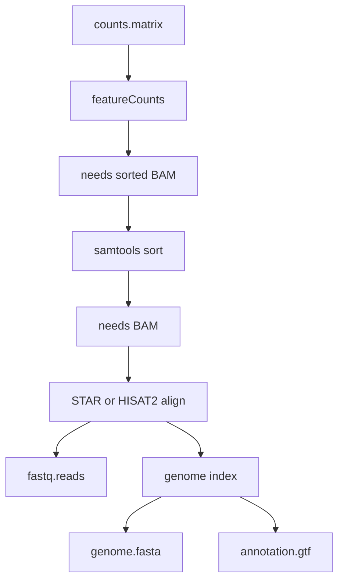

# How tools get chosen

Comeni does not keep a hand-written list of complete pipelines. You say what you have and what
you want. The resolver works backward through tool contracts until it reaches the inputs you
already hold.



## The short version

1. A contract says what a tool consumes and produces.
2. The resolver asks which contract can produce the thing you want.
3. It repeats that question for each input the chosen contract needs.
4. If several tools fit, rules and conventions decide when they can.
5. If nothing can defend the choice, the app asks a person.

That is why adding one tool to the registry can make it available in many future analyses. You
declare what the tool means, not every pipeline it might appear in.

## Example

If the goal is gene-level counts from RNA-seq reads, the resolver may find this chain:

```text
counts.matrix[gene_level]
  <- featureCounts
     needs alignment.bam[coordinate_sorted]
       <- samtools/sort
          needs alignment.bam
            <- STAR or HISAT2 align
               needs fastq.reads
               needs genome index
```

The aligner can depend on a measurement such as read length. Long reads may match a STAR rule;
short reads may match a HISAT2 rule. If the measurement is missing or no rule applies, the
choice becomes reviewable instead of being hidden.

## Change one fact

The useful mental model is “facts change routes.” In the RNA-seq example:

| Data fact | Likely aligner | Reason shape |
|---|---|---|
| `read_length: 150` | STAR | long reads match the STAR rule |
| `read_length: 50` | HISAT2 | short reads match the HISAT2 rule |
| no read length | review needed or convention | no data-backed rule can fire |

The user does not drag in STAR because they like STAR. The user states or measures the data
fact, and the registry explains which tool follows from that fact.

## What keeps it honest

| Rule | Why it exists |
|---|---|
| Smallest useful output wins | avoid adding extra states or steps nobody asked for |
| Ties are questions | avoid arbitrary alphabetical choices |
| Rules must point at reachable tools | avoid saying one thing and emitting another |
| Missing facts do not call a model silently | keep tier labels meaningful |

## What appears in the app

The builder should show the result as ordinary steps and wires. The decision panel or step
details should answer the deeper question: “why is this step here?”

| User question | Where the answer comes from |
|---|---|
| Why is `featureCounts` here? | its contract produces the wanted count matrix |
| Why is `samtools sort` here? | `featureCounts` needs coordinate-sorted BAM |
| Why is STAR here instead of HISAT2? | a rule matched the read-length fact |
| What would make this route change? | different facts, different loaded registry, or a lab overlay |

## Where the details live

This page is the user model. Implementation details such as recursion limits, port
alternatives, surplus ranking, and exact failure modes belong in [Internals](../internals/index.md).
