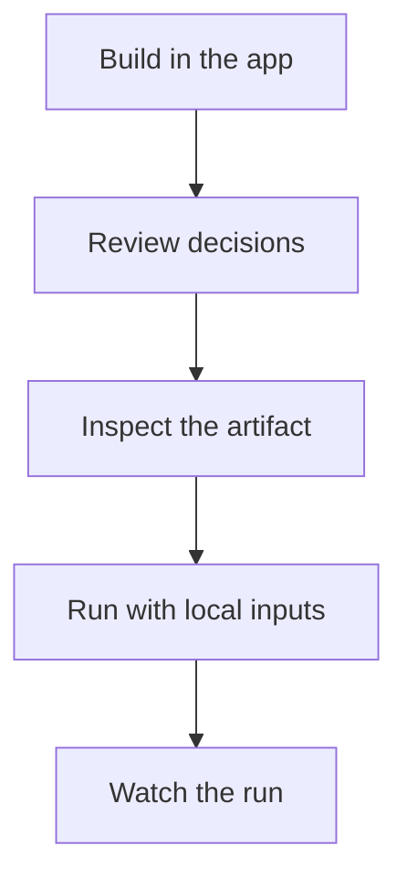

# Handbook

The handbook is for the person responsible for an analysis. It explains the app workflow first
and the machinery only after the workflow needs it.

## Guides

| You want to | Read |
|---|---|
| understand the whole workflow | [The product loop](product-loop.md) |
| decode draft, artifact, gate, run, and registry | [Core words](core-words.md) |
| follow the shared worked example | [RNA-seq example](rnaseq-example.md) |
| use the canvas and right-side panels | [The builder](builder.md) |
| know what green, yellow, and red decisions mean | [Reviewing decisions](reviewing-decisions.md) |
| understand where data paths enter | [Inputs in the alpha](inputs-alpha.md) |
| launch a pipeline in the current alpha | [Running pipelines](running-pipelines.md) |
| inspect a live or failed run | [Watching runs](watching-runs.md) |
| understand why a tool was chosen | [How tools get chosen](how-tools-get-chosen.md) |

## Reference

Reference pages are exact and therefore more technical. Start with the
[glossary](reference/glossary.md) when an interface word is unclear. Use the schemas and CLI
reference when you are working with artifacts, tests, or automation.
