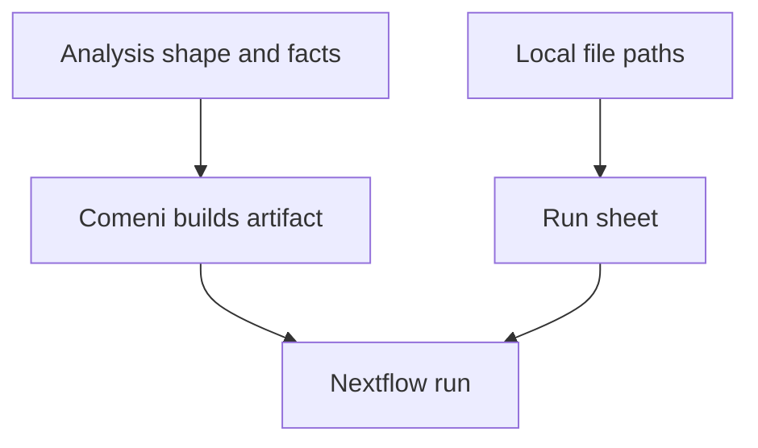

# Inputs in the alpha

Inputs are the most important moving surface in the alpha. This page explains what happens
today, what is expected to change, and what concept should stay stable.

## The stable concept

Comeni chooses a pipeline from the analysis shape and data facts. Local file paths enter later,
when you run the pipeline.

For the RNA-seq example, these are different kinds of information:

| Kind | Example | Used for |
|---|---|---|
| Analysis shape | “gene counts from paired-end RNA-seq” | choosing the pipeline structure |
| Data fact | `read_length: 150` | applying rules such as STAR vs HISAT2 |
| Run input | `data/*_R{1,2}.fastq.gz` | executing this pipeline on this machine |

The app should not need your FASTQ path to decide that an aligner is required. It may need read
length, strandedness, organism, or other facts to decide which aligner and settings are
defensible.

## Current alpha behavior

In the current local stack, pressing **Run** from the builder opens a run sheet. The run sheet
asks for local input values such as read paths and reference paths, then submits the artifact to
the local run service.

For the shared [RNA-seq example](rnaseq-example.md), values look like:

| Field | Example value |
|---|---|
| Reads | `data/*_R{1,2}.fastq.gz` |
| Genome FASTA | `reference/genome.fa` |
| Annotation GTF | `reference/genes.gtf` |

Use values that are valid from the machine and container setup running the local stack.

## Expected to change

Input collection should become more structured. A lab should eventually be able to reuse
known sample sheets, project locations, reference sets, and execution profiles rather than
typing loose paths for every run.

Do not treat the current run sheet as a stable API. Treat it as the current way to supply
run-time values while the product learns the right lab workflow.

## Where does my data go?

Comeni builds and records the workflow. Nextflow runs it where you point the run. In the local
alpha stack, the run service launches Nextflow against paths you provide.

The key boundary is:

AI assistance should operate on the analysis description, registry source material, and bounded
review questions. It should not need raw FASTQ contents to decide the pipeline structure.

## Practical checks

| Question | Answer |
|---|---|
| Do I upload files to design a pipeline? | no; the builder works from analysis shape and facts |
| Do I provide paths to run locally? | yes, in the current alpha run sheet |
| Can the same artifact run twice? | yes, a run is one execution of an artifact |
| Can inputs change without changing the pipeline? | yes, when the scientific shape and decisions stay the same |

Next: [Running pipelines](running-pipelines.md) explains the launch path.
