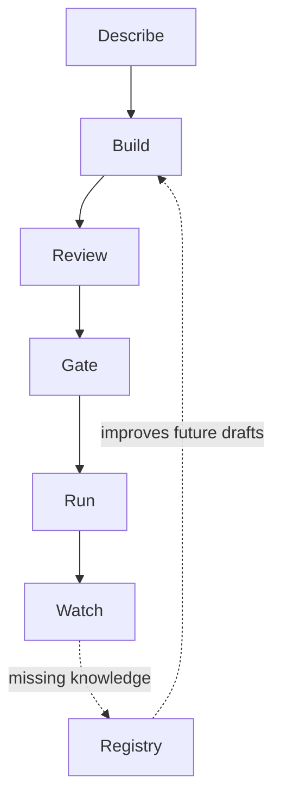

# The product loop

Comeni Labs turns a scientific request into a pipeline through a loop a person can inspect.
The important thing is not that the app draws a graph. The important thing is that every tool,
parameter, and unresolved question carries a reason.

Read the loop as a working rhythm, not a strict wizard. You may inspect the artifact before
every run, return to the builder after a failed run, or update the registry when a repeated
manual answer becomes lab policy.

## Lifecycle words

| Stage | What changes |
|---|---|
| Draft | an editable graph exists in the builder |
| Artifact | the draft is saved as a durable pipeline record |
| Emitted files | Nextflow files are generated from the artifact |
| Run | the emitted workflow executes with local inputs |
| Registry update | future drafts improve because Comeni learned a tool, fact, or rule |

For plain-language definitions, read [Core words](core-words.md).

## Describe

In the current alpha, the natural-language prompt on the first-run screen is disabled. Use the
builder path instead. The product direction is still important: the user should describe the
analysis and correct a typed goal, not write a command-line workflow from scratch.

Stable concept: the request should name biological intent and data facts. It should not require
the scientist to name every command that will appear in the workflow.

## Build

The builder shows a pipeline draft as steps, typed ports, wires, settings, and open questions.
You can add tools, inspect settings, swap implementations, and open the artifact view.

## Review

Comeni separates quiet choices from choices that need attention. A convention is not the same
thing as a measured-data rule, and neither is the same thing as an unanswered ambiguity.

## Gate

A gate checks the kept artifact. In the app, the header **Run** action sequences the current
alpha path: keep the draft, run the lint gate, open the run sheet, then submit.

## Run

Comeni emits Nextflow. The current local stack can launch it for you, but the artifact is still
plain Nextflow that can run on a laptop, HPC cluster, Kubernetes, or cloud account.

Run-time inputs are separate from pipeline design. The alpha behavior is described in
[Inputs in the alpha](inputs-alpha.md).

## Watch

The run page folds Nextflow events into a readable state: what is running, what succeeded, what
failed, what retried, and where to look next.

## Maintain

When a tool is missing or a decision needs lab-specific science, update the registry. That is
how one improvement becomes available to every compatible future analysis.

Next: follow the same loop with the [RNA-seq example](rnaseq-example.md), then use
[The builder](builder.md) for the screen-level guide.
