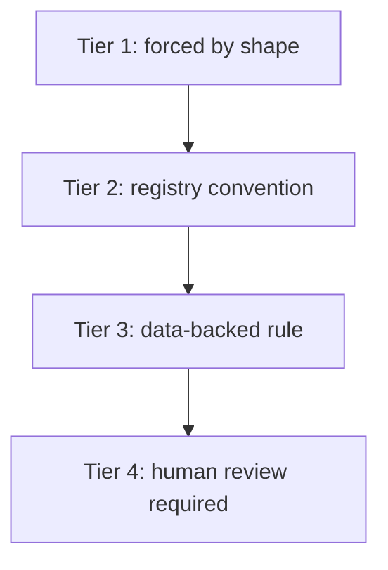
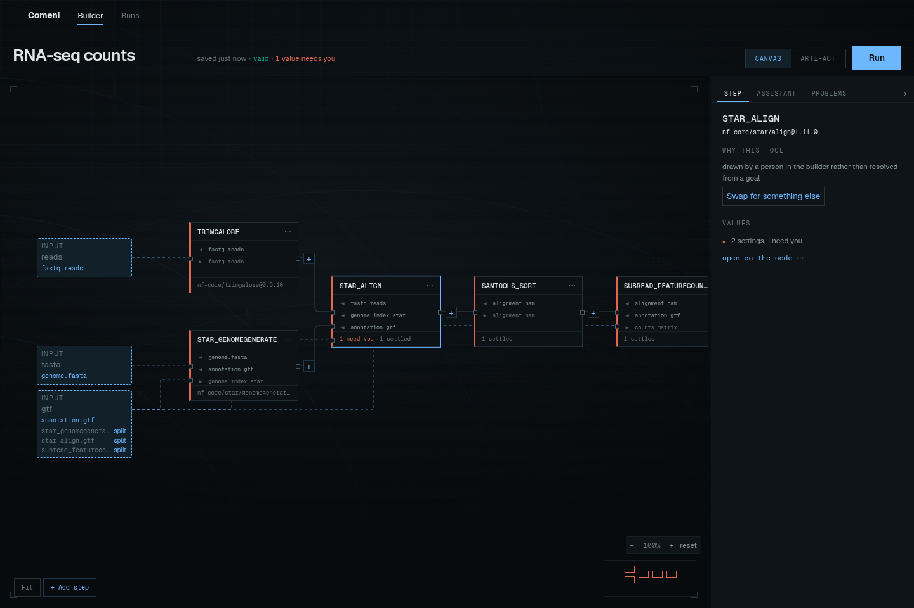

# Reviewing decisions

Comeni's core promise is that choices are labeled. A pipeline is defensible when you can tell
which parts were forced, which parts followed convention, which parts followed data-backed
rules, and which parts needed a human.

## What to do with each label

| Label | Meaning | What you do |
|---|---|---|
| Structural | there was no real choice to make | usually ignore |
| Convention | the loaded registry has a documented default | glance if your lab differs |
| Data-profiled | a declared rule matched a data fact | check the premise and citation |
| Ambiguous | Comeni could not defend a choice | answer before relying on the pipeline |

The interface uses this same idea in quieter language: green is ordinary, yellow is advisory,
and red means the pipeline still needs a person.

## RNA-seq example

The shared [RNA-seq example](rnaseq-example.md) gives a useful mix of decisions:

| Item | Tier | Why | User action |
|---|---|---|---|
| Trim Galore | convention | the loaded registry has one trimming implementation | scan |
| STAR genomeGenerate | convention | it builds the index needed by STAR align | scan |
| STAR align | data-profiled | `read_length: 150` matches the STAR rule | check read length |
| samtools sort | convention | it produces coordinate-sorted BAM for counting | scan |
| featureCounts | convention | it produces gene-level counts | scan |
| `seq_platform` | ambiguous | no rule knows the sequencing platform | answer |

This is the difference between a useful assistant and an unreviewable answer. The same pipeline
can contain defaults, evidence-backed choices, and open questions.

## Review the premise, not just the answer

A data-backed rule is only as good as the measurement it read. If a value was asserted by a
person, check that assertion. If it was measured by a profiling step, check whether that
profiling step fits the data and lab protocol.

For example, STAR is a reasonable result only if the read-length fact is true for the data being
run. If a later profiling step measures a different read length, the aligner decision should be
revisited rather than treated as a permanent preference.

## Answering a red decision

When the app asks for a value, answer the narrow question it is asking. Do not use the answer as
a place to smuggle a broader pipeline change.

| Red decision asks | Good answer | Better long-term fix |
|---|---|---|
| Which sequencing platform? | choose the actual platform for this run | add a lab rule if the platform is always known from context |
| Which implementation? | choose the tool and record why | add a cited rule if the choice depends on data |
| Which new state/type/role? | propose or select the correct vocabulary term | maintain the registry vocabulary |

## When to change the registry

If you keep answering the same question the same way, that answer probably belongs in a rule.
If the tool you need is absent, it probably belongs as a contract. The builder should not become
a pile of private one-off edits when the lab has a repeatable convention.

For the exact tier semantics, see [The four tiers](the-four-tiers.md).

For how tool choices reach those tiers, read [How tools get chosen](how-tools-get-chosen.md).
