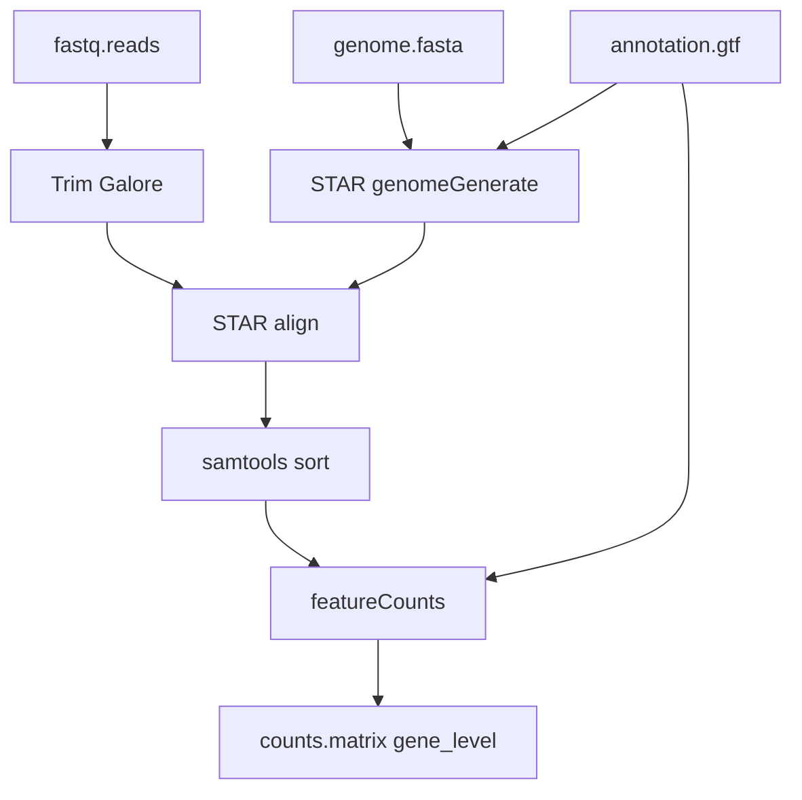

# RNA-seq example

Most handbook pages use the same example: gene counts from paired-end RNA-seq reads. Reusing one
pipeline keeps the documentation from becoming a set of disconnected facts.

## The request

The scientist wants a gene-level count matrix from paired-end RNA-seq data:

| Part | Example |
|---|---|
| Have | paired FASTQ reads, genome FASTA, annotation GTF |
| Want | `counts.matrix` at gene level |
| Data facts | 150 bp reads, reverse stranded library, 12 samples, paired-end |
| Expected result | a Nextflow pipeline that trims reads, aligns them, sorts BAMs, and counts genes |

In the current alpha, the app does not yet turn this sentence into a typed goal from the first
screen. The working path opens the builder directly. The stable concept is still the same:
Comeni should reason from the analysis shape and data facts, not from a user naming every tool.

## The expected graph

This is a conceptual graph. The builder may lay the same steps out differently on screen, but
the dependencies should tell the same story.

## The decision story

| Decision | Example outcome | Why it matters |
|---|---|---|
| Trimming | Trim Galore | registry convention: this loaded stack has one trimming tool |
| Aligner | STAR | data-backed rule: 150 bp reads match the long-read aligner rule |
| Sorter | samtools sort | registry convention: produces coordinate-sorted BAM |
| Counter | featureCounts | registry convention: produces gene-level counts |
| Sequencing platform | needs review | no declared fact or rule proves it |

That mix is the point. The pipeline is not a flat model answer. It contains quiet conventions,
data-backed choices, and at least one explicit human question.

## Artifact shape

When the draft is kept, the durable record is the artifact:

| File | Role |
|---|---|
| `pipeline.yml` | the full record of steps, settings, decisions, and provenance |
| `main.nf` | emitted Nextflow workflow |
| `nextflow.config` | profiles and input parameters for execution |
| `modules/` | the exact module source included by the workflow |

The app should be the comfortable way to build and review this artifact. The artifact should
remain understandable without the app.

Use this page as the shared fixture for the handbook. When another page says “the RNA-seq
example,” it means this request, this graph shape, and this decision story.
