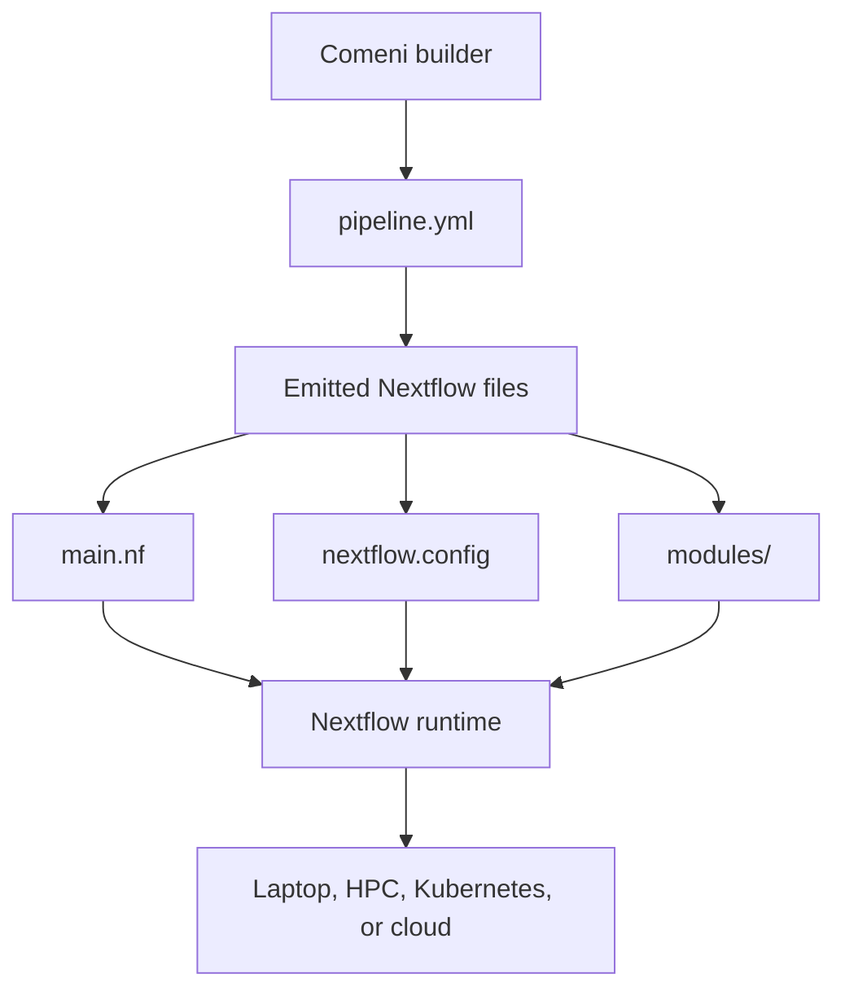

# Running pipelines

Comeni builds a pipeline artifact; Nextflow runs it. The local alpha stack can launch a run
from the app, and the emitted files can also be taken to the environment where your lab already
runs Nextflow.

If the lifecycle terms are not clear yet, start with [Core words](core-words.md).



## Run from the app

In the builder, press **Run**. In the current alpha, that action:

1. keeps the current draft as an artifact,
2. runs the lint gate,
3. opens the run sheet for local input values,
4. submits the run to the local Wiener services.

Inputs and samplesheets are still an alpha surface. Expect this flow to become more polished
and more lab-aware before the API is treated as stable.

The dedicated input model page is [Inputs in the alpha](inputs-alpha.md).


For the shared [RNA-seq example](rnaseq-example.md), a local run needs paths like these:

| Input | Example |
|---|---|
| Paired reads | `data/*_R{1,2}.fastq.gz` |
| Genome FASTA | `reference/genome.fa` |
| Annotation GTF | `reference/genes.gtf` |

Those are run-time paths. They are not part of the scientific choice that selected STAR,
samtools, or featureCounts.

## Current alpha behavior

| Step | What happens today |
|---|---|
| Keep | the current draft is written as a pipeline artifact |
| Lint gate | the app checks the artifact before submission |
| Run sheet | the app asks for local input values |
| Submit | the local run service launches Nextflow from the artifact |

## Expected to change

Input collection will likely become more structured. A lab should eventually be able to reuse
known sample sheets, project locations, and execution profiles instead of filling loose fields
each time.

The stable concept is the boundary: Comeni decides and records the pipeline before local paths
enter the run.

## Run as plain Nextflow

The artifact contains the Nextflow files and vendored modules needed to run outside the app.
That is the portability boundary: Comeni helps create and justify the workflow, while Nextflow
executes it on the target system.

For execution backends and production Nextflow configuration, use the official Nextflow and
Seqera documentation alongside the emitted files.

The app path does this for you locally. The equivalent shape outside the app is:

```bash
cd exported-pipeline
nextflow run main.nf -profile docker \
  --input 'data/*_R{1,2}.fastq.gz' \
  --fasta reference/genome.fa \
  --gtf reference/genes.gtf
```

Treat that command as illustrative. The exact parameter names come from the emitted
`nextflow.config` and the pipeline artifact you are running.

If you are handing the pipeline to someone else, hand over the artifact directory rather than a
memory of the builder screen. The artifact is the portable record.

## Before relying on a run

Run a gate appropriate to the evidence you need. A lint or preview gate checks different things
from a test gate on real data. A successful gate is evidence only for what that gate actually
exercised.

For the local containers and development commands, see [Local development stack](the-stack.md).

Next: use [Watching runs](watching-runs.md) to interpret what happens after submission.
