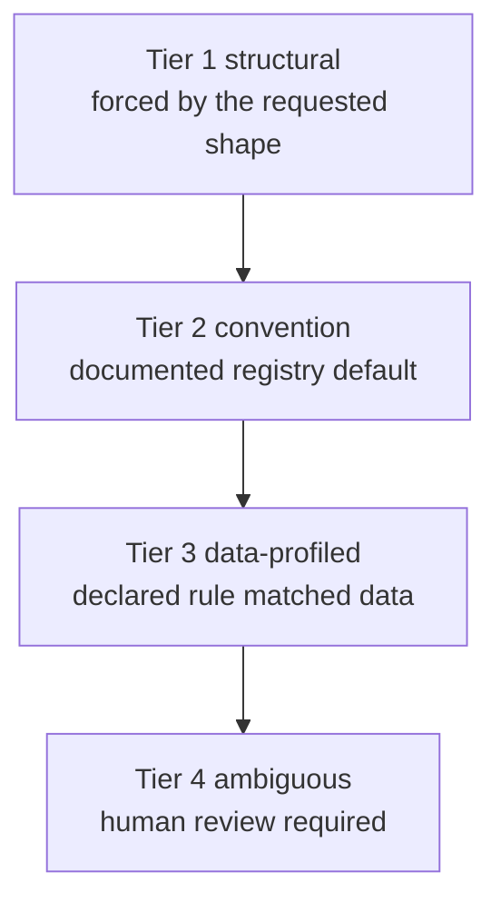

# The four tiers

Every module choice and important setting exits at one tier. The tier tells you how the choice
was justified and how much attention it needs.



| Tier | Fires when | Review level | Reader action |
|---|---|---|---|
| 1 structural | the inputs force the choice | none | ignore unless debugging |
| 2 convention | the loaded registry has a documented default | none | glance if your lab differs |
| 3 data-profiled | a declared rule matched a measurement | advisory | check the premise and citation |
| 4 ambiguous | no rule or convention can defend the choice | required | answer before relying on it |

## Why this matters

A chat answer often makes every part of a workflow feel equally plausible. Comeni separates the
cases. It should be obvious which parts were forced, which parts are defaults, which parts came
from data-backed rules, and which parts are open questions.

That separation is the product's honesty mechanism. The AI can help fill gaps, but a model
guess must not be presented as the same thing as a declared rule or a measured fact.

## Tier 1: structural

There was no real decision. The requested shape and available typed ports force the step or
connection.

Example: if a step consumes a genome index and the graph already contains exactly one compatible
index output, the wire is structural. There is no useful question for the user.

## Tier 2: convention

The registry made a documented default choice. This often means one loaded tool fills the role
or a priority settled an otherwise equal choice.

Convention is useful, but it is scoped. A lab overlay can change what the loaded registry
prefers.

In the RNA-seq example, `samtools sort` is convention because the loaded registry has a clear
way to produce coordinate-sorted BAM for `featureCounts`.

## Tier 3: data-profiled

A rule looked at a declared measurement and chose a tool or setting for a stated reason. This is
where citations matter.

Yellow/advisory does not mean wrong. It means the rule matched exactly as written, and the
person responsible for the analysis should check that the fact it read is true for this data.

In the RNA-seq example, the aligner choice is data-profiled:

```text
read_length = 150
  -> alignment rule matches the long-read branch
  -> STAR align is selected
```

If the read length changes to a short-read case, the rule can select a different aligner. The
goal did not name STAR; the data fact changed the route.

## Tier 4: ambiguous

Comeni could not defend a choice from structure, convention, or a matching rule. The value is
flagged for a person.

Tier 4 is always reviewable. Even a confident AI suggestion is still a suggestion until a human
accepts it.

In the RNA-seq example, `seq_platform` may be tier 4. The registry can know that STAR accepts a
sequencing platform setting, but it cannot infer which platform produced your reads unless a
measurement, lab convention, or human answer provides that fact.

## Reading a mixed pipeline

| Step or value | Likely tier | What the tier tells you |
|---|---|---|
| Trim Galore | 2 | accepted default in this registry |
| STAR align | 3 | a rule read `read_length` |
| `seq_platform` | 4 | needs a person or a new rule |
| featureCounts strandedness setting | 3, when covered | a rule may map library strandedness to the tool's parameter |

The exact artifact keeps these labels beside the decisions. The app should make the same
distinctions visible without forcing you to read YAML first.

When reviewing, start with tier 4 because it can block a reliable run. Then scan tier 3 because
it depends on facts about the data. Tier 2 usually becomes interesting only when your lab has a
different convention from the loaded registry.

## Where to go next

For the user workflow, read [Reviewing decisions](reviewing-decisions.md). For the routing
algorithm, read [How tools get chosen](how-tools-get-chosen.md).
