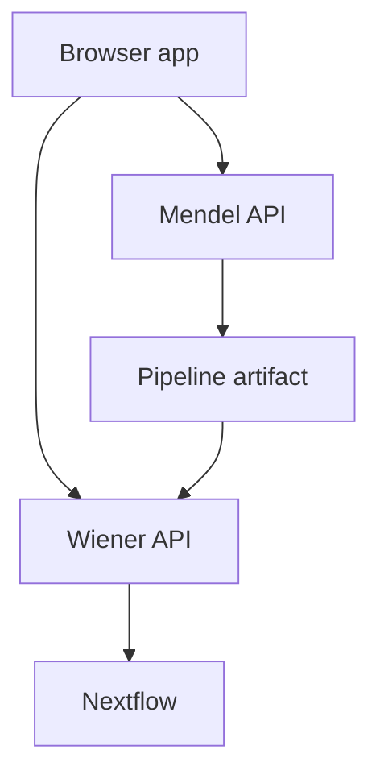

# Local development stack

This page is for people running or developing the alpha stack locally. If you only want to use
the product, start with [Install and open the app](../start/install-and-open.md).

## Bring it up

```bash
make dev
```

When it finishes, use:

| Address | Use |
|---|---|
| `http://localhost:5173/` | app with Vite hot reload |
| `http://localhost/` | nginx serving the built frontend |
| `http://localhost:8000/docs` | Mendel API docs |
| `http://localhost:5173/runs` | runs board |
| `http://localhost:5173/forge/queue` | registry review queue |

Use `:5173` while developing the frontend.

## What is running

| Container | Job |
|---|---|
| `api` | Mendel API: drafts, build service, registry-backed decisions |
| `worker` | long Mendel jobs over Redis |
| `web` | nginx for the built SPA and `/api` proxy |
| `postgres`, `redis` | Mendel database and queue |
| `wiener-api` | run launch and run queries |
| `wiener-ingest`, `wiener-worker` | ingest and fold Nextflow events |
| `wiener-postgres` | Wiener database and migration chain |
| `otel-collector`, `clickhouse`, `grafana` | local telemetry |

Mendel builds and explains pipeline artifacts. Wiener launches and observes runs. The browser
carries a pipeline artifact between them; the two services are not one combined backend.



## Useful commands

```bash
make dev-logs
make migrate
make wiener-migrate
make dev-down
```

## Safety

The local development worker uses the Docker socket so it can launch Nextflow, which launches
containers. Treat that as root-equivalent access to your machine. Do not expose the development
stack to a network you do not control.

## Production overlay

```bash
make prod
make prod-down
```

`docker-compose.prod.yml` overlays the development compose file. It is not a separate product
architecture.
