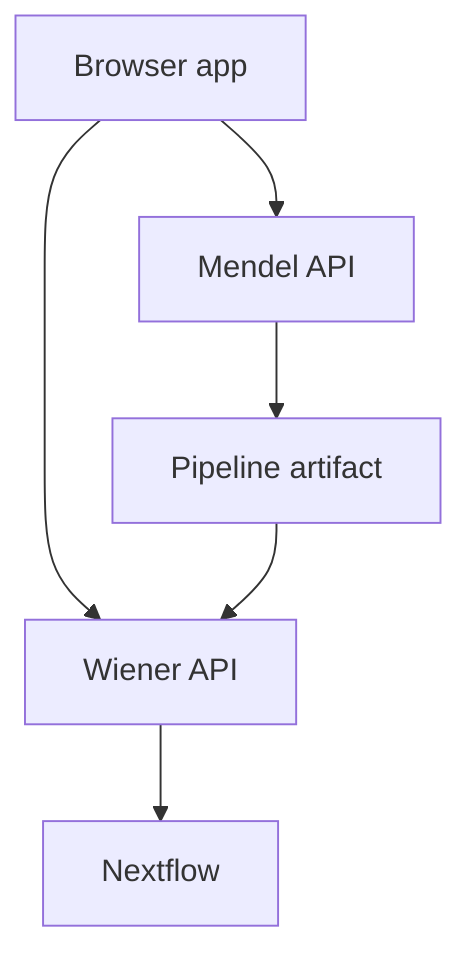

# Local development stack

This page is for people running or developing the alpha stack locally. If you only want to use
the product, start with [Install and open the app](../start/install-and-open.md).

## Bring it up

```bash
make dev
```

When it finishes, use:

| Address | Use |
|---|---|
| `http://localhost:5173/` | app with Vite hot reload |
| `http://localhost/` | nginx serving the built frontend |
| `http://localhost:8000/docs` | Mendel API docs |
| `http://localhost:5173/runs` | runs board |
| `http://localhost:5173/forge/queue` | registry review queue |
| `http://localhost:8010/` | this wiki, with live reload |

Use `:5173` while developing the frontend.

## What is running

| Container | Job |
|---|---|
| `api` | Mendel API: drafts, build service, registry-backed decisions |
| `worker` | long Mendel jobs over Redis |
| `ai-worker` | the only container that calls a model. Idle until one is configured |
| `ollama` | a local model server. Opt-in — `make ai-up` |
| `web` | nginx for the built SPA and `/api` proxy |
| `postgres`, `redis` | Mendel database and queue |
| `wiener-api` | run launch and run queries |
| `wiener-ingest`, `wiener-worker` | ingest and fold Nextflow events |
| `wiener-postgres` | Wiener database and migration chain |
| `otel-collector`, `clickhouse`, `grafana` | local telemetry |
| `wiki` | mkdocs serving these pages, reloading as you edit them |

Mendel builds and explains pipeline artifacts. Wiener launches and observes runs. The browser
carries a pipeline artifact between them; the two services are not one combined backend.



## Useful commands

```bash
make dev-logs
make migrate
make wiener-migrate
make dev-down
```

## Run a model locally

`make dev` never downloads a model. Adding one is two commands and two lines in `.env`.

```bash
make ai-up                            # start the model server. Downloads nothing
make ai-pull MODEL=qwen2.5-coder:14b  # ~9GB, once. Kept in a named volume
```

`make ai-up` prints the two lines to add to `.env`:

```
COMENI_AI_MODEL=ollama/qwen2.5-coder:14b
COMENI_AI_BASE_URL=http://ollama:11434
```

Then restart the AI worker so it reads them:

```bash
docker compose up -d --force-recreate ai-worker
```

Use `http://ollama:11434`, not `http://localhost:11434`. The worker reaches the model server
over the compose network; `localhost` there is the worker's own container.

To use a hosted model instead, set `COMENI_AI_MODEL` and `COMENI_AI_API_KEY` and leave
`COMENI_AI_BASE_URL` empty. Nothing else changes — the same worker, the same prompts, the same
registry.

Leaving `COMENI_AI_MODEL` empty is a supported way to run the forge. Sources sync, scaffolds
derive, and every open question is answered by hand.

## When nothing is generating

```bash
curl -s localhost:8000/api/health/ai
```

| Field | What to do about it |
|---|---|
| `configured: false` | no model is set. Add the two lines above, or leave it — this is a supported mode |
| `model_available: false` | the endpoint is not answering. `make ai-up`, and check `make ai-logs` |
| `model_available: null` | a hosted model, which is not probed |
| `worker_available: false` | no AI worker is running. `docker compose up -d ai-worker` |
| `queue_depth` | how many jobs are waiting. A number that only grows with a worker running means jobs are failing — `make ai-logs` |

`make ai-down` stops the model server. Downloaded models stay.

## Safety

The local development worker uses the Docker socket so it can launch Nextflow, which launches
containers. Treat that as root-equivalent access to your machine. Do not expose the development
stack to a network you do not control.

## Production overlay

```bash
make prod
make prod-down
```

`docker-compose.prod.yml` overlays the development compose file. It is not a separate product
architecture.
