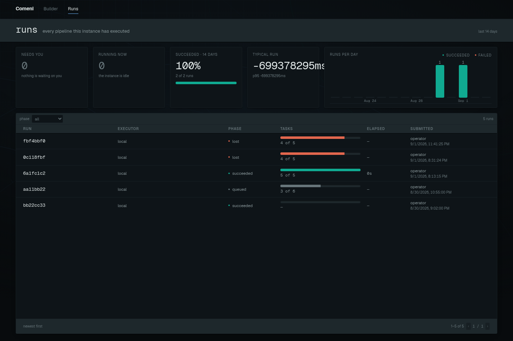

# Watching runs

The run pages turn Nextflow events into a lab-readable view of what happened. Use them to answer
the practical questions first: is work still moving, what failed, what retried, and where is the
evidence?

## Runs board

Open `/runs` to see recent runs. The board is for comparison and triage:

| View | Use |
|---|---|
| Phase filter | separate running, succeeded, failed, cancelled, and lost runs |
| Time bands | see whether recent work looks normal |
| Rows | open the run that needs attention |

Start on the board when you are comparing runs. Open a single run when you need evidence about
one execution.

## One run

A run page shows the state folded from the event stream. The important areas are:

| Area | What it answers |
|---|---|
| Header | which run this is, its phase, elapsed time, and executor |
| Overview | how many tasks are done, running, waiting, failed, or cached |
| Failure panel | the most useful failure detail when a run fails |
| Timeline | when attempts started and ended |
| Tasks | filterable task-level detail |
| Console | event stream and logs |

## Healthy run example

For the shared [RNA-seq example](rnaseq-example.md), a healthy run should move through phases
without needing you to inspect every task:

| What you see | Meaning |
|---|---|
| phase is `running` | Nextflow has accepted the work and tasks are reporting |
| task counts increase | the event stream is still moving |
| cached count appears | Nextflow reused work from a previous compatible run |
| phase becomes `succeeded` | every required task completed |

The overview answers “is the run broadly okay?” before the task table answers “what happened to
each unit of work?”

## Failed runs

Start with the failure panel. It is meant to pull together the task, exit code, attempts,
memory evidence, and report text when the run produced one. Then use Tasks and Console for the
full record.

## Failed run example

| Symptom | First place to look | Why |
|---|---|---|
| one process failed | Failure panel | it gathers the likely cause and attempt history |
| many tasks failed immediately | Console | launch or input path errors often show there first |
| tasks keep retrying | Tasks filtered by attempt | retries can reveal resource escalation or repeated failure |
| no task reports for a long time | Timeline and header | the run may be queued, stalled, or unable to reach the executor |

Do not start by reading raw logs line by line. Start from the folded state, then drill down.

Next: if the failure was caused by a missing tool, wrong convention, or repeated manual answer,
go to [Using the forge](../registry/using-the-forge.md).

## Alpha note

The watch surface is useful today, but it is still local-stack oriented. Cluster and production
deployment guidance belongs in the environment-specific run documentation as the platform
matures.
