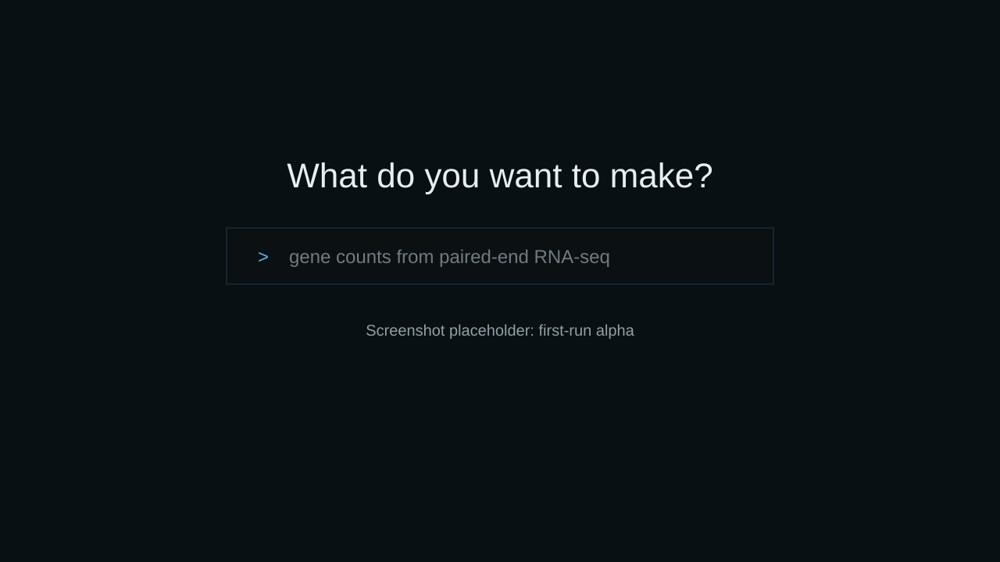
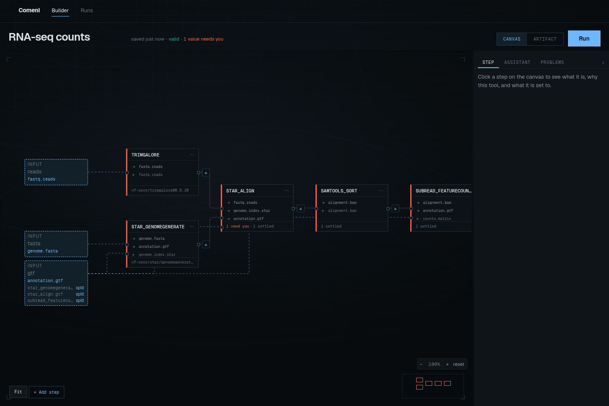
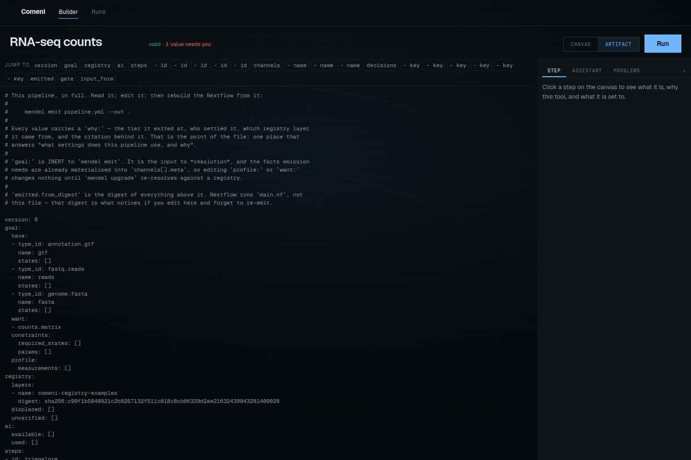
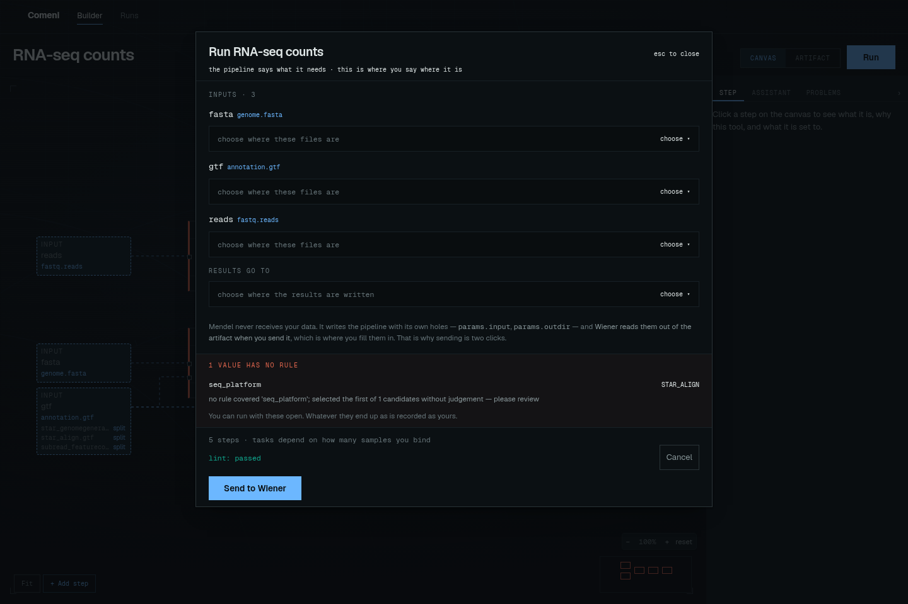

# Your first pipeline

This is the first app-first path through Comeni Labs. It should take about fifteen minutes once
the local alpha stack is running.

You will open the app, inspect a pipeline draft, review its decisions, run it through the
current alpha launch flow, and watch the run page.

This walkthrough uses the shared [RNA-seq example](rnaseq-example.md): gene counts from
paired-end RNA-seq reads.

If the words draft, artifact, gate, run, or registry are new, read [Core words](core-words.md)
first. It is short and will make this walkthrough easier.

## 1. Open Comeni

If the stack is not running yet, follow [Install and open the app](../start/install-and-open.md).
Then open [http://localhost:5173](http://localhost:5173).

On a fresh checkout, the first screen asks what you want to make. Natural-language goal entry is
not wired yet in the alpha, so use the working path: click **build it by hand**.



| Current alpha behavior | Expected to change | Stable concept |
|---|---|---|
| The prompt is disabled and links to the builder. | A typed natural-language request should become a reviewable goal. | The user describes an analysis; the system does not silently invent a pipeline. |

## 2. Inspect the draft

The builder opens a pipeline draft. Treat the screen as three questions:

| Question | Where to look |
|---|---|
| What steps are in this pipeline? | the canvas |
| What does each step consume and produce? | the ports and wires |
| What still needs a person? | the status line and Ask/problems panel |

Select a step and read its settings. The point is not to memorize the module. The point is to
see that settings and tool choices carry reasons.



For the RNA-seq example, expect a graph shaped like this:

```text
fastq.reads
  -> Trim Galore
  -> STAR align
  -> samtools sort
  -> featureCounts
  -> counts.matrix[gene_level]

genome.fasta + annotation.gtf
  -> STAR genomeGenerate
  -> STAR align
```

The exact layout may move as the builder changes, but the scientific chain should remain
recognizable: prepare reads, prepare the index, align, sort, count.

## 3. Read the decisions

Look for values that need review. Green/conventional choices can be scanned. Yellow/data-backed
choices deserve a premise check. Red/ambiguous choices need an answer before the pipeline is
something to rely on.

The deeper rule is simple: Comeni may assist, but it must not hide a guess as if it were a
scientific decision.

For the full ladder, read [Reviewing decisions](reviewing-decisions.md).


In this example, the decision story should look like this:

| Decision | Why it is there | What you do |
|---|---|---|
| Trim Galore | convention: the loaded registry has one trimming tool for this role | scan it |
| STAR align | data-backed rule: 150 bp reads match the STAR rule | check the read-length premise |
| samtools sort | convention: it produces coordinate-sorted BAM | scan it |
| featureCounts | convention: it produces gene-level counts | scan it |
| `seq_platform` | ambiguous: no declared fact proves the platform | answer or leave the pipeline unready |

That last row is not a failure. It is the system refusing to guess a biological or platform
fact it cannot defend.

## 4. Open the artifact

Switch from **Canvas** to **Artifact**. The artifact view shows the materialized pipeline record.
That record is the bridge between the low-code app and plain Nextflow.

The important files are:

| File | Meaning |
|---|---|
| `pipeline.yml` | the pipeline record: steps, settings, decisions, provenance |
| `main.nf` | emitted Nextflow workflow |
| `nextflow.config` | execution configuration and declared inputs |
| `modules/` | the module source used by this pipeline |



Read the artifact as the evidence record. The app is the easier way to work with it, but the
file is what makes the pipeline portable and reviewable outside the app.

## 5. Run it

Press **Run**. In the current alpha, the button keeps the draft, runs a lint gate, asks for the
run inputs, and submits to the local run service.

Inputs and samplesheets will change as the app matures. For now, focus on the shape of the
workflow: the run sheet is where local data paths enter, after the pipeline has already been
built and reviewed.

For the fuller explanation of what enters at design time versus run time, read
[Inputs in the alpha](inputs-alpha.md).



For a local dry run, example values will look like ordinary Nextflow inputs:

| Field | Example value |
|---|---|
| Reads | `data/*_R{1,2}.fastq.gz` |
| Genome FASTA | `reference/genome.fa` |
| Annotation GTF | `reference/genes.gtf` |

Use paths that make sense on the machine running the local stack. The current form is an alpha
surface; the stable idea is that data paths enter at run time, not while Comeni is choosing the
pipeline.

## 6. Watch it

After submission, open the run from `/runs`. The run page shows phase, elapsed time, task
counts, timeline, task table, and console events.


If a run fails, start with the failure panel, then use task filters and console lines for the
full record.

Expected first checks:

| If you see | Start with |
|---|---|
| Running tasks but no completions | Overview and timeline |
| One failed process | Failure panel |
| Many retries | Tasks filtered by attempt |
| Missing input errors | Console and run sheet values |

## What you learned

- Comeni is app-first and low-code; the CLI is not the main user path.
- The graph is editable, but the artifact is the durable record.
- Decisions are labeled by how they were justified.
- The output is still Nextflow, so your lab can run it outside Comeni.

Next: [The product loop](product-loop.md), [The builder](builder.md), and
[Watching runs](watching-runs.md).
