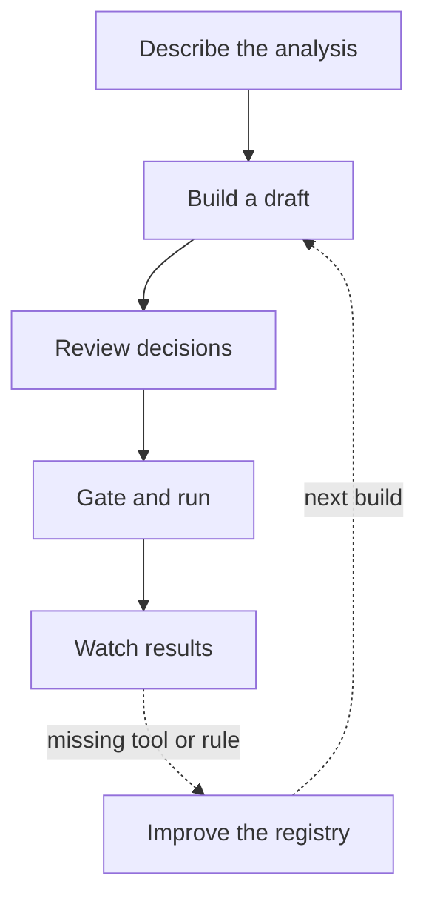

# Describe an analysis. Get a pipeline you can defend.

Comeni Labs is a low-code way to create real Nextflow pipelines with AI help kept inside
reviewable boundaries. You work in the app. Comeni explains what it chose. The artifact that
comes out is plain Nextflow that your lab can run where its data already lives.

The loop is intentionally small. Most users live in the first five boxes; registry maintainers
step into the last one when the app needs new scientific knowledge.

| Book | Start here if |
|---|---|
| [Start here](start/index.md) | you want the first successful path through the app |
| [Handbook](handbook/index.md) | you use Comeni to build, review, run, and inspect analyses |
| [Tools](tools/index.md) | you want to know which tools this registry can use today |
| [Registry](registry/index.md) | you add tools, rules, measurements, or lab conventions |
| [Internals](internals/index.md) | you work on the platform itself |

Comeni Labs is **Alpha, pre-MVP**. User guides describe the current app workflow and call out
surfaces that are expected to move, especially inputs, run submission, and AI-assisted drafting.
