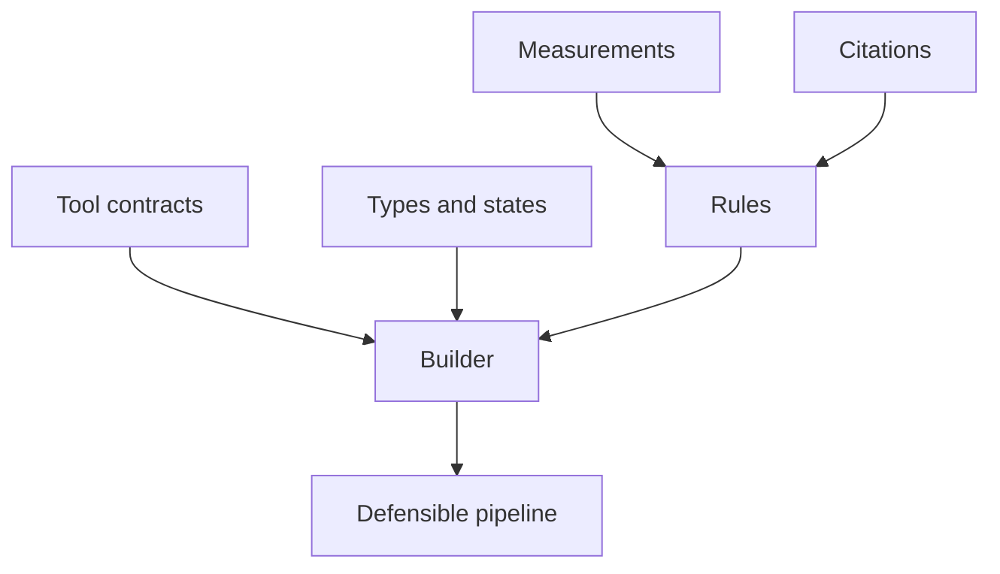

# Registry

The registry is Comeni's scientific memory. It tells the app which tools exist, what they
consume and produce, which measurements matter, and which data-backed rules can justify a
choice.

Think of the registry as the part of Comeni that replaces “the bioinformatician just knows.”
Nextflow can run a process, and nf-core can publish reusable modules, but neither one tells a
pipeline builder the full scientific meaning of a step. Comeni needs that meaning written down:
this file is a BAM, this BAM is coordinate-sorted, this setting follows strandedness, this
aligner is preferred for this measured read length.

## The intuition

A pipeline builder has to answer four ordinary questions:

| Question | Registry answer |
|---|---|
| What can I use? | contracts declare tools |
| What flows between steps? | types and states name scientific objects |
| What do we know about this dataset? | measurements name facts rules may read |
| Why choose this option? | rules and citations justify decisions |

Without those answers, a low-code builder can still draw boxes, but it cannot defend the graph.
It would know that something is a file, not that it is a sorted BAM suitable for counting. It
would know that STAR and HISAT2 are both aligners, not when one should win for this dataset.

That is why registry work pays back. You do not write a complete pipeline every time. You teach
Comeni one reusable fact, tool, or rule, and future compatible analyses inherit it.

## What lives here

| Thing | Meaning |
|---|---|
| Contract | the binding between a real tool and the builder: what it takes, what it gives, and how to call it |
| Type | the name of a thing that flows between tools, such as `fastq.reads`, `alignment.bam`, or `counts.matrix` |
| State | a precise condition on a type, such as `trimmed`, `coordinate_sorted`, or `gene_level` |
| Measurement | an observed or asserted fact about the data, such as read length, strandedness, or sample count |
| Rule | a cited decision table that turns measurements into tool or parameter choices |
| Layer | your lab's overlay on top of the public registry: private tools, local defaults, and validated conventions |

## One concrete path

In the [RNA-seq example](../handbook/rnaseq-example.md), the registry lets the builder reason
like this:

1. The user wants `counts.matrix[gene_level]`.
2. The `featureCounts` contract says it can produce that.
3. `featureCounts` needs `alignment.bam[coordinate_sorted]`.
4. The `samtools sort` contract says it can make a BAM coordinate-sorted.
5. The aligner rule reads `read_length: 150` and selects STAR.
6. No fact proves `seq_platform`, so the builder asks a person.

Each line depends on registry data. Remove the contracts and the graph cannot be built. Remove
the states and the builder cannot tell sorted BAM from unsorted BAM. Remove the rule and STAR
becomes a preference or a question instead of a data-backed choice.

## Where to start

| You want to | Read |
|---|---|
| use the app to review missing registry work | [Using the forge](using-the-forge.md) |
| add a tool Comeni does not know | [Writing a contract](writing-a-contract.md) |
| make a choice depend on read length, strandedness, or another fact | [Making a choice depend on your data](making-a-choice-depend-on-your-data.md) |
| keep private lab tools or conventions | [Your lab's own layer](your-labs-own-layer.md) |

The registry pages get more exact than the user handbook because registry data is a public
claim. Small YAML files are the interface, but the goal is not YAML. The goal is a pipeline
builder that can explain itself.

Before writing new registry data, check the existing [Tools](../tools/index.md) catalogue. A
missing convention may only need a rule; a missing capability needs a contract.

## Before and after

Registry changes should be visible in the app.

| Before | Registry change | After |
|---|---|---|
| a tool cannot be added or selected | add a contract | the builder can use it wherever its ports fit |
| a repeated choice is always manual | add a cited rule | the choice becomes tier 3 when the data fact matches |
| a lab uses a private convention | add a lab layer | the public registry stays clean and the lab gets its own default |
| a source changes under a tool | review drift in the forge | the accepted contract matches the source again |

If a change cannot be seen in a future build, it may still be valid reference data, but it has
not yet improved the product loop.
