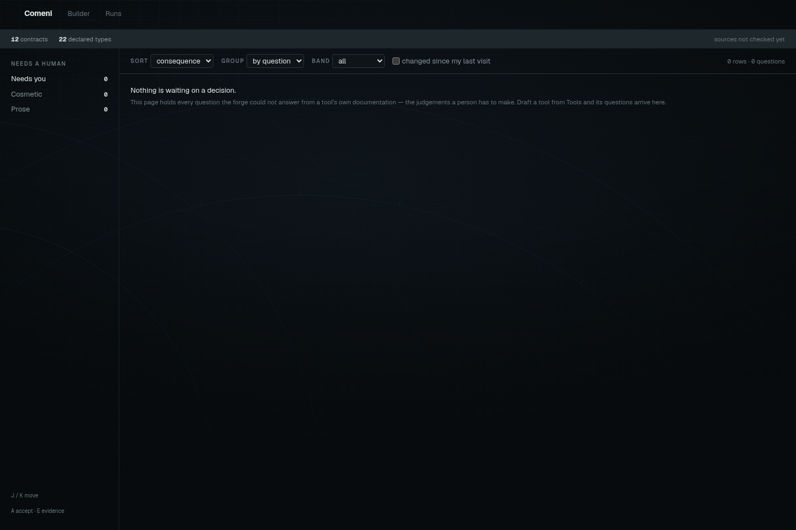
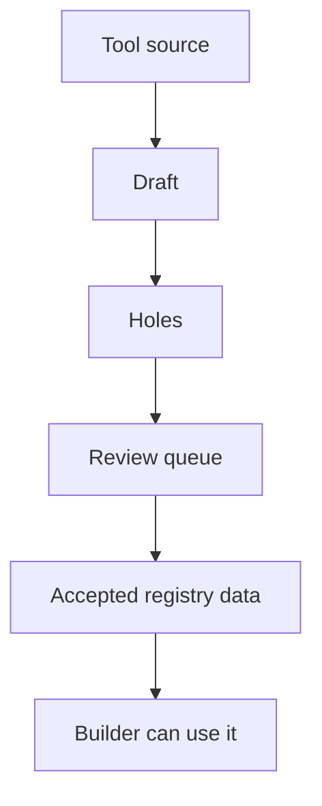

# Using the forge

The forge is the app surface for maintaining the registry. Use it when Comeni is missing a
tool, when a source has drifted, or when a draft needs a human judgement before it can become
registry data.

Open `/forge/tools` for the tool board or `/forge/queue` for work waiting on a decision.



## What the forge does



The forge can derive facts from sources: process names, containers, module files, and other
things stated by the tool itself. It asks people for judgements: semantic roles, states,
citations, and choices where the source is not enough.

## Queue work

| Work | Meaning |
|---|---|
| Hole | a required field could not be derived |
| Proposal | a new role, type, or value was suggested because nothing existing fit |
| Drift | the source moved away from the accepted contract |

The queue is ordered by cost of waiting, not by how interesting the item is.

## Worked example: a missing depletion tool

Imagine the RNA-seq pipeline needs a ribosomal RNA depletion step that is not in the registry.
The source can tell the forge some facts, but not all of the scientific meaning:

| Field | Source can derive? | Human judgement |
|---|---|---|
| process name | yes | confirm if source is odd |
| container | yes | confirm pin is acceptable |
| input and output file names | often | decide semantic type and state |
| role | no | choose or propose the role |
| citation | no | add the paper, manual, or lab validation record |

The forge should draft the easy parts and put the judgement in the queue as holes or proposals.

## Example queue item

```text
Hole: mylab/sortmerna@4.3.6 role
Why: the source names files and commands, but not the pipeline job this module performs.
Allowed answers: trimming, profiling, qc_per_sample, ...
```

A good answer is narrow and reviewable:

```text
role = rrna_depletion
reason = removes ribosomal reads before alignment in the lab RNA-seq protocol
```

If `rrna_depletion` is not already a declared role, it should enter as a proposal. A person can
approve, rename, or reject it instead of letting the draft invent vocabulary silently.

## Human approval is the point

AI assistance may draft or propose, but registry writes should remain reviewable. A tool
definition becomes useful precisely because it is declared, checked, cited, and owned.

## After acceptance

Once accepted, the registry data changes future builds:

1. the new contract becomes a candidate wherever its inputs and outputs fit,
2. any new types, states, roles, or measurements become part of the vocabulary,
3. rules can now target the new role or implementation,
4. the builder can choose the tool without a one-off manual graph edit.

That is why registry work pays back. One reviewed declaration becomes reusable product
behavior.

## Next

Read [Writing a contract](writing-a-contract.md) when you need to add a tool by hand. Read
[Making a choice depend on your data](making-a-choice-depend-on-your-data.md) when the builder
keeps asking a question your lab can answer with a rule.
