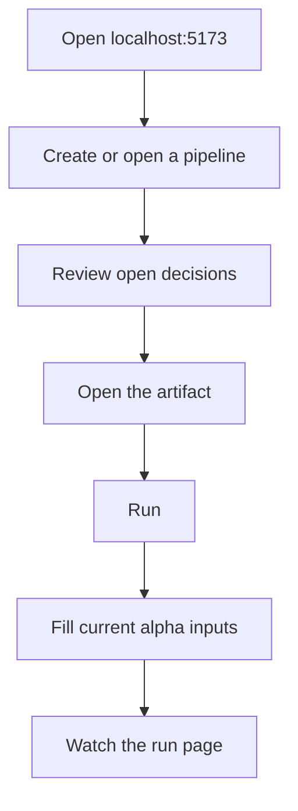

# Start here

This book is the shortest path from a checkout to a pipeline you can inspect. It follows the
product the README describes: open the app, build a pipeline, run it, and watch what happens.

You do not need to learn the Mendel CLI to use Comeni Labs. The CLI exists for development,
automation, and artifact repair; the product path is the browser.

## First path

| Step | Page |
|---|---|
| Bring up the local alpha stack | [Install and open the app](install-and-open.md) |
| Learn the product's core words | [Core words](../handbook/core-words.md) |
| Build and run one RNA-seq pipeline | [Your first pipeline](../handbook/your-first-pipeline.md) |
| See which parts are alpha surfaces | [What is not built yet](../status.md) |

The first run should leave you with three ideas:

- Comeni asks for the shape of an analysis, not a shell script.
- A decision is only quiet when the system can defend why it is quiet.
- The pipeline artifact is portable Nextflow, not a private Comeni runtime.

If you already know Nextflow, resist the urge to start with the CLI reference. The fastest way
to understand Comeni is to watch where the app asks for evidence and where it refuses to guess.
