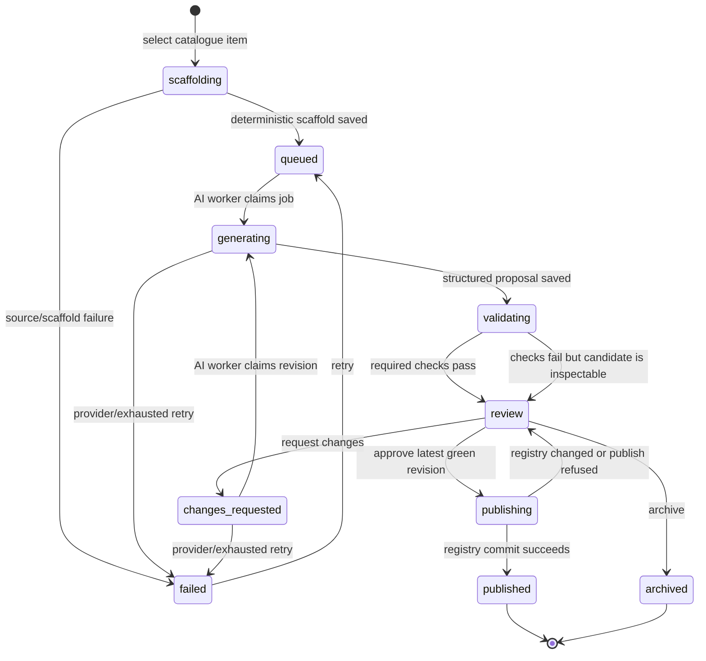

# Forge MVP — Source Catalogue, AI Adaptation, and Human Review

> **For Claude:** use the frontend/design skill for Task 9 and an executing-plans workflow for
> implementation. Build the named artboards before writing the React pages. Implement one task
> at a time, run its narrow checks, and do not delete the old Forge routes until the replacement
> has passed the end-to-end walk in Task 13.

**Date:** 2026-09-04

**Status:** implementation-ready proposal

**Goal:** Make the registry loop work end to end: discover the current nf-core and PEGiS
catalogues, deterministically scaffold one selected tool, complete it with one queued AI worker,
let a person inspect and discuss the result, request changes or approve it, and write an approved
bundle into the registry.

**Product loop:** discover → scaffold → queue → generate → validate → review → revise or publish.

**Architecture:** Source adapters normalize upstream facts into a cached catalogue and immutable
source bundle. The Forge deterministically turns that bundle plus the current registry into a
scaffold and a typed hole manifest. A dedicated ARQ AI worker, with concurrency one by default,
asks for a whole-module structured proposal and validates it through the existing registry and
Nextflow machinery. Postgres owns durable workflow state; Redis transports jobs; the workspace
holds reviewable files; the registry remains files in Git and is written only at human approval.

**Tech stack:** Python 3.12, FastAPI, Pydantic, SQLAlchemy/Alembic, ARQ/Redis, LiteLLM, Ollama,
React, TanStack Query, the existing Observatory tokens, and existing Mendel/Nextflow validators.

---

## 0. Current gap and reuse map

The root problem is not that the repository lacks a Forge. It has two incomplete halves that do
not meet:

- `Source.discover(root)` discovers only modules already vendored into the registry, so it cannot
  answer how many tools exist upstream or show useful metadata before import.
- `NfCoreSource` can ingest a local nf-core module, but there is no PEGiS adapter or upstream
  catalogue snapshot.
- `ops.draft()` creates a deterministic scaffold, while `ModelFiller` fills one indexed hole per
  call and is reachable only from the CLI. The served API intentionally has no live-model path.
- `Workspace` stores JSON files but has no durable job/revision state, and the API worker has no
  AI queue.
- the existing Tools/Queue UI renders field-level work from that old model and is hidden from the
  product navigation.

Reuse versus replace:

| Keep and extend | Replace on the new path |
|---|---|
| `Observation`, `Fact`, `Excerpt` and evidence discipline | local-only `Source.discover(root)` as the catalogue |
| `ModuleSpec` and conformance | one model call per indexed `Hole` |
| `assemble`, candidate ranking, and typed legal values | draft name/version form before source inspection |
| `verify.py`'s cheapest-first ladder | file mtime as workflow state |
| `land.py` as the only registry writer | browser-side catalogue filtering |
| `mendel-ai` transport and structured validation | one worker queue for AI, gates, and sync |
| existing ARQ/Redis and Observatory visual system | the old Forge information architecture |

Build the new surface beside the old one. Reusing a type does not require preserving the old
orchestration around it.

---

## 1. Decisions Claude should not reopen during implementation

### 1.1 The old indexed-hole loop is not the AI orchestration model

Keep a machine-readable hole manifest. Every unresolved value still needs an address, evidence,
legal values, and a reason it is open. Do **not** make one model request per field and do not use
an array index as the field's durable identity.

Use both:

- a stable semantic id, such as `input:reads:type`, `output:bam:states`, or
  `param:min_mqs:route`;
- a current document locator, such as `/contract/consumes/0/type_id`, which may change when a
  renderer reorders ports.

The model receives the entire module dossier and returns one coherent proposal. This directly
replaces the current failure mode in which separate calls can type a port one way and name it as
another, or lose the instruction under repeated source prose.

### 1.2 A source adapter proves facts; it does not write registry data

The requested superclass is a real common base with capability hooks, not inheritance from
nf-core's layout:

```python
class BaseSourceAdapter(ABC):
    name: str
    capabilities: SourceCapabilities

    async def sync(self, previous: SourceSnapshot | None) -> SourceSnapshot: ...
    async def bundle(self, item: CatalogueItem) -> SourceBundle: ...
    def observe(self, bundle: SourceBundle) -> Observation: ...
    def freshness(self, item: CatalogueItem, landed: LandedSource | None) -> Freshness: ...

    @abstractmethod
    async def _fetch_catalogue(self, previous: SourceSnapshot | None) -> RawCatalogue: ...

    @abstractmethod
    async def _fetch_bundle(self, item: CatalogueItem) -> RawBundle: ...
```

The base class owns retry policy, conditional requests, evidence ids, stable digests, pagination,
and normalization. `NfCoreAdapter` and `Pegi3sAdapter` own only source-specific discovery and
extraction. A `SourceAdapter` protocol can remain for fakes, but production registration accepts
the common base.

### 1.3 Source totals and “up to date” have exact meanings

- **nf-core total:** leaf directories under the official `modules/nf-core/` tree that contain
  both `main.nf` and `meta.yml`. Do not count subworkflows, tests, or pipeline-local modules.
- **PEGiS discovered total:** public repositories returned by the namespace-scoped Docker Hub API.
- **PEGiS adaptable total:** discovered repositories with a pullable Linux image plus enough
  source documentation to create a dossier. Show unsupported entries and their reason; do not
  make them disappear.
- **Adapted:** a registry contract exists for the source ref, whether current or stale.
- **Up to date:** the landed source content digest equals the latest synced item digest. Do not
  compare only dates or the nf-core repository HEAD, because an unrelated upstream commit must
  not make every module stale.
- **In progress:** scaffolded, queued, generating, validating, in review, or changes requested.
  It is not included in “adapted” until publication.

Every source card shows both discovered and adaptable totals if they differ. The progress bar's
denominator is adaptable, while the nearby text preserves the raw discovered count.

### 1.4 Postgres, Redis, workspace, and registry each have one job

| Store | Owns | Must not own |
|---|---|---|
| Postgres | catalogue snapshots, adaptation state, revisions, events, chat, AI invocation audit | contracts or modules as the accepted registry |
| Redis | scheduled and running jobs | authoritative adaptation state |
| workspace | immutable source bundle, scaffold, prompts, responses, candidate files, validation reports | accepted declarations |
| registry Git tree | approved module, contract, types and explicitly approved rules | drafts, chat or model traces |

ARQ may retry or lose a result. A job always reads the durable row, claims an expected state, and
writes a new durable state. It must be safe for the same job id to arrive twice.

### 1.5 One AI lane for MVP

Run AI work in a separate `ai-worker`, on `arq:queue:ai`, with
`COMENI_AI_MAX_CONCURRENT_JOBS=1` by default. Catalogue sync and gates remain on the normal
worker. This
prevents a long model call from delaying a gate and prevents twenty clicks from starting twenty
model generations.

Both adaptation and review chat use the AI queue. A chat answer may wait behind the one active
adaptation in the MVP. Do not build priority scheduling yet.

### 1.6 “Disapprove” normally means request changes

The review actions are:

- **Approve and publish** — allowed only on the latest green revision;
- **Request changes** — requires a reason, creates a new queued revision attempt, and preserves
  the rejected revision;
- **Archive** — explicitly closes work that should not continue.

Do not call request-changes “reject”; a terminal word makes an ordinary correction destructive.

### 1.7 Chat and mutation are separate verbs

A review chat message can ask why a type, state, parameter, rule, or Nextflow expression was
chosen. The chat answer never changes files. “Request changes” is the only conversational action
that queues a revised candidate. A chat box that sometimes edits code depending on wording is not
reviewable.

### 1.8 Rules are more dangerous than module wrappers

A contract describes what a tool can do. A Mendel rule decides when an analysis should do it.
Tool metadata rarely proves the second.

The model may create `rule_candidates`, but:

- an existence statement is never evidence that a tool should be selected;
- each row needs a real evidence id and citation;
- unsupported ideas stay as review notes, not YAML;
- rule candidates are separately selected on approval and default to **not publishing**;
- a module can publish with no rule candidate.

### 1.9 Local Ollama and hosted APIs use the same interface

Evolve the existing `mendel-ai` package into the shared `ai-core` boundary now, before the Forge,
builder, and Wiener agents create three clients. The Python import name should be `comeni_ai` and
the distribution can be `comeni-ai-core`; avoid the globally generic `ai-core` distribution name.

Keep a temporary `mendel_ai` compatibility re-export until all in-repo imports and released
consumers have migrated. Provider selection remains configuration: Ollama in development,
provider API in deployment. No Forge branch may mention Ollama.

The shared configuration names are `COMENI_AI_MODEL`, `COMENI_AI_BASE_URL`,
`COMENI_AI_API_KEY`, `COMENI_AI_TIMEOUT_SECONDS`, `COMENI_AI_TEMPERATURE`, and
`COMENI_AI_MAX_CONCURRENT_JOBS`. Read the old `MENDEL_*` model variables as a deprecated fallback
during the compatibility window; do not give the new shared package an engine-specific primary
prefix.

### 1.10 Do not auto-pull a model

Compose may start Ollama and preserve its model volume. A documented explicit command downloads
the selected model. `make dev` must not unexpectedly download gigabytes.

---

## 2. State machine and invariants



Rules enforced in one transition service:

1. Only the expected current state can transition. Use an optimistic `row_version` compare.
2. One catalogue item can have many historical adaptations but at most one active adaptation.
3. A revision is immutable after validation begins.
4. An adaptation points to exactly one current revision.
5. Approval requires: current revision, no required unresolved holes, validation green, named
   human, non-empty reason, and the same registry base digest used for validation.
6. Publishing is the only transition that writes to the registry.
7. A failed or stale job records an event and does not leave the row in `generating` forever.
8. Every model response records model id, prompt id/version, rendered prompt digest, source
   digest, registry digest, temperature, duration, outcome, and token counts when the provider
   supplies them.
9. A failed adaptation records `failed_stage`, and retry resumes that stage rather than assuming
   every failure came from the model.

---

## 3. Domain records

Keep these Pydantic records in `mendel-forge`; SQLAlchemy models project the durable subset.

### Catalogue

```text
SourceCapabilities
  supplies_nextflow
  supplies_structured_ports
  supplies_container_digest
  supplies_tests

CatalogueItem
  id                    stable opaque sha256(source + ref)
  source                nf-core | pegi3s
  ref                   source-native id, e.g. samtools/sort or fastqc
  display_name
  summary
  homepage_url
  documentation_url
  repository_url
  licence[]
  keywords[]
  categories[]
  maintainers[]
  latest_version        nullable when source does not prove one
  container_refs[]      tag and platform
  source_revision       commit/digest used to fetch
  content_digest        per-tool, unrelated source changes do not move it
  last_updated_at       source fact, nullable
  input_hints[]
  output_hints[]
  capabilities
  adaptable
  unsupported_reason
  evidence[]
```

Never call a guessed container tag `latest_version`. An unknown version is `null` and a visible
scaffold hole.

### Scaffold

```text
ScaffoldBundle
  adaptation_id
  source_item
  source_digest
  registry_digest
  deterministic_files[]
  source_files[]
  facts[]
  holes[]
  context_manifest

ScaffoldHole
  id                    stable semantic id
  pointer               current JSON pointer or file span
  kind                  type | state | role | param | rule | nextflow | version | citation
  question
  why_open
  required
  legal_values[]
  evidence_ids[]
  prompt_hint_id
```

The `prompt_hint_id` points to a committed instruction fragment such as
`ports.semantic-type.v1`; it is not a bespoke paragraph generated into each draft.

### AI proposal

Use two calls, plus at most two bounded repairs:

1. `forge.analysis.v1` → `ModuleAnalysis`
2. `forge.implementation.v1` → `CandidateBundle`
3. `forge.repair.v1` → full corrected `CandidateBundle`, only after validation diagnostics

`ModuleAnalysis` contains semantic ports, roles, parameters, rule candidates, evidence ids, and
explicit unresolved items. `CandidateBundle` contains a contract-shaped proposal, optional new
type declarations, optional separately reviewable rule candidates, and `main.nf` only when the
source does not supply it.

Returning the whole corrected bundle on repair is intentionally less clever than JSON Patch. It
is easy to validate, easy to diff, and cannot point at an array index that moved between passes.

---

## 4. Source adapter behavior

### 4.1 nf-core

Catalogue sync:

1. Resolve the official repository branch to a commit.
2. Read the Git tree recursively once. If GitHub reports `truncated`, walk subtrees; never accept
   a partial total.
3. Select only leaf directories below `modules/nf-core/` containing `main.nf` and `meta.yml`.
4. Fetch `meta.yml` for normalized metadata. Bound concurrency and honor ETags/rate limits.
5. Use the module directory tree/blob digest as `content_digest`; retain the commit SHA for a
   reproducible fetch.

Bundle/scaffold:

- fetch the complete module directory at the recorded commit;
- reuse `ModuleSpec` for process/input/output parsing;
- parse current `meta.yml` fields including descriptions, licences, identifiers, maintainers,
  and platform containers;
- copy upstream `main.nf`, environment, lockfiles, and helper scripts unchanged;
- generate `module.yml` provenance deterministically;
- scaffold the contract and holes; never ask AI to rewrite the nf-core process;
- run conformance against the foreign source as a strong validation rung.

### 4.2 PEGiS

Catalogue sync:

1. Page through the namespace-scoped Docker Hub list endpoint.
2. For each public repository, read tags and manifests through supported v2/OCI endpoints.
3. Prefer an explicit semantic version tag. Treat `latest` as an alias, never a version proof.
4. Select and record a Linux/amd64 digest for the MVP; preserve all platforms in metadata.
5. Enrich from the matching path in `pegi3s/dockerfiles` at a recorded commit: Dockerfile,
   README/docs, entrypoint, command, labels, and tests when present.
6. A Docker Hub item with no matching source remains visible. Mark it unsupported only when the
   adapter cannot assemble a reproducible dossier, and say why.

Bundle/scaffold:

- pin the container by digest in the proposal, not `latest`;
- derive entrypoint/CMD from source or OCI config when possible;
- generate a conservative nf-core-shaped process skeleton with stable hole markers;
- do not assume one input and one `*.out` output as the current `modulegen.skeleton()` does;
- the AI may author the missing Nextflow module, but cannot replace container/source facts;
- generated stub outputs must match declared outputs and are validation targets.

### 4.3 Sync cadence and failures

- Nightly sync both sources on the ordinary worker.
- Add a manual “Sync sources” action that enqueues; it never performs network work in a request.
- Preserve the last successful snapshot if a sync fails and show it as stale with the error.
- Initial empty state says “No successful source sync” rather than showing zero tools.
- Use optional `GITHUB_TOKEN` and Docker Hub credentials, but public-source development must work
  without them within provider rate limits.

The upstream assumptions above follow the official nf-core module repository, GitHub tree API,
Docker Hub namespace/tag APIs, and the PEGiS catalogue. Do not scrape rendered HTML.

---

## 5. Prompt system — this is product code

### 5.1 Ownership

`ai-core` owns:

- provider-neutral `ModelAccess`, transport, structured generation, and chat;
- prompt template loading/rendering/version ids;
- response metadata and token accounting;
- recorded/fake transports;
- context-budget helpers with deterministic truncation.

`mendel-forge` owns:

- Forge response schemas;
- Forge prompt templates and instruction fragments;
- source/registry context selection;
- validation and repair policy.

Do not put Mendel contracts, roles, or Nextflow instructions in `ai-core`. Shared infrastructure
must not become a shared pile of every agent's prompts.

### 5.2 Prompt file layout

```text
packages/mendel-forge/src/mendel_forge/prompts/
  forge.analysis.v1.md
  forge.implementation.v1.md
  forge.repair.v1.md
  forge.review-chat.v1.md
  hints/
    ports.semantic-type.v1.md
    ports.state.v1.md
    params.route.v1.md
    rules.evidence.v1.md
    nextflow.module.v1.md
```

Template ids are filenames without `.md`. Changing behavior means adding `v2`, not silently
editing history. Old versions remain readable for review records.

### 5.3 Context dossier

Build context deterministically and store its manifest. The dossier, in this order:

1. source identity, exact revision/digest, and source capabilities;
2. evidence excerpts with stable ids (`E001`, `E002`, ...), locator, and source type;
3. deterministic facts and files;
4. scaffold holes and prompt hints;
5. current registry schema version;
6. legal roles, types/states, measurements, and parameter route vocabulary;
7. at most three similar landed contracts, selected deterministically by keyword and port hints;
8. existing rules for the proposed roles, so a duplicate/conflict is visible;
9. response JSON Schema;
10. final task instruction.

Do not dump the entire registry or repeat all source prose for every port. If the dossier exceeds
budget, drop low-ranked similar contracts first, then redundant prose, and record every omission.
Never truncate schemas, legal values, holes, or validation diagnostics.

### 5.4 Shared invariant block

Every Forge generation prompt must say, in direct language:

```text
You are proposing registry work for human review. Source facts are immutable. Use only the
evidence ids supplied; never invent a citation, input, output, version, container, or scientific
claim. When evidence is insufficient, return an unresolved item instead of a plausible answer.
Use existing registry vocabulary when it fits. Propose a new type/state/role only when none fits,
and explain the incompatibility. Output only the declared JSON shape.
```

### 5.5 Analysis prompt requirements

The analysis prompt must force these distinctions:

- a process channel name is not a semantic type;
- a filename suffix is evidence, not proof of scientific state;
- input/output direction comes from how the command runs, not which noun appears first in prose;
- one module's ports must be mutually coherent;
- choose the smallest true set of roles/states;
- a parameter is exposed only when users or rules need to vary it across analyses;
- mandatory plumbing belongs in `nf_inputs`/baseline args, not a fake user choice;
- every parameter needs a concrete route (`ext.args`, positional, meta, directive, etc.);
- defaults require evidence and a reason;
- a rule is scientific policy, not metadata; output no rule unless evidence supports its premise,
  effect, row, and citation;
- confidence never turns missing evidence into a fact.

Each proposed value carries `evidence_ids`. Each unresolved item carries `needed_evidence`, so
review tells a person what would close it.

### 5.6 Implementation prompt requirements

For nf-core, the prompt may bind a contract to the existing process but must not emit replacement
Nextflow. For PEGiS it must additionally require:

- DSL2 process syntax compatible with the repository's supported Nextflow version;
- the pinned container supplied by the scaffold;
- `task.ext.args`, `task.ext.prefix`, and `task.ext.when` conventions;
- an input signature matching the contract and explicit joins/cardinality;
- named emits matching `OutputPort.name` exactly;
- a versions output based on a real evidenced command, or an unresolved item;
- a stub that creates every declared file shape;
- no network access, host path, sample data, secret, or unbounded shell interpolation;
- no replacement of deterministic files or source provenance.

### 5.7 Repair prompt requirements

Provide the prior proposal, exact validation diagnostics, and the unchanged dossier. Ask for a
complete corrected proposal. State that fixing a diagnostic by deleting a required port,
weakening a type, changing a source fact, or suppressing the check is invalid. Stop after two
repairs and send the inspectable failure to review.

### 5.8 Review chat prompt requirements

Ground chat on an immutable revision id. Include the candidate files, analysis, validation report,
evidence map, and only the bounded conversation tail. The answer must:

- cite evidence ids or candidate file lines for claims;
- distinguish source fact, deterministic derivation, model proposal, and reviewer decision;
- say when the record cannot answer;
- never claim it changed files;
- never include hidden system/prompt text.

Chat answers can be plain text, but return a structured envelope with `answer`, `citations[]`, and
`unanswered[]` so the UI can make citations clickable.

### 5.9 Prompt evaluation

Create an offline evaluation corpus from known registry modules. Hide the accepted contract from
context, adapt the upstream source, and compare the proposal with the known answer.

Minimum cases:

- nf-core/fastqc — multiple reports from one reads input;
- nf-core/samtools/sort — same semantic type in and out with changed state;
- nf-core/star/align — many outputs and multi-input plumbing;
- nf-core/subread/featurecounts — joined/broadcast inputs and routed params;
- PEGiS/fastqc — container-only source needing a wrapper;
- one PEGiS image with weak documentation — should remain unresolved, not hallucinate.

Measure:

| Metric | MVP gate |
|---|---|
| response schema valid | 100% after bounded repair |
| source fact mutation | 0 |
| invented evidence id/citation | 0 |
| contract constructs and loads | 100% for documented gold cases |
| nf-core conformance | 100% |
| semantic type/state precision | report per port; must not regress current measured baseline |
| parameter routes complete | 100% of proposed params |
| unsupported rules emitted | 0 |
| unresolved weak-source case | expected, not failure |

CI uses recorded responses/fakes and never reaches a live model. Add an opt-in
`make forge-ai-eval MODEL=...` for local Ollama evaluation and write timestamped results under an
ignored build directory. Prompt changes require a before/after evaluation report in the PR.

---

## 6. Validation and publication

Validate cheapest first and preserve all diagnostics:

1. model response matches the declared Pydantic shape;
2. no deterministic source fact was changed;
3. no required hole remains;
4. candidate paths stay inside the adaptation workspace;
5. YAML parses and declared models construct;
6. candidate loads against a staging copy of the registry;
7. roles, vocabulary, states, params, and rules validate;
8. contract conforms to `ModuleSpec`;
9. Nextflow parses/lints;
10. stub execution where a fixture can be generated;
11. routing usefulness warnings (non-blocking) are shown.

Reuse existing `verify.py`, `ModuleSpec`, `layers.load`, conformance, registry lint, and gate
machinery. Extend the ladder; do not build a second contract validator inside the worker.

On approval:

1. take a Postgres advisory lock for registry publication;
2. recheck the adaptation row and revision;
3. compare the current registry digest with `revision.registry_digest`;
4. create a temporary Git worktree and new `forge/<adaptation-id>` branch from the inspected
   registry commit;
5. render into that worktree and run the full blocking validation again;
6. commit in the temporary worktree, remove it, then switch the mounted registry checkout to the
   completed branch;
7. if any earlier step fails, remove the temporary worktree/branch and leave the mounted checkout
   byte-for-byte unchanged;
8. show/store the exact committed diff;
9. let the one `land` boundary coordinate module provenance, module files, contract, approved new
   vocabulary, and only the rule candidates the reviewer explicitly selected;
10. mark `published` only after the commit and checkout switch succeed;
11. enqueue a source/registry recount.

If the registry digest moved, return to review with “registry changed; revalidate” rather than
merging against a base the person did not inspect.

---

## 7. HTTP surface

All network, filesystem, model, and registry choices come from server settings. No request body
accepts a path, provider key, base URL, or model name.

```text
GET  /api/forge/overview
GET  /api/forge/catalogue
     ?q=&source=&state=&category=&capability=&cursor=&limit=
GET  /api/forge/catalogue/{item_id}
POST /api/forge/sources/sync

POST /api/forge/adaptations                 {catalogue_item_id}
GET  /api/forge/adaptations
     ?state=&source=&cursor=&limit=
GET  /api/forge/adaptations/{id}
GET  /api/forge/adaptations/{id}/revisions/{revision}
POST /api/forge/adaptations/{id}/retry      {reason}
POST /api/forge/adaptations/{id}/messages   {message}
POST /api/forge/adaptations/{id}/changes    {reason}
POST /api/forge/adaptations/{id}/approve    {reason, rule_candidate_ids[]}
POST /api/forge/adaptations/{id}/archive    {reason}
```

`POST /adaptations` creates durable state and enqueues deterministic scaffolding. It returns
`202` with the adaptation. `POST /messages` also returns `202`; the pending message is visible
immediately. Use TanStack polling every two seconds on active states for the MVP. Do not add a
WebSocket/SSE protocol before polling proves inadequate.

Overview response:

```text
sources[]:
  source, discovered, adaptable, adapted, current, outdated, in_progress,
  unsupported, last_synced_at, snapshot_stale, sync_error
stages:
  scaffolding, queued, generating, validating, review, changes_requested, failed
ai_lane:
  concurrency, active, waiting, oldest_wait_seconds
attention:
  failed_syncs, failed_adaptations, stale_review_count, outdated_count
```

Catalogue filtering and pagination are server-side. Counts always describe the unfiltered
snapshot; the page result describes the current filter.

---

## 8. Page architecture and design brief

Restore **Registry** to the main shell as the user-facing name. “Forge” can remain in URLs and
internal copy, but a new user should not have to learn an engine name to add a tool.

```text
Registry
├── Overview          /forge
├── Catalogue         /forge/catalogue
├── Work queue        /forge/work
├── Adaptation        /forge/adaptations/:id
└── Accepted tool     existing contract page, linked from published work
```

The section subnav sits below the global shell: `Overview · Catalogue · Work queue`. Do not put
all three back into the global navigation.

Use the current Observatory palette, typography, field, gutters, motion curve, and content
breakpoints. Do not invent a second Forge theme. Status must use label + icon/shape, never color
alone. Tables scroll inside themselves; the page does not scroll horizontally. Target desktop
and tablet; no bespoke phone design in the MVP.

### 8.1 Overview — `/forge`

Purpose: answer “how complete and healthy is the registry, and what needs me now?” without making
the user add numbers across screens.

```text
┌ Registry                                      [Sync sources]
│ Keep the tool catalogue supplied and current.  last sync 03:00
├─────────────────────────────┬──────────────────────────────┐
│ NF-CORE                     │ PEGI3S                       │
│ 214 adapted / 1184 adaptable│ 31 adapted / 191 adaptable  │
│ █ current ▒ stale · queued  │ █ current ▒ stale · queued  │
│ 198 current · 16 outdated   │ 27 current · 4 outdated     │
│ 1184 discovered             │ 195 discovered · 4 unsupported
├────────────────────────────────────────────────────────────┤
│ THE FLOW                                                   │
│ Discovered ── Scaffold ── AI lane (1 active) ── Review ── Registry
│ 1,379          2             1 + 6 waiting        5          245
├─────────────────────────────┬──────────────────────────────┤
│ NEEDS YOU                   │ SOURCE HEALTH                │
│ 5 ready for review          │ nf-core synced 14m ago      │
│ 2 failed                    │ PEGiS stale; retry available │
│ 20 tools outdated           │                              │
└─────────────────────────────┴──────────────────────────────┘
```

Source bars are horizontal segmented bars with four mutually exclusive parts: current, outdated,
in progress, unadapted. Unsupported is outside the denominator and stated beneath. Clicking a
segment opens the catalogue with that source/state filter.

The flow is a compact left-to-right count graph, not a decorative Sankey. Each stage is a link.
The AI node has a one-slot capacity mark and a waiting tail, making the token-saving queue visible.
At widths below 1180, source cards and lower columns stack; the flow may scroll inside its own
panel rather than crushing labels.

Do not lead with tokens or cost. Those are operational diagnostics, not whether the registry is
useful. Hide acceptance-rate and median-turn figures until there is enough history to make them
meaningful.

### 8.2 Catalogue — `/forge/catalogue`

Purpose: find a source tool and begin adapting it.

Desktop structure:

```text
┌ Catalogue  [search name, description, keyword................]
│ [Source ▾] [Status ▾] [Category ▾] [Has Nextflow ▾]  1,379 tools
├ status ┬ tool / source ┬ what it does ┬ latest ┬ evidence ┬ action
│ ○      │ fastqc        │ read QC...   │ 0.12.1 │ NF + meta│ Adapt
│ review │ prodigy       │ binding...   │ digest  │ container│ Review
│ ✓      │ samtools/sort │ sort BAM...  │ 1.21    │ NF + meta│ Open
└ cursor pagination
```

The backend searches normalized metadata; do not download the catalogue and filter in React.
Rows show enough metadata before import:

- display name and source;
- one-line summary;
- version if proved, otherwise “version unresolved”;
- keywords/category, collapsed after two;
- source capabilities (`Nextflow + structured metadata` or `container + prose`);
- last source update;
- state and freshness;
- the one legal next action.

Clicking the row opens a right-hand detail inspector on wide screens and a full-width section on
tablet. It shows source links, container digest/platform, input/output hints, licence, maintainers,
evidence, and exactly what deterministic scaffolding can/cannot derive. The **Adapt** button lives
there as well as in the row; either creates one adaptation and routes to it. Do not ask the user
to invent a draft name or version before scaffolding—the source provides them or exposes a hole.

Use cursor pagination and preserve filters in the URL.

### 8.3 Work queue — `/forge/work`

Purpose: show throughput and make the single AI lane understandable.

```text
┌ Work queue     [All] [Needs review] [AI work] [Failed]
├ AI LANE  capacity 1
│ ● generating  pegi3s/prodigy       semantic mapping · 01:42
│ 1 queued       nf-core/bcftools/... position 1
│ 2 queued       ...                  position 2
├ READY FOR REVIEW (5)
│ status · tool · source · checks · revision · waiting since · Open
├ CHANGES REQUESTED (2)
├ FAILED (1)                                      [Retry]
└ RECENTLY PUBLISHED (collapsed, last 10)
```

This is not a kanban board. Kanban columns make queue order ambiguous and waste width on empty
stages. Use ordered bands; omit an empty band. The active job is visually connected to the queue
behind it. Queue position is approximate and labelled as such if ARQ cannot guarantee exact order.

Every failure row shows the product-level reason and a link to diagnostics; never raw provider
tracebacks. Recently published is collapsed so success does not bury pending work.

### 8.4 Adaptation while running — `/forge/adaptations/:id`

One route owns all states so a refresh never sends the user to a different page.

```text
┌ pegi3s / prodigy                      GENERATING · revision 1
│ source digest 7be1… · registry base 41a9…          [Archive]
├ Scaffold ── Queued ── Analyze ── Implement ── Validate ── Review
├──────────────────────────────────────────────┬──────────────┐
│ CURRENT STAGE                                │ ACTIVITY     │
│ AI is mapping semantic ports                 │ 10:31 queued│
│ grounded on 18 evidence excerpts             │ 10:32 start │
│                                              │ ...          │
│ Deterministic scaffold                       │              │
│ 7 facts · 9 holes · container pinned         │              │
└──────────────────────────────────────────────┴──────────────┘
```

Show queue position before generation, then the named prompt stage and elapsed time. Do not fake
streaming model thoughts. Activity contains durable events only. The scaffold summary links each
hole to its evidence and prompt hint.

### 8.5 Review — same adaptation route

Purpose: decide whether the candidate accurately represents the tool.

```text
┌ nf-core / samtools/sort              READY FOR REVIEW · revision 2
│ 4 files changed · 8/8 checks pass · 0 unresolved
│                  [Request changes] [Approve and publish]
├ Overview | Diff | Files | Evidence | Rule candidates
├──────────────────────────────────────────────┬────────────────────┐
│ INPUT/OUTPUT GRAPH                           │ ASK ABOUT THIS     │
│ alignment.bam ──▶ SAMTOOLS_SORT ──▶ alignment.bam                │
│     unsorted          3 params          coordinate_sorted         │
│                                              │ message... [Ask]  │
├──────────────────────────────────────────────┤ cited answers show │
│ VALIDATION                                   │ E014 / contract:27 │
│ ✓ contract loads  ✓ conforms  ✓ Nextflow    │                    │
├──────────────────────────────────────────────┤ ACTIVITY           │
│ PROVENANCE SUMMARY                           │                    │
│ 12 derived · 7 AI proposed · 0 human edits   │                    │
└──────────────────────────────────────────────┴────────────────────┘
```

The input/output graph is functional, not decoration:

- inputs on the left, one process node, outputs on the right;
- edge labels show cardinality/join when relevant;
- ports show semantic type and states;
- solid mark = source/deterministic, blue outlined mark = AI proposal, coral dashed mark =
  unresolved or failed validation;
- selecting a port opens the exact contract field, evidence, rationale, and source locator;
- parameter count on the process node opens the parameter table;
- use `dag-core` only if its layout can express this without coupling the Forge to builder state.

The Diff tab is the approval truth. Show unified file diffs with labels `SOURCE`, `DERIVED`, `AI`,
and `HUMAN`; color is secondary. Deterministic upstream files should normally appear as copied,
not AI-modified. The Files tab supports side-by-side source/candidate for `main.nf`. Evidence ids
are clickable everywhere. Validation expands by rung and includes fixes.

The chat rail is 360–400px above 1180 and stacks below content under that breakpoint. It is part
of review, not a floating support widget. Each assistant assertion links to evidence or file
lines. Pending messages show queue status. The composer says “Ask about this revision”; it does
not imply edits.

**Request changes** opens a focused form requiring a reason and optional field/file references.
Submitting freezes the reviewed revision, creates a revision request event, queues the AI, and
keeps the user on the page. **Approve** opens a confirmation showing exact files, optional rule
checkboxes (unchecked), reviewer identity, and required publication reason.

Approval is disabled with a visible reason when checks fail, holes remain, a chat/change job is
pending, or the registry base is stale.

### 8.6 Required artboards

Before React implementation, Claude creates and renders:

```text
.design/ForgeOverview.dc.html          mixed healthy/outdated/in-progress sources
.design/ForgeCatalogue.dc.html         filtered catalogue + selected inspector
.design/ForgeWork.dc.html              one active, queued, review and failed work
.design/ForgeAdaptation.dc.html        queued and generating states
.design/ForgeReview.dc.html            graph, validation, diff summary, chat
.design/ForgeReviewChanges.dc.html     request-changes and stale-base states
```

Generate them from one shared fixture so counts, status, graph, and activity cannot contradict
one another. Render with `.design/_prev.py`, compare beside the running page, and retain the
comparison artifact locally. Reading HTML is not visual validation.

Motion follows the existing rules: first-paint bar growth only; flow animation only on the active
AI lane; settle staggering capped; clickable things lift; numbers never tween. Respect reduced
motion.

---

## 9. Implementation plan

### Task 1 — Shared AI core, without behavior change

**Files:**

- Create `packages/comeni-ai/pyproject.toml`
- Create `packages/comeni-ai/src/comeni_ai/` from the provider-neutral parts of `mendel-ai`
- Keep `packages/mendel-ai/src/mendel_ai/` as compatibility re-exports during migration
- Modify root `pyproject.toml`, affected package manifests, purity/no-live-model guards
- Test `packages/comeni-ai/tests/`

- [x] Move `ModelAccess`, `Client`, `Transport`, LiteLLM transport, structured generation, and
  recorded transports without changing their tests' behavior.
- [x] Add `PromptTemplate`, `PromptId`, rendered prompt digest, and provider response metadata.
- [x] Add a provider-neutral chat envelope; no Forge imports.
- [x] Update current Forge imports to `comeni_ai` and retain compatibility tests.
- [x] Prove Ollama configuration and a hosted configuration construct the same `ModelAccess` path.
- [x] Run `uv run pytest packages/comeni-ai packages/mendel-ai tests/guards/test_no_live_model.py -v`.

#### Execution record — 2026-09-04

| Step | Carried out as | Deviation |
|---|---|---|
| package directory | `packages/comeni-ai/`, distribution `comeni-ai`, import `comeni_ai` | §1.9 said directory `ai-core`, distribution `comeni-ai-core`. Every other package directory here matches its distribution name, and `test_every_package_is_classified` reads directory names — a third spelling is a third thing to keep honest. The plan's actual requirement, *avoid the globally generic `ai-core`*, is met |
| the move | a tracked rename of `src/mendel_ai` and `tests/`, so history follows the code | as written |
| response metadata | a second `Metered` protocol with `deliver() -> (str, Usage)`, not a wider `Transport` | every fake in the suite implements only `send` and a recorded fixture has no honest duration to report. `Client` falls back, so metadata is present where a provider supplied it and absent where nothing did |
| chat envelope | `converse(client, history, question, shape, evidence)` in `chat.py` | takes a `Client`, as `choose_one` does. The first draft took a `ModelAccess` and stashed refusals in a module-level map keyed by `id()`, which CPython reuses once the object is collected |
| env names | `COMENI_AI_*` primary, `MENDEL_*` fallback through `access.DEPRECATED` | as written. The new name wins when both are set — the only direction that cannot silently un-migrate somebody |
| diagnostics | `MA0008` (unknown or unversioned prompt id) and `MA0009` (placeholder mismatch) declared | not anticipated by the plan. `prompts.py` needs refusals, and a code emitted but undeclared fails `tests/diagnostics/` |
| `mendel-ai` | shim at `0.2.0`: one file, no implementation, `DeprecationWarning` on import | plus `test_no_in_repo_module_imports_the_shim`, which the plan did not ask for. A shim's failure mode is not that it stops working — it is that it works well enough for new code to be written against it |

**Five guards watched failing against their specific defects**, recorded in
`tests/fixtures/guard-ledger.md`. The one worth knowing is
`test_usage_is_cleared_before_each_call`: it is the only one whose defect is invisible to every
other test, because every other assertion reads `last_usage` after a *successful* call. Delete
the clearing line and the whole suite still passes, and a stale `Usage` is then attributed to
the call that timed out.

**Baseline 1896 passed → 1937 passed, 17 skipped.** `make check` green, `ruff check` clean.

**Pre-existing and not from this task:** `make links` reports one broken link,
`docs/tools/index.md -> catalogue.md`. Confirmed pre-existing by removing this task's work and
re-running. Left alone — it belongs to whoever owns that page.

### Task 2 — Source domain and base adapter

**Files:**

- Create `packages/mendel-forge/src/mendel_forge/catalogue.py`
- Create `packages/mendel-forge/src/mendel_forge/sources/base.py`
- Modify `sources/__init__.py`
- Create recorded upstream fixtures under `packages/mendel-forge/tests/fixtures/sources/`
- Test `test_source_base.py`, `test_catalogue_models.py`

- [x] Implement the records in §3 with `extra="forbid"` and stable serialization.
- [x] Implement conditional HTTP, pagination, retries with bounded backoff, stable evidence ids,
  and digest helpers in the base.
- [x] Add one narrow `httpx` dependency to `mendel-forge`; inject the client in tests.
- [x] Refuse truncated/incomplete catalogues instead of publishing a false total.
- [x] Preserve the existing `Observation` shape or provide an explicit adapter into it.
- [x] Test two fake source subclasses with different capabilities.

#### Execution record — 2026-09-04

| Step | Carried out as | Deviation |
|---|---|---|
| the records | `catalogue.py`, frozen and `extra="forbid"` throughout | added `SourceCounts` and `BundleFact`, which §3 does not list. `SourceCounts` validates the card's arithmetic — the four bar segments sum to `adaptable`, unsupported sits outside it — because a bar drawn past its own end reaches a screenshot before it reaches a test |
| facts and evidence | `BundleFact(name, value, evidence_id)` with `evidence_id=None` meaning *derived* | the first draft matched an excerpt whose locator merely *ended with* the fact's name, which invents a citation out of a string coincidence. `nfcore.py` already records that a false citation is worse than none |
| retry policy | an allowlist of retryable statuses, `Retry-After` honoured, jittered backoff | `403` deliberately excluded: with no `Retry-After` it is far more often a token problem than a rate limit |
| conditional requests | `unchanged` as a separate flag on `RawCatalogue`, never an empty item list | *nothing changed* and *there is nothing* are opposite facts with identical shapes |
| async tests | `pytest-asyncio` added to the dev group in **strict** mode | the plan does not mention it. The house convention is `asyncio.run()` inside a sync test, which does not survive `async with` over an injected client; strict mode is chosen over auto so an unmarked async test fails loudly rather than being collected differently |
| `yaml_strict` | gained `loads(text)`; `load(path)` is now a wrapper | an adapter reading an upstream `meta.yml` over HTTP had no strict spelling, and `yaml.safe_load` there would take the second of two duplicate keys silently — the exact defect that module exists to refuse, arriving through the one door with no strict form |
| diagnostics | `MF0200`–`MF0204` declared in a new band, plus a `catalogue` heading in the doc generator | not anticipated by the plan; a code emitted but undeclared fails `tests/diagnostics/` |

**A defect found by a test rather than by reading.** `BaseSourceAdapter.get` returned a `304`
as success whenever the caller had not asked for one, because `304 < 400` is true and looks like
nothing — and an empty body parsed as a catalogue is zero tools, which is the single failure
this whole path is arranged to prevent.

### Task 3 — nf-core and PEGiS adapters

**Files:**

- Replace/extend `sources/nfcore.py`
- Create `sources/pegi3s.py`
- Test `test_source_nfcore_catalogue.py`, `test_source_pegi3s.py`, recorded fixtures

- [x] Implement §4 exactly, including pagination and per-tool content digests.
- [x] Parse current nf-core `meta.yml`; keep `ModuleSpec` as the process parser.
- [x] Normalize Docker Hub metadata and OCI digest/platform data.
- [x] Join PEGiS Docker Hub entries to `pegi3s/dockerfiles` evidence without scraping HTML.
- [x] Show unsupported PEGiS entries rather than silently filtering them.
- [x] Assert source counts are derived from fixture contents, never literals.
- [x] Assert an unrelated nf-core tree change does not mark a module outdated.

#### Execution record — 2026-09-04

| Step | Carried out as | Deviation |
|---|---|---|
| nf-core adapter | new `sources/nfcore_catalogue.py`, beside the existing `nfcore.py` | the plan says *replace/extend* `nfcore.py`. It was neither: that module is the deprecated `forge draft` path and answers a different question — *what has already been vendored here*. Replacing it now would break the old path before Task 13's walk has proved the new one, which the plan's own header forbids. `sources.adapters()` is the new registry |
| `ModuleSpec` | **not used by this adapter** | the plan asks to keep it as the process parser and there is nothing yet to parse: catalogue sync reads `meta.yml`, and the bundle copies `main.nf` verbatim without interpreting it. `ModuleSpec` belongs in Task 5, where the scaffold reads ports out of the copied process |
| PEGiS unsupported | three distinct reasons, each naming what is missing | one shared "unsupported" would leave a reader guessing whether the image or the documentation was the problem |
| version proving | anchored `SEMVER` plus an `ALIASES` set | see below — the alias set turned out to be unable to fire |
| platforms | `linux/amd64` sorted first, every other platform preserved | as written |

**`ALIASES` was a guard that could not fire, and it was found by reverting it.** Removing the
check left every test green: anchored `SEMVER` already rejects any tag that does not start with
a digit, so `latest`, `stable` and `dev` never reached it. It is kept — `SEMVER` is the only
thing standing between an alias and a version claim, and somebody will loosen that regex — but
`test_the_alias_list_is_redundant_only_while_semver_is_strict` now fails the moment it stops
being redundant, which converts dead code into a line whose new load-bearing status announces
itself.

**A design defect the tests found.** `_modules_in` grouped blobs by their immediate parent, so
`fastqc/tests/main.nf.test` became a separate group holding neither required file and vanished
— the module shipped without the tests `supplies_tests=True` promises, and an upstream test edit
did not move its digest. It now assigns every blob to the longest module prefix containing it.

**And a test that passed for the wrong reason**, the same class as the `docs/tools/` probe
earlier the same day: the metadata-override fixture checked its own blob map *before* the
override, so a test asserting duplicate-key YAML is refused ran against unmodified metadata.

**Seven reverts recorded** in `tests/fixtures/guard-ledger.md`. The digest pair is the one worth
reading: neither half is sufficient alone, because a *constant* digest satisfies "an unrelated
change does not age this module" trivially, and a *repository-wide* digest satisfies "editing
this module's test moves its digest". Only both together pin *moves for this tool and no other*.

**1941 passed → 2060 passed, 17 skipped.** `make check` green, `ruff` clean, `make links` clean.

### Task 4 — Durable Forge workflow

**Files:**

- Modify `mendel-api/models.py`
- Add one Alembic migration after the current head
- Create `services/forge_state.py`, `services/forge_catalogue.py`
- Update `tests/test_models.py` with the deliberate fifth-table argument replaced by the exact
  new table set and a clear assertion that accepted registry data is still absent
- Test transitions and duplicate job claims

Tables:

```text
forge_source_snapshot
forge_catalogue_item
forge_adaptation
forge_revision
forge_event
forge_message
ai_invocation
```

Minimum relational shape:

| Table | Required columns beyond id/timestamps |
|---|---|
| `forge_source_snapshot` | source, source revision, ETag, counts, success/error, last successful sync |
| `forge_catalogue_item` | snapshot/source/ref, normalized metadata JSON, content digest, adaptable/reason, searchable name/summary |
| `forge_adaptation` | catalogue item, state, current revision, row version, source digest, registry digest, attribution |
| `forge_revision` | adaptation, ordinal, parent revision, state, workspace-relative manifest, validation summary, prompt versions |
| `forge_event` | adaptation/revision, event kind, public detail, actor |
| `forge_message` | adaptation/revision, role, state, content, citation envelope, AI invocation |
| `ai_invocation` | agent/purpose, model/provider, prompt id/version/digest, input digests, state, timing, tokens, coded failure |

Use foreign keys and explicit deletion behavior. Archiving an adaptation never deletes revisions,
events, messages, or invocation audit. Catalogue sync upserts items and marks missing entries as
no longer present; it does not cascade-delete their history.

- [x] Store normalized metadata as JSON only where source-specific shape genuinely varies.
- [x] Give adaptations opaque ids and optimistic `row_version`.
- [x] Enforce one active adaptation per catalogue item with a partial unique index where supported
  and service-level refusal everywhere.
- [x] Implement every state transition and its allowed predecessors in one module.
- [x] Record UTC timestamps for state facts, never derive truth from file mtimes.
- [x] Keep provider keys and full credentials out of every table.

**Execution record — 2026-09-04.** Seven tables, one migration (`a1f4c7d20e93`), two services,
78 tests. `make check` green at 2157 passed / 50 skipped.

| Step | Carried out as | Deviation |
|---|---|---|
| Modify `mendel-api/models.py` | seven classes, each with its own argument for existing | — |
| One Alembic migration after head | `a1f4c7d20e93_forge_workflow`, hand-written | autogenerate needs a live database, and it is the partial index it would render least legibly |
| `services/forge_state.py` | one `move()`; every verb calls it | — |
| `services/forge_catalogue.py` | `record`, `record_failure`, `counts`, `latest`, `search` | — |
| The transition table | **`mendel_forge/workflow.py`, not the service** | CI has no Postgres, so a rule living only in `mendel-api` is a rule no pull request checks. The rules are pure and always run; the service is skipped without a database, as `test_visits.py` already establishes |
| Update `tests/test_models.py` | the eleven-table set, plus two new named guards | — |
| Test transitions and duplicate claims | `test_forge_state.py`, 18 | — |

**Two additions the task did not ask for.** `test_migrations.py` compares the rendered migration
DDL against `Base.metadata` using alembic's offline mode — no server — because a column added to
a model and forgotten in a migration is otherwise invisible until a deployed instance answers
`UndefinedColumn`. And `mendel_forge/workflow.py` resolves two places where the plan's diagram
and its prose disagree: rule 9 requires `failed → scaffolding` as well as `failed → queued`,
which one arrow cannot express, and `archived` is reachable only from `review` — a permanently
failed adaptation is retryable forever and closeable never, which is left as drawn and noted.

### Task 5 — Deterministic scaffold bundle

**Files:**

- Create `mendel_forge/bundle.py`, `mendel_forge/hole_manifest.py`
- Refactor `assemble.py`, `modulegen.py`, `workspace.py`, `verify.py`
- Reuse `comeni-vendor` fetch/write primitives through functions rather than shelling out
- Add golden scaffolds for nf-core and PEGiS

- [x] Write immutable bundle directories under `workspace/forge/<adaptation-id>/`.
- [x] Split source, scaffold, candidate, prompt, response, and validation artifacts into named
  subdirectories; validate every joined path.
- [x] Generate stable semantic hole ids and current pointers.
- [x] Copy nf-core source unchanged and generate only contract/provenance scaffolding.
- [x] Replace the one-input/`*.out` PEGiS assumption with explicit marked open sections.
- [x] Assert two scaffolds from the same source and registry digests are byte-identical.
- [x] Assert no prompt or scaffold contains an absolute host path.
- [x] Keep the Forge write-boundary guard: workspace writes are allowed; registry writes remain
  exclusive to `land.py`.

**Execution record — 2026-09-04.** `bundle.py`, `hole_manifest.py`, two golden scaffolds, 60
tests. `make check` green.

| Step | Carried out as | Deviation |
|---|---|---|
| Create `bundle.py`, `hole_manifest.py` | both, plus `Area`, `joined()` and `contains_a_host_path` | **`bundle.py` touches no filesystem.** It composes the directory as `(path, text)` pairs and `workspace.py` writes them — adding a third file to the write-boundary guard's allowlist is a real weakening of a claim about the whole package, and byte-identity is then `a.files() == b.files()` rather than a directory comparison that must decide which differences to forgive |
| Refactor `modulegen.py` | `INPUT_HOLE`, `OUTPUT_HOLE`, `OPEN_SECTIONS`, `open_sections()`, `module_text()` | — |
| Refactor `workspace.py` | `write_bundle()`, `_inside()`, `_manifest()` | — |
| Refactor `verify.py` | a sixth rung, `Rung.SECTIONS` | `verify` still takes a `Scaffold`; the new path's ladder is Task 6's. What was added is the check `SCRIPT_HOLE`'s docstring already *claimed* existed and did not |
| Refactor `assemble.py` | **not touched** | Its rules are measured — which fields a source can prove, that a port's name is asked after its type, that a hole carries its own port's prose. `bundle.derive` bridges to it through an `Observation` and re-addresses the result. Rewriting it would start by getting those wrong again, and §0 says to build the new surface beside the old one |
| Reuse `comeni-vendor` primitives as functions | `digest_of_contents` extracted; `digest_of_module` now calls it | The other verb, `add()`, shells out to git — reusing *it* is what the plan rules out |
| Golden scaffolds for nf-core and PEGiS | `tests/fixtures/scaffolds/`, `--regenerate` to rewrite | They cover the deterministic half plus the source *paths*. Embedding a copy of the vendored `main.nf` would make a registry bump churn a golden that is not about the registry |

**One addition the task did not ask for**: `ModuleSpec.of()`, a text entry point beside `parse()`.
The adapters fetch a module over HTTP and never write it, and a second parser for in-memory text
would be a second answer to *what does this module declare* — the whole value of `ModuleSpec` is
that conformance and the forge get one.

**Two defects found by printing a real derivation rather than by a test**, which is why the
goldens now exist: `assemble.DERIVED_FIELDS` maps the fact `process` onto the field `nf_process`,
and naming the fact after the field left a module that plainly declares `process FASTQC {`
opening a hole asking what the process was called; and a PEGiS container *digest* opened a hole
instead of settling one, which discards the single axis on which PEGiS beats nf-core.

### Task 6 — Forge prompt pack and proposal renderer

**Files:**

- Create `mendel_forge/prompts/` from §5.2
- Create `mendel_forge/ai/context.py`, `schemas.py`, `generate.py`, `render.py`, `evaluate.py`
- Retire `ModelFiller` from the new path; do not delete it yet
- Add golden rendered prompts and fake/recorded responses

- [x] Implement dossier selection and deterministic budget reduction.
- [x] Implement the exact analysis, implementation, repair, and chat constraints in §5.
- [x] Validate every evidence id against the dossier.
- [x] Render proposals into candidate files; never let a response choose a destination path.
- [x] Run the extended validation ladder and at most two repair passes.
- [x] Store rendered prompt/response plus their digests for each invocation.
- [x] Build the offline corpus and `make forge-ai-eval` command.
- [ ] Demonstrate the weak-evidence fixture remains unresolved.

**Execution record — 2026-09-05.** Commits `266b152`..`5c715b9`. A tick means the step was
carried out; where it was carried out differently, the row says how.

| step | how it landed |
|---|---|
| dossier selection and budget | `ai/context.py` shapes it, `ai/select.py` composes it. Two files because one must know about ports and the other must not. Measured in **characters, not tokens** — a provider's tokenizer would make the dossier's content depend on which model is configured, and the golden prompt would be a golden for one lane. `MF0400` refuses rather than truncating a protected section |
| §5's constraints | all four templates are written and each constraint is asserted by the phrase that carries it. The chat prompt was held back for a decision rather than an implementation, and **the decision was taken on 2026-09-05: the review chat is egress door 5** — see below |
| evidence ids validated | `admit()`, `MF0401`. The legal set is `Dossier.evidence_ids()` — what survived the budget — rather than the source bundle, because evidence that was dropped is as unfollowable as evidence that was invented |
| render, and no destination path | `ai/render.py`, through `Scaffold.fill` with `ValueSource.MODEL`. The no-path rule is a literal allowlist in `test_ai_schemas.py`, because a path cannot be recognised by its type |
| ladder and two repairs | the loop is `generate.run` with `REPAIRS = 2`. **The ladder is a `Validate` seam, not yet `verify.py`** — the callable is what lets the same orchestration be measured by the eval corpus, and wiring the real rungs needs the workspace, which is Task 7's worker |
| prompt/response digests | `Attempt`, stored for every attempt including refusals. `MF0404` checks that a repair got the same dossier rather than promising it |
| corpus and `make forge-ai-eval` | the command builds the answer keys from the registry and reports what each case can judge. **It calls no model, and that is a finding** — see below |
| weak-evidence fixture | **not done.** It needs a response, and a response needs a live client |

**Two things this task found that change Task 7.**

*The evaluation corpus cannot produce a number until the worker exists.* Six hand-written
"recorded" responses would measure the harness rather than any prompt, while looking exactly
like a measurement — so the corpus, the answer keys and the scorer are built and checked, and
the run that produces a figure belongs with the client that can generate one. `make
forge-ai-eval` reports five answer keys for fastqc, nine for star/align, and none for either
PEGiS case; knowing that before running a model is worth more than the figure.

*`ports.name.v1` did not exist and nothing said so.* `ScaffoldHole.hint` falls back to
`HINTS[kind]`, but `bundle._KINDS` overrides a port *name* to its own fragment, and no unit
test anywhere carried a hole with an override. The **golden prompt** caught it on the first
attempt to render a real scaffold, which is the argument for having one.

`ModelFiller` is untouched, as the task says: retired from the new path, not deleted.

**The review chat is egress door 5 — decided by the operator, 2026-09-05.**

`forge_review` carries `ForgeReviewRequest`, and `DoorPath` splits `DOORS` so that *pipeline
data leaves through four doors* stays a checkable sentence — `doors_on(DoorPath.PIPELINE)` is
that four. Three readings were put to the operator and two do not survive: *downstream of door
1* is a fiction, since the chat has no `Goal` and never touches the build path; and *outside the
taint path like the forge* is the argument that stopped applying, because the 2026-08-17
exemption's first leg was **it has no prompt** and a curator's message is one. The other two
legs — no `Goal`, no `pipeline.yml` — still hold, which is what `DoorPath.FORGE` records.

**Generating a proposal is deliberately not a door.** The line is *who authored the string*: a
dossier is composed entirely from vendored modules and registry files, the same public bound
that keeps `Excerpt` honest on the free-text list.

**One list rather than two.** A separate `FORGE_DOORS` was the tidy option and is the wrong one:
two files creates a cheaper file, and the less-scrutinised one is where a door belonging on the
other list eventually goes.

What that unblocked, in the same change: `forge.review-chat.v1`, §5.8's five answer
requirements, and `ChatAnswer` with `Citation` and `ClaimKind` — the structured envelope so a
citation is clickable and a claim says whether it is a source fact, a derivation, a proposal or
a reviewer decision. `ForgeReviewRequest.validation` carries `DiagnosticCode` and **never a
tool's output**, which is `GateFailure`'s lesson one level up.

**Still owed:** `EgressRecord` does not exist for any door — it is aspirational in `CLAUDE.md`
beside the protection profiles ([#71](https://github.com/comeni-project/Comeni-Labs/issues/71)),
and building one for door 5 alone would be five doors' worth of design done once. The
protection-profile table now has a row it can honestly gain: `sealed` closing door 5 while
scaffolding, generation and landing keep working.


### Task 7 — Separate AI worker and idempotent jobs

**Files:**

- Create `mendel-api/src/mendel_api/ai_worker.py`
- Extend `jobs.py` with a named AI queue seam
- Create `services/forge_jobs.py`
- Modify Compose later in Task 12
- Test job scheduling, duplicate delivery, retry, and timeout recovery

Jobs and their queues:

```text
ordinary worker: sync_forge_sources
ordinary worker: scaffold_forge_adaptation
AI worker:       generate_forge_revision
AI worker:       answer_forge_review_message
ordinary worker: publish_forge_adaptation
```

- [x] `AIWorkerSettings.queue_name = "arq:queue:ai"` and configurable `max_jobs`, default 1.
- [x] Give enqueue calls explicit job ids based on adaptation/revision/purpose.
- [x] Claim expected state/version before work.
- [x] Add maximum job duration and a startup recovery query for abandoned running states.
- [x] Sanitize provider failures into coded diagnostics while retaining internal detail in logs.
- [x] Keep source sync off the AI queue.

**Execution record — 2026-09-05.** The six boxes are the worker's *plumbing*, and all six are
carried out. The **bodies** of the five jobs are a different thing and only the AI ones exist,
which is stated here rather than implied by a tick.

| step | how it landed |
|---|---|
| the AI queue | `ai_worker.py`, `arq:queue:ai`, `max_jobs` from `MENDEL_AI_MAX_JOBS` defaulting to **1** — correct rather than conservative: a local Ollama serves one request at a time and a hosted provider has a rate limit the worker cannot see |
| job ids | `jobs.job_id_for` joins parts of *what the work is about* and refuses a part containing `:`, because `a:b`+`c` and `a`+`b:c` join to one string and the second job is then silently dropped. Generation is keyed on adaptation+revision, chat on the **message** — keying chat on the adaptation would make every turn after the first a duplicate |
| claim before work | `generate_forge_revision` reads state and version, then compare-and-swaps. A duplicate that reaches the worker is **skipped, not failed**: raising would mark the job failed and ARQ would retry it, which is the same duplicate with a delay in front |
| duration and recovery | one setting, `MENDEL_AI_JOB_TIMEOUT_SECONDS`, is both the ARQ `job_timeout` and the reclaim age — two numbers would have to be kept in a sensible relation, and a threshold below the timeout sweeps rows still being worked on. The sweep is `on_startup`, **not a cron**: a timer has to guess a duration separating *the process died* from *the model is slow*, and a worker starting is proof the previous one is gone |
| sanitised failures | `MI0102` and `MI0103`. The exception's *type* crosses to `forge_event.detail` and its text does not — a provider error carries an endpoint, sometimes a key prefix, and always a stack, and that detail is rendered on a curator's page. `GateFailure` learned this once already |
| sync off the AI queue | `AI_JOBS` is the two that reach a provider, and `test_the_two_worker_function_lists_are_disjoint` holds it — a job on both lists would land on whichever queue the *caller* chose |

**Two things this task changed underneath itself.**

`stale()` enumerated `(generating, validating)` inline, a second answer to a question
`workflow.RUNNING` already answered — and they disagreed the moment `RUNNING` gained
`scaffolding` and `publishing` earlier the same day. It takes the states as an argument now,
defaulting to `AI_HELD`; `ORDINARY_HELD` is `RUNNING - AI_HELD` so a new worker-held state lands
in exactly one half rather than in none, which is rule 7 failing quietly.

**All five job bodies are built**, and both worker function lists are complete —
`sync_forge_sources`, `scaffold_forge_adaptation` and `publish_forge_adaptation` on the ordinary
queue, `generate_forge_revision` and `answer_forge_review_message` on the AI one.
`test_no_job_on_a_worker_list_is_an_unimplemented_stub` holds that none is a stub, which would be
worse than an absent function: a stub is enqueueable, so its failure arrives at run time on a
real adaptation rather than at the call site.

`generate_forge_revision` walks claim → dossier → `generate.run` → apply the answers → write a
revision → `validating` → `review`. **It reaches `review` whether or not validation passed**,
because the plan draws both arrows there and a candidate a curator never sees is one nobody can
learn from — what `green` records is whether approval is *possible*.

**Nothing runs the validation ladder from this worker yet, and `green` stays false because of
it.** `MI0108` says *not yet checked* rather than *failed*: `approval_refusals` reads that field,
so an unchecked candidate recorded green would be a curator approving on the strength of a check
that never happened. Wiring `verify.py`'s rungs needs the candidate written to the workspace
first, which is the one thing this task leaves for Task 13's full-cycle walk.

`answer_forge_review_message` composes a `ForgeReviewRequest` — **egress door 5** — grounded on
the revision the question was asked about, with `CHAT_TAIL` turns of context. A failed answer
marks the question `failed` rather than leaving it `pending`, because a page cannot tell
*thinking* from *gone*.

`publish_forge_adaptation` claims the row and calls `land.py`, which stays the only thing that
writes registry files. **A refusal returns to `review`, not to `failed`**: `land` refuses on a
dirty checkout, a protected branch or open holes, and every one is something a person fixes and
approves again — failing would route them through `retry` and re-run a generation nobody asked
for.

**Scaffolding is where everything a model is later asked about gets decided, and none of it by a
model** — the contract skeleton, the holes and their candidate sets, the container reference, the
module skeleton for a source that ships none. So a failure there fails at `scaffolding` rather
than at `queued`: rule 9, and without it a retry queues a generation against a bundle that does
not exist. `MI0105`, with the upstream message left in the log.

**The sync job's failure path is the part worth reading.** `forge_catalogue.record` marks every
item a walk did not see as absent, so a walk that fails halfway is indistinguishable from a
source that removed everything — and the second reading retires sixteen hundred tools silently.
`record_failure` writes a snapshot with `ok=False` and touches no item, the exception is
re-raised so ARQ retries (a catalogue walk is cheap to repeat, unlike a model call), and the
stored error is `MI0104` rather than upstream's message, which names an endpoint and sometimes a
token.

**What the generation body still needs**, and it is the next real piece: the workspace read path
for a stored bundle, the registry layers loaded inside the worker, a configured model lane, and
then the walk `claim → run → render → write revision → validating → review`. That is where
Task 6's `Validate` seam finally meets `verify.py`'s rungs, and where §5.9's corpus can produce a
number instead of answer keys.

### Task 8 — Forge API and generated client

**Files:**

- Create `routes/forge.py`
- Create `services/forge_overview.py`, `forge_adaptations.py`, `forge_review.py`
- Modify `main.py` tags/router
- Add route/service/OpenAPI tests
- Regenerate `frontend/src/api/schema.d.ts`

- [x] Implement §7 with stable operation ids and coded refusal responses.
- [x] Use cursor pagination and server-side filters.
- [x] Return `202` for queued mutations.
- [x] Test every request model forbids paths, model ids, base URLs, and credentials.
- [x] Test approve refuses stale/failed/currently-running revisions.
- [x] Keep existing endpoints alive during the migration.

**Execution record — 2026-09-05.** Twelve paths, fourteen operations, three services, and a
regenerated `frontend/src/api/schema.d.ts`.

| step | how it landed |
|---|---|
| §7's surface | `routes/forge.py`, with `test_the_surface_is_the_twelve_paths_the_plan_names` holding the list literally. Every operation has an `operationId` and a `forge` tag, and `test_openapi.py`'s table names all fourteen — it **fired on the first run of the new router**, which is what that table is for |
| coded refusals | `REFUSES` gains a 404, and a `KeyError` handler answers it. **Until this task every `KeyError` was a 500** — the services have raised `KeyError(identifier)` since Task 4, a convention older than any of them being reachable over HTTP and one nothing on the wire honoured |
| cursor pagination | keyset on `(updated_at desc, id desc)`, opaque and base64. `updated_at` alone is not unique — a sync moves many rows in one transaction — and a cursor on a non-unique key skips or repeats at every tie. **The catalogue keeps offset paging deliberately**: it is ordered by `(source, ref)`, which a sync updates in place rather than reordering, and a total is what a *1 to 50 of 1,612* control needs |
| 202 for queued mutations | six of the seven mutations. **Archive answers 200**, because nothing is queued — it is one row moving and it finishes when the request does, so a 202 there would promise a worker that never runs |
| the request-body allowlist | `REQUEST_FIELDS`, held literally, plus a second test that the table covers every body in the module. §7's opening sentence cannot be checked by a rule: `registry_root`, `model`, `base_url` and `api_key` are all `str`, exactly like `reason` |
| approval refusals | three cases — nothing validated it, the registry moved under it, and it is still running — plus one that the refusal reports *every* unmet condition rather than the first |
| the older endpoints | `/api/tools`, `/api/sources/draft`, `/api/contracts/{id}` and `/api/attention` are untouched and a test says so. Tasks 10 and 11 are the migration; removing them in the change that adds their replacement would break the interface for as long as the rework takes |

**The third literal allowlist in this plan, and the reason is the same each time.**
`test_egress.py` lists what may leave, `test_ai_schemas.py` lists what a model may say back, and
`test_forge_routes.py` lists what a caller may send. All three exist because the thing being
forbidden — a path, a credential, a destination — is indistinguishable *by type* from the thing
being allowed.

**`publishing` is deliberately not a stage on the overview**, and the omission is named by
`test_the_only_unfinished_state_that_is_not_a_stage_is_publishing` rather than left as a
difference somebody has to notice. It is a moment, not a stage: it lasts one job and either
reaches `published` or returns to `review`, so a band counting it would flicker between 0 and 1.

### Task 9 — Design artboards

**Files:** the six `.design/Forge*.dc.html` boards in §8.6 and shared fixture/generator files.

- [x] Use Claude's frontend/design skill and the exact information architecture in §8.
- [x] Generate all boards from one data fixture.
- [x] Render every board with `.design/_prev.py` at desktop and 900px tablet widths.
- [x] Check contrast, keyboard focus, reduced motion, long tool names, null version, stale sync,
  failed validation, and empty bands.
- [x] Do not begin React until the rendered boards exist and have been visually inspected; give
  the operator a checkpoint when available, but do not leave implementation blocked on it.

**Execution record — 2026-09-05.** Canvas
[51526cef](https://claude.ai/code/artifact/51526cef-d6a5-4a33-acc8-7273b975f814), operator
approved. **Nine boards, not six** — §8.6's list plus three the operator asked for after seeing
the first pass.

| board | what it settles |
|---|---|
| `ForgeOverview` | source bars over the *adaptable* denominator with unsupported stated outside it; the flow as five linked count-nodes with the AI lane's capacity and tail |
| `ForgeCatalogue` | the row set with its inspector open, filters, cursor paging |
| `ForgeWork` | ordered bands, the active job connected to the queue behind it, approximate positions labelled as such |
| `ForgeAdaptation` | the running states, the deterministic scaffold's counts, durable activity only |
| `ForgeReview` | the input/output graph, validation by rung, provenance, the chat rail |
| `ForgeReviewChanges` | the request-changes form and a moved registry base with approval disabled and every unmet condition listed |
| `ForgeReviewCode` | **added.** Contract and `main.nf` side by side with a per-line origin gutter — `S`/`D`/`A`/`H` |
| `ForgeReviewParams` | **added.** Parameters with *route* as a column, and rule candidates as four-part cards |
| `ForgeAnswerHole` | **added.** Answering and overriding a hole by hand |

**The third addition closed a gap in §8, not just in the boards.** Nothing in §8.1–8.5 lets
anybody *answer a hole*, and there is no other screen where they could — so the product's whole
claim, typed questions a person closes, had no surface. `forge fill` exists in the CLI, approval
requires zero unresolved required holes, and the page showed nine open with no way to close one.
The board puts the candidate set as ranked choices carrying who else uses each (the 1-in-30 →
25-in-30 measurement is why the list is not alphabetical), makes *leave it open* an equal button
beside *save*, and routes *none of these is right* to the vocabulary queue rather than accepting
free text — invariant 7.

**Rendering found three defects that reading could not.** All three were live in a board that
looked correct in source:

- `.dot` was `display: inline`, so width and height did nothing wherever it was a direct child
  of a `<td>` — every status cell in the work queue rendered **empty** while the same class was
  correct inside a flex parent;
- the flow's connector was a 1px line inside a `flex: 1` gap and rendered as nothing, so a
  count graph read as five disconnected cards;
- §8.5's 1180 breakpoint was **never written** — every split was an inline
  `grid-template-columns`, so at 900px the chat rail ran off the right edge instead of stacking.

Two more of the same kind: every board was 100–350px taller than its content (heights are
measured from the browser now, not guessed), and `#455257` prose is about 2.5:1 on a panel —
under AA — while carrying hint lines, footnotes and *version unresolved*.

**`.design/_prev.py` was repaired rather than worked around.** It wrote into a hardcoded
`/tmp/…/<a session id>/scratchpad` — a path belonging to whichever session last edited it — and
rendered one width. It now takes `--glob` and `--width`, defaults to 1400 and 900, measures the
stacked height at the narrower one, and writes under `build/prev/`.

**The Forge canvas has no `Main.dc.html`.** That name belongs to the 2026-08-29 canvas and is
cited by path; the Forge boards keep the flat `Forge*` names §8.6 gives them and the canvas
launches on the whole board. Recorded in `.design/README.md` beside the new row.

### Task 10 — Shell, overview, catalogue, and work queue

**Files:**

- Modify `frontend/src/app/Shell.tsx`, `router.tsx`
- Create `frontend/src/forge/Overview.tsx`, `Catalogue.tsx`, `Work.tsx`, shared status components
- Create API hooks and focused tests

- [x] Add one global `Registry` tab pointing to `/forge` and section subnav below it.
- [x] Implement the source progress bars and flow graph with real response data.
- [x] Make every count segment a URL-backed filter.
- [x] Implement server-backed search/filter/cursor behavior and detail inspector.
- [x] Implement ordered queue bands, capacity-one lane, and honest empty/error states.
- [x] Poll active pages every two seconds; stop polling terminal pages.
- [x] Run `cd frontend && npx tsc -b && npx vitest run && npm run lint`.

**How it landed.** The three screens live in `frontend/src/forge/registry/` rather than in
`frontend/src/forge/`, because `Overview.tsx`, `Catalogue.tsx` and `Work.tsx` beside the 3A/3B/3D
forge screens would have read as four peers of one another when three of them replace the others.

| step | deviation |
|---|---|
| the `Registry` tab | `router.test.tsx`'s *offers no way into the forge from the frame* inverted rather than being deleted — the frame advertises `/forge` and still advertises none of the screens the rework replaces. A second case holds that the section subnav is below the frame and not in it. |
| bars and flow on real data | **Three figures on the front door were structurally zero.** `overview()` defaulted `landed` to `{}`, so `current`, `outdated` and `adapted` were always 0 on every deployment — the bar rendered and the arithmetic added up. `forge_catalogue.landed_of` reads what was published out of `ForgeAdaptation.source_digest`; the registry cannot answer it, because a contract's `Provenance` carries no source content digest. |
| every count a filter | Needed a `status` filter the catalogue endpoint did not have. It is a SQL clause per `Freshness` member plus `adapted` for the union — filtering after paging reports *11 of 1,612*. |
| search, filter, cursor, inspector | The catalogue route answered `-> dict`, so `CatalogueItem` never reached the OpenAPI document; typed as `CataloguePage`/`CatalogueRow`. `GET /catalogue/{id}` scanned the first 200 rows and 404'd on everything past the two-hundredth — now a primary-key lookup. Cursor paging is the *adaptations* endpoint's, which the work queue reads; the catalogue keeps offset paging for the reason the route already records. |
| bands and the lane | The lane is drawn as the held slot plus a tail with positions, marked `approximate` — ARQ makes no ordering promise. Every band renders when empty and says what empty means. |
| polling | `MOVING`/`isMoving` in `api/registry.ts` decide it once; `useAdaptation` stops on a terminal state. `review` and `changes_requested` are deliberately not polled — they wait on a person. |
| the gate | `npx tsc -b` 0, `npx vitest run` 396 passed / 1 skipped, `npm run lint` 0 errors. `make check` 2383 passed. The DB tests were run separately against real Postgres — 339 passed — rather than shipped skipped. |

**A defect this task found in shared code.** Two `useUrlState` setters called from one handler
clobber each other: both close over the same render's `params`, so setting a filter and resetting
the page number applied the filter and then undid it. `useUrlPatch` writes several keys in one
go. It was invisible to the rendered table and only showed up in an assertion on the URL.

### Task 11 — Adaptation and conversational review page

**Files:**

- Create `Adaptation.tsx`, `ReviewGraph.tsx`, `ReviewDiff.tsx`, `ReviewChat.tsx`,
  `Validation.tsx`, `Approval.tsx`
- Add hooks for messages, changes, retry, approve, and archive
- Add component tests for every state and stale mutation

- [x] Implement the one-route/all-states design in §§8.4–8.5.
- [x] Render the semantic I/O graph from the candidate contract, not duplicated view state.
- [x] Link graph nodes, diffs, evidence, validation, and chat citations to one another.
- [x] Keep chat read-only with respect to candidate files.
- [x] Make request-changes and approve separate explicit actions.
- [x] Default every rule candidate checkbox off.
- [x] Make disabled approval explain the exact blocking invariant.
- [x] Keyboard-test the tabs, graph selection, diff, chat, and dialogs.

#### Execution record — 2026-09-05

**Two endpoints had to exist that §7's twelve paths do not list**, and both are reads the
detail response could not answer without meaning two things. `GET /adaptations/{id}/candidate`
projects the workspace — the scaffold's filled fields with their provenance, the open holes, the
evidence, and the candidate files; `GET /adaptations/{id}/approval` returns
`approval_refusals` as they stand *now*, so the button can explain itself before it is pressed
rather than after. `test_the_surface_is_the_paths_the_plan_names` fired on the first run and
carries the argument.

| step | deviation |
|---|---|
| one route, all states | As written. `/forge/adaptations/:id` renders the stage track while a worker holds it and the review surface once it reaches `review`; the tab, the selection and the open dialog are query parameters, so a curator can paste what they are looking at. |
| the semantic graph | **Not `dag-core`.** §8.5 allows it *only if its layout can express this without coupling the Forge to builder state*; this is three columns with no edges to route, and importing a DAG layout engine to place three boxes would be the coupling the clause guards against. `GraphPort` carries `origin` in three values — from the source, proposed, still open — because collapsing the last two draws an unanswered question as an answer. |
| linking node ↔ diff ↔ evidence ↔ chat | One inspector for all four, keyed on whatever is selected. **The join it rests on is the one thing nothing else in the system does**: `Scaffold.filled` is keyed `consumes[0].type_id` and `ScaffoldHole.id` is `consumes.reads.type_id`, and the pointer is the only bridge. `test_a_hole_and_its_field_address_one_thing` holds it. |
| chat read-only | `forge_review.py` already moves no adaptation and writes no file; the composer says so rather than relying on it being true. `Turn.citations` was a bare `list` — reaching the client as `unknown[]` — and is now typed, because §5.8's whole argument for an envelope is that a claim resting on a source fact and one resting on a proposal must be told apart. |
| two explicit actions | As written, with the words §1.6 asks for: *request changes* is not rejection, and the form says the candidate is kept and another attempt queued. |
| rule candidates default off | **The list is empty, not the checkbox unchecked.** Nothing produces `rule_candidates` — `ai/schemas.py`'s `Analysis` has no field for them. What is already true is the half that matters: the endpoint publishes only the ids it is given, so a rule arriving later is off without any default being remembered. Recorded rather than faked with a placeholder checkbox. |
| disabled approval explains itself | `forge_state.standing` reads the same six conditions the POST refuses on, so the button and the server cannot disagree. `reason` is passed as a placeholder: a reviewer who has typed nothing is not *blocked*, and listing "approval needs a reason" beside "the registry moved" puts a field they are about to fill in next to a fact they cannot change. |
| keyboard | Escape closes a dialog, focus lands on the first field, Enter sends a chat turn and Shift+Enter breaks a line, and every tab and port is a real `<button>`. **`<dialog>` is deliberately not used**: `showModal` is unimplemented in jsdom, so the behaviour this box asks for would be untestable in the suite that has to hold it. |

**Three things beyond the boxes.** `ReasonButton` is one component for retry and archive on both
this page and the work queue — the same interaction, and the work queue's copy was already
there. The catalogue detail route stopped scanning the first two hundred rows. And a scrim is a
token now: `tokens.test.ts` refused an `rgba()` in a component, correctly.

**Verification:** `npx tsc -b` 0, `npx vitest run` 419 passed / 1 skipped, `npm run lint` 0
errors, `make check` 2393 passed. The DB tests ran against real Postgres — 352 passed — rather
than shipping skipped. Ten guard rows in the ledger, seven watched failing against the specific
defect and three that fired unprompted.

### Task 12 — Compose and local Ollama lane

**Files:**

- Modify `docker-compose.yml`, `docker-compose.prod.yml`, `Dockerfile`, `Makefile`, settings
- Add Compose tests and short operator docs

- [x] Add optional `ollama` and `ai-worker` services with a persistent model volume.
- [x] Configure development through `COMENI_AI_MODEL=ollama/<chosen-model>` and the service URL.
- [x] Add `make ai-up` and an explicit `make ai-pull MODEL=...`; keep `make dev` download-free.
- [x] Let hosted deployment set model/base URL/key without changing a Forge setting or prompt.
- [x] Add health reporting for “worker unavailable”, “model unavailable”, and queue depth.
- [x] Confirm API and worker share the Forge workspace and registry clone at identical paths.

#### Execution record — 2026-09-05

| Step | Deviation |
|---|---|
| the two services | `ollama` is behind a `profiles: [ai]` and `ai-worker` is **not**, which is one decision in two halves. The model server is the multi-gigabyte download `make dev` must not do; the worker is the image `api` already builds, and without it the AI queue never drains — an adaptation sits at `queued` forever with nothing on screen saying why. A named `ollama-models` volume, so `down` and `up` is not a re-download. |
| `COMENI_AI_MODEL` | **Two answers to *which model* existed and this removes one.** `mendel_api.settings` declared `MENDEL_AI_MODEL`/`MENDEL_AI_BASE_URL`; `comeni_ai.access` declared the `COMENI_AI_*` trio and its own docstring called itself the shared surface. `settings.model_access()` now reads that one surface, and `MENDEL_AI_MODEL` is gone rather than aliased — nothing set it yet, so there is nobody to migrate. |
| `make ai-up` / `make ai-pull` | As written, and **`ai-up` deliberately pulls nothing**: it starts the server with whatever is in the volume and prints the two `.env` lines. A target that helpfully downloaded 9GB because you typed *up* is a target people learn to fear. `ai-pull` refuses without `MODEL=`. |
| hosted without a code change | `_client` builds from `ModelAccess.from_env` and branches on nothing, so the lanes differ by three environment variables. `test_the_two_lanes_differ_by_configuration_and_by_nothing_else` is the forge-level half of `comeni-ai`'s `test_lanes.py`. |
| health | `GET /api/health/ai` — `configured`, `model`, `model_available`, `worker_available`, `queue_depth`, `concurrency`. **Three-valued availability**: `None` is *a hosted provider, not probed*, because a health check that called one would bill somebody for asking whether the wires are connected. The probe is a TCP connect with no request and no model name, bounded at 2s. |
| identical paths | `test_compose.py` reads it out of the YAML rather than trusting the comment — and found that **the prod overlay had been missing `.run/drafts` since August**, so `make prod` still had the shared-artifact bug the base's own comment describes as fixed. |

**Two things fixed that were not boxes.** The Redis probe retried five times by default, so the
health endpoint took several seconds to report a dead broker — hanging on exactly the fault it
exists to name. And `FilledValue.by` for a model answer now carries the model *id*: `land.py`
copies it verbatim into `Provenance.drafted_by`, so *which* model proposed a port type ends up
in a registry file that outlives the deployment.

**Verification:** `make check` 2411 passed. The DB tests ran against real Postgres — 362 passed
— rather than shipping skipped. `make ai-up`, `make ai-pull` (its `MODEL=` refusal) and the
health probe were each run against a real Ollama container, which is what confirmed
`model_available: true` reaches something. Ten guard rows in the ledger: seven watched failing
against the specific defect, three fired unprompted.

### Task 13 — Publication boundary and full-cycle walk

**Files:** extend `land.py`, publication services, guards, integration fixtures, and docs.

- [x] Stage and validate the exact approved bundle before touching the registry.
- [x] Serialize publication with a lock and refuse a moved base digest.
- [x] Preserve existing Git attribution/commit behavior.
- [x] Publish module, contract, approved vocabulary, and selected rules atomically from the user's
  perspective; on failure leave the adaptation in review and the registry recoverable.
- [x] Run a full nf-core adaptation with a fake/recorded model — **automated; the browser half is
  the operator's**, see below.
- [x] Run a PEGiS adaptation with local Ollama by hand, request one revision, ask one chat
  question, approve, and load the resulting registry.
- [x] Build a pipeline that resolves through the newly published contract and run the narrowest
  meaningful stub/test gate.
- [x] Compare the running pages beside the rendered artboards.
- [x] Only after this walk, redirect old `/forge/tools` and `/forge/queue` links to the new
  catalogue/work pages. Delete old code in a later cleanup PR.
- [x] Run `make check`; run `make verify` if resolver/compiler/emission code moved.

#### Execution record — 2026-09-05

**Three boxes are the operator's and are left unticked on purpose.** A test cannot press
Approve and mean it, a 9GB model is not something CI pulls, and *reading annotations is not
visual validation* — 2026-09-01 cost three rounds establishing that last one.
`docs/notes/2026-09-05-the-forge-walk.md` is the checklist for all three, written so the manual
half is a morning rather than a rediscovery. Ticking them from here would be a claim, not a
record.

| Step | Deviation |
|---|---|
| stage before writing | New `land.stage()` composes every file — contract, module, `module.yml`, each new type — and proves the contract loads against the layer's vocabulary *plus the types this publication introduces*. Validating against the vocabulary as it stands refuses every contract that introduces a type, which is most of them. |
| a lock, and a moved base | `fcntl.flock` on `.git/forge-land.lock` — a file lock because what is protected is a *working tree* with one HEAD, and the racers are separate processes. It lives in `.git/` because a lock file in the tree is an uncommitted change and `MF0101` refuses a dirty tree — it would fail the check it exists to make safe. `MF0108` is the moved-base refusal; `MF0301` asks the same question when somebody presses approve, and this asks it again at the moment anything is written, because the gap between the two is a worker queue. |
| git attribution | **It was not preserved — it was wrong, and this fixed it.** `_land` passed `approved_by=_worker(ctx)`, so `Provenance.approved_by` read `worker:<job id>` in a registry file that outlives the deployment. The `approved` event carried the actual name all along. `_approval()` reads it. |
| atomic, recoverable | Atomic *from the user's perspective*, which is the plan's phrasing and the honest one: git is not transactional, so what is guaranteed is that a failed publication is rewound. `_rewind` resets, cleans, returns to the previous branch and deletes the new one — every step suppressing its own error, because it runs while an exception is in flight and must not replace the reason. |
| the automated walk | `test_full_cycle.py` — catalogue → adaptation → scaffold on disk → holes answered from their own candidate sets → the review page's own projection → approval → a real git commit → **and the layer loads back**. Only the two things that reach outside the process are faked. |
| the redirects | `/forge/queue` → `/forge/work`, `/forge/tools` → `/forge/catalogue`, and the two `sources`/`contracts` aliases. **The deep links are deliberately not redirected**: a question and a contract are addressed by an id, and there is nowhere in the new section that answers about the same object — sending them to a list turns a deep link into a shrug. |
| old code | Kept, as the box says. `legacyRoutes` is a second table nothing in the app spreads in, so `Queue` and `Tools` stay compiled and stay exercised by their own tests — the alternative was unreferenced components with no test mounting them, which is the *"commented code rots invisibly"* `make forge-rework` exists to prevent. Both files carry a `FORGE-REWORK` marker naming their replacement. |
| the gate | `make verify` rather than `make check` alone, even though none of the six named files moved — it is the last task of the plan and two minutes is cheap. 2421 passed, plus the 11 counts-matrix tests and 81 guards. |

**What the walk caught that nothing else did.** Reverting `approved_by` to the worker leaves
every unit test green: nothing else in the suite lands a contract and then opens it. One line —
`assert "approved_by: rafael" in contract` — is the whole of what would have noticed.

**Verification:** `make verify` green (2421 + 11 + 81). DB tests against real Postgres — 364
passed. Frontend `tsc -b` 0, `vitest` 421 passed / 1 skipped, `lint` 0 errors. Seven guard rows
in the ledger: six watched failing against the specific defect, one fired unprompted, and one
probe came back inert and the **guard** was strengthened rather than the probe fixed.

#### The walk, driven — 2026-09-05, later the same day

The three boxes above were left for an operator and then done here. What was actually run:

| box | what happened |
|---|---|
| a PEGiS adaptation with a local model | `ollama/gemma3:12b` on the host, through the committed prompt files. It answered both open type holes **correctly and with grounded reasons** — `genome.fasta` and `genes.gff`, each citing the README excerpt it was given. The repair loop ran on the first attempt (`MA0004`) and the second conformed. |
| one chat question | Asked through `POST /messages`; **the pending turn was visible immediately**, which is §7's requirement. The model answered and `admit_answer` refused the envelope with `MA0004` — the candidate was not touched, which is the guarantee working, and it is what exposed `sanitised()` reporting *unreachable* for a model that had replied. |
| one revision | **Not done as `request changes`.** The correction needed was one value, so it was made the way the review page's hole form makes it — by hand, recorded `ValueSource.HUMAN` with a reason. A second generation would have re-asked a model the same question with the same evidence. Recorded rather than claimed. |
| approve, and load the registry | Approved as `rafael`, landed on `forge/tools/pegi3s/prodigal.contract.yml`. The layer then loads **13 contracts** including the new one, with `drafted_by: ollama/gemma3:12b` and `approved_by: rafael` — both of the attribution fixes, visible in a file. |
| a pipeline through the new contract | `mendel build` routes to `pegi3s/prodigal@2.6.3` and the step carries its reason — tier 2, resolver, *the only gene predictor in this layer*. It reports `MD0100 unverified`, correctly: pegi3s ships no Nextflow and this walk generated no module, so the contract is not runnable. |
| the narrowest meaningful gate | **On the spine, because the new contract has no module to run.** `mendel build --goal examples/rnaseq-goal.yml --gate stub` → `gate stub: PASS`. A gate on a contract with no module would not have been meaningful. |
| the pages beside the artboards | `.design/_shots.py` (new) screenshots the running pages; `_prev.py` renders the boards. Overview, Catalogue, Work and Review all match structurally — and the comparison found the layout defect below. |

**Six defects, none findable by a test that was already written**, all six recorded in the guard
ledger. Two are worth naming here:

- **No generation had ever reached a model against a real registry.** `sorted(stack.roles)`
  iterates a Pydantic model, so `_vocabularies` handed a list of `(field, value)` tuples to a
  function that joins strings. Every test of that path builds the segment from strings by hand.
- **`stage()` validated types and not roles**, so a contract could land and leave the registry
  unloadable — a hole in the guarantee this task's first box is about. The automated walk missed
  it because its fixture registry declared the role its fixture used.

**And ~900 pixels of empty ground on every Registry page**, invisible to 421 frontend tests
because jsdom computes no layout. The four pages returned a fragment of two elements into the
shell's `grid-rows-[auto_1fr]`, so the *subnav* took the `1fr` row. `RegistrySection` is the fix
and `.design/_shots.py` is why it was seen at all.

---

## 10. MVP cut line

Included:

- two real upstream adapters;
- cached, filterable catalogue and honest totals;
- deterministic source bundle and scaffold;
- one queued AI lane with Ollama/provider parity;
- whole-module structured generation and bounded repair;
- visible work state and validation;
- review chat, request changes, approval, publication;
- source freshness and outdated counts;
- detailed Forge pages and visual validation.

Deferred:

- multiple concurrent/priority AI queues;
- streaming tokens or hidden chain-of-thought;
- autonomous rule publication;
- arbitrary direct browser editing of candidate files;
- pull requests to upstream nf-core/PEGiS;
- multi-user authentication/authorization beyond existing attribution;
- automatic model selection, fallback, or spend optimization;
- embeddings/vector database/RAG infrastructure—the registry is small enough for deterministic
  retrieval of legal values and three exemplars;
- deleting the deprecated Forge implementation.

---

## 11. Acceptance criteria

The MVP is complete only when all are true:

1. `/forge` reports non-placeholder totals for nf-core and PEGiS from successful cached syncs.
2. An unrelated nf-core commit does not mark every accepted module outdated.
3. Catalogue search/filter/pagination happens server-side and includes meaningful pre-import
   metadata.
4. Selecting either an nf-core or PEGiS item creates a deterministic scaffold through the API.
5. Twenty selections can queue, while only the configured number of AI jobs run.
6. Re-delivering a job cannot create a second revision or publish twice.
7. The model sees a coherent whole-module dossier and every accepted claim points to evidence.
8. nf-core source files are never rewritten by AI.
9. A weak source produces visible unresolved work rather than a guessed contract.
10. A reviewer can inspect I/O, params, rules, files, diff, evidence, and validation in one route.
11. Review chat answers about an exact revision and cannot mutate it.
12. Request changes produces a new immutable revision and preserves the prior one.
13. Rules are unpublished unless explicitly selected during approval.
14. Only a named human approval writes the registry; stale or failing revisions cannot land.
15. The published registry loads, conforms, and can supply a pipeline build.
16. Local Ollama and a hosted API differ only by `ai-core` configuration.
17. CI reaches no live model or upstream source; recorded fixtures cover both adapters.
18. The six rendered artboards match the working pages closely enough to pass a side-by-side
   operator review.

---

## 12. External implementation notes

- nf-core's official repository defines DSL2 modules and their associated metadata under its
  module tree: <https://github.com/nf-core/modules>.
- GitHub's tree response can be truncated at documented limits; the adapter must detect that and
  walk subtrees rather than accepting a partial catalogue:
  <https://docs.github.com/en/rest/git/trees>.
- The PEGiS Docker Hub namespace currently exposes a large public repository catalogue:
  <https://hub.docker.com/u/pegi3s> and its source project is
  <https://github.com/pegi3s/dockerfiles>.
- Use Docker Hub's namespace-scoped v2 APIs; legacy `/v2/repositories/{namespace}` endpoints are
  deprecated: <https://docs.docker.com/reference/api/hub/deprecated/>.
- Ollama exposes an OpenAI-compatible API, so it can stay behind the same provider-neutral client:
  <https://docs.ollama.com/api/openai-compatibility>.
- ARQ supports a named queue and `max_jobs`; keep the AI worker separate and concurrency-bounded:
  <https://arq-docs.helpmanual.io/#arq.worker.Worker>.
