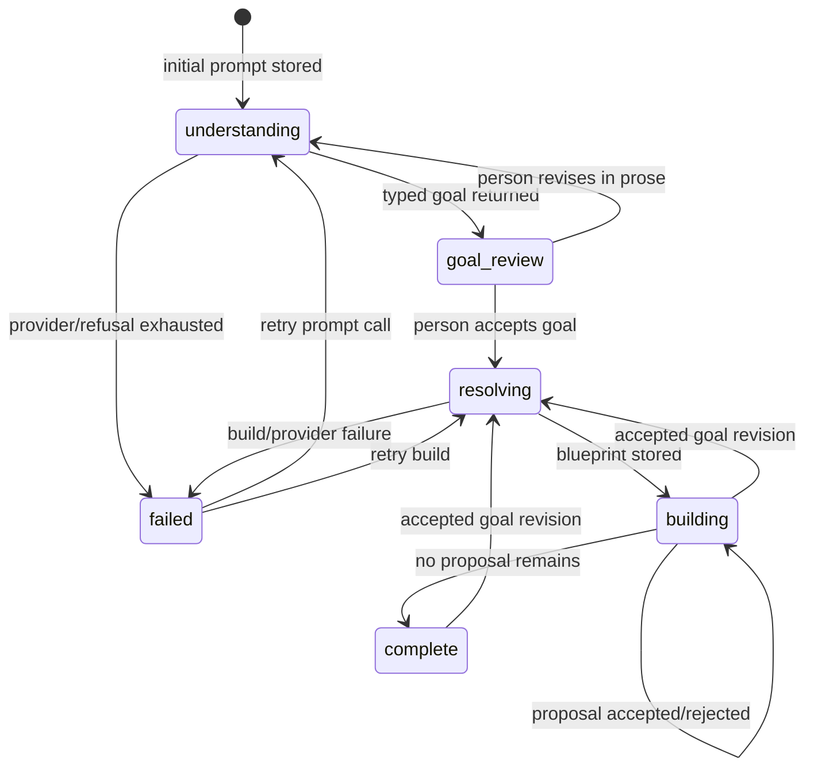

# The Living Pipeline — Conversational Build and Spawn MVP

> **For Claude:** REQUIRED DESIGN STEP: invoke Claude's `frontend-design` skill (called
> `frontend/design` in the earlier project plan) for Task 1. Produce and inspect the named
> artboards and interaction storyboard before changing production React. Then use an
> executing-plans workflow and implement one task at a time. Run the narrow check for each task
> before widening the suite. Do not grow the current `Builder.tsx` monolith and do not delete
> the working manual builder until the replacement has passed Task 14's browser walk.

**Date:** 2026-09-07

**Status:** proposed

**Goal:** Replace the builder's unwired one-shot Assistant placeholder with a durable,
continuous authoring conversation. A researcher describes what they have, what they want to do,
and what they want to obtain; Comeni restates the analysis, builds a typed pipeline visibly one
step at a time, offers real registry-backed choices, fills parameters transparently, and keeps
the canvas and `pipeline.yml` preview synchronized. The same engine supports **Build** (guided)
and **Spawn** (automatic) policies.

**Product phrase:** the draft is a **living pipeline**. The conversation, canvas, settings, and
YAML preview are views of one changing draft, not four competing representations.

**Architecture:** A model turns natural language into a typed `Goal` or a typed authoring intent.
The existing resolver—not the model—constructs the complete pipeline blueprint. An authoring
service converts that blueprint into ordered, typed proposals. Build waits for the person at
meaningful decisions; Spawn accepts every safe proposal and uses the declared tier-4 resolver
for the remaining closed choices. The browser owns proposal previews, optimistic reveal,
selection, layout transitions, and animation. The server owns model access, registry truth,
provenance, persistence, authoritative validation, and canonical YAML serialization.

**Primary path:** describe → confirm goal → resolve blueprint → reveal/choose modules → answer
open settings → review living pipeline → keep → gate → run.

**Tech stack:** Python 3.12, FastAPI, Pydantic, SQLAlchemy/Alembic, ARQ/Redis, `comeni-ai`, React
19, TanStack Query, the existing canvas primitives and product tokens, CSS/Web Animations API.
Do not add a frontend state library, animation library, or YAML library for this MVP.

---

## 0. Current reality and reuse map

The implementation agent should read these before editing:

- `CLAUDE.md`, especially the product claim, the three runtime AI points, invariant 6, and the
  current-state notes about the builder and input cardinality.
- `frontend/src/build/Builder.tsx`, `useBuilder.ts`, `useGraph.ts`, `usePipelineDraft.ts`,
  `Rail.tsx`, `Sources.tsx`, `Node.tsx`, `Wires.tsx`, `ArtifactView.tsx`, and `useKeep.ts`.
- `frontend/src/home/First.tsx`: the natural-language door is deliberately disabled today.
- `packages/mendel-api/src/mendel_api/routes/build.py` and `services/build.py`: `Goal` already
  resolves to a laid-out `BuiltPipeline`; `DraftGraph` already draws and validates.
- `packages/mendel-api/src/mendel_api/models.py`, `jobs.py`, `ai_worker.py`, and the Forge job
  services: these are the durable-state, queue, pending-turn, and invocation-audit precedents.
- `packages/comeni-core/src/comeni_core/goal/asked.py` and `goal/profile.py`: the typed boundary
  for what the user has, wants, and knows about the data.
- `packages/comeni-core/src/comeni_core/artifact/egress.py`: goal extraction is already pipeline
  egress door 1. Evolve that door deliberately; do not create a quiet sixth door.
- `packages/comeni-core/src/comeni_core/artifact/pipeline.py`: `AiPoint.PROMPT`, `TIER_4`, and
  `REPAIR` are the three runtime AI points. This plan does not add a fourth.
- `packages/mendel-resolver/src/mendel_resolver/ports.py`: `AmbiguityResolver` is the existing
  seam for tier-4 model choice.
- `packages/mendel-resolver/src/mendel_resolver/materialise.py`: drawn graphs are currently
  attributed wholesale via `by`. A mixed human/resolver/model session needs finer provenance.
- `packages/mendel-compiler/src/mendel_compiler/pipeline_file.py`: this is the only canonical
  YAML serializer. Reuse `dump`; never reproduce it in TypeScript.
- `packages/comeni-ai/src/comeni_ai/`: provider-neutral validated generation and conversation.
  The deprecated `packages/mendel-ai/` is a compatibility shim and must receive no new code.
- `docs/notes/journal/2026-09-01-the-fan-out-and-the-sheet.md`: in this repository “fan-out”
  already means that N sample items must produce N process invocations; it is not only graph
  branching.

What exists now:

| Existing seam | Reuse |
|---|---|
| `Goal -> orchestrate.build -> BuiltPipeline` | complete blueprint and authoritative reasons |
| `DraftGraph` plus `validate` and `draw` | editable working graph |
| compatibility index and candidate endpoint | local wire checks and real alternatives |
| `useGraph` | local graph operations; extract/reuse, do not fork its rules casually |
| server layout plus client-owned offsets | stable final coordinates and immediate gestures |
| ARQ AI queue | slow authoring/model work with visible pending state |
| `AiInvocation` | shared audit row; `agent="builder"` was anticipated by its design |
| `PromptTemplate`, `Client`, `choose_one`, `converse` | versioned prompts and validated replies |
| `Scope.SAMPLE`, `Scope.RUN`, `StepInput.gather` | collection flow and N→N/N→1 semantics |
| existing Run orchestration | keep → lint → run sheet → submit after authoring |

What is wrong with the present interaction:

- `Rail.Assistant` is static copy and explicitly says the result will never be chat.
- `First` shows the prompt but disables it.
- the manual builder surrounds the graph with implementation-oriented controls instead of
  guiding a researcher through the analysis.
- the graph shows one channel but does not explain “many items”, “once per sample”, or “collect
  all”; `PortView` even documents a doubled many-port encoding without carrying cardinality.
- `Builder.tsx` is already a large integration component. Adding a transcript, job lifecycle,
  proposal cards, and motion directly to it would make the feature unmaintainable.
- `DraftGraph` is saved as a whole and `ir_of(..., by=...)` attributes the whole drawing to one
  author. A living session can contain resolver decisions, model decisions, and later human
  changes in the same draft.

Build the new surface beside the old one, reuse its small primitives where they still fit, and
cut over only after a real browser walk.

---

## 1. Decisions Claude should not reopen during implementation

### 1.1 “Living pipeline” names one draft

Conversation, canvas, settings, validation, and YAML preview must all address the same draft id
and revision. A chat message must never hold a private graph that is later copied into the real
builder. A direct canvas edit must appear in the conversation as a compact receipt, and a choice
accepted in the conversation must appear on the canvas immediately.

The conversation is workflow history. `DraftGraph` remains the working pipeline shape.
`pipeline.yml` remains the durable artifact. Deleting or truncating chat history must not change
what a kept pipeline means.

### 1.2 Build and Spawn are policies over one proposal engine

Do not implement two builders.

| Behaviour | Build | Spawn |
|---|---|---|
| Goal summary | person confirms or edits | show and proceed when valid; pause only on material ambiguity |
| Resolver tiers 1–3 | reveal with reason; continue | accept automatically |
| Tier-4 closed choice | show candidates and wait | ask model through `AmbiguityResolver` |
| Missing candidate/model refusal | wait visibly for a person | also wait; never fabricate |
| Settings | reveal progressively | fill deterministic/model-safe values, leave human gaps |
| Result | `DraftGraph` | the same `DraftGraph` |

Mode is chosen when the session starts and recorded. An optional “finish automatically” action
may switch Build to Spawn only if Task 1's design makes it clear; do not make mode switching a
prerequisite for the MVP.

### 1.3 The model never authors YAML, graph JSON, UI markup, or compatibility

The model may return only declared Pydantic response shapes:

- an understood `Goal` plus a short summary and typed open questions;
- one of a closed set of authoring intents;
- a choice from candidate ids supplied by the server;
- a bounded explanation referring to known step/question ids;
- a proposed goal or setting revision that still requires validation and, when consequential,
  explicit acceptance.

It must never return `DraftGraph`, `Pipeline`, YAML, React/HTML, coordinates, arbitrary API
calls, or invented module alternatives. The registry and resolver already own those answers.

### 1.4 Resolve the whole blueprint, reveal it incrementally

After goal confirmation, resolve the complete pipeline once. Store the resulting pipeline and
registry digest as the session blueprint. Order proposals deterministically by the existing
layout's `(rank, order, id)` or an equivalent topological order.

The complete blueprint solves two problems:

1. Each “next module” is selected with downstream compatibility already known; the agent does
   not make locally plausible choices that later dead-end.
2. The browser knows each proposed node's final target position before reveal, so nodes can
   materialize and wires can grow without the graph jumping after every response.

Build still presents one module at a time. Keeping the blueprint private in session state is not
the same as spawning it into the draft.

### 1.5 Client owns immediacy; server owns authority

Client-side:

- render the transcript and typed blocks;
- preview a candidate as a ghost node on hover **and keyboard focus**;
- optimistically reveal an accepted proposal;
- animate nodes, wires, parameters, collection markers, and YAML highlights;
- keep selection synchronized between chat and canvas;
- use the cached compatibility index for drag/hover feedback;
- pan, zoom, move nodes, edit fields, and maintain transient UI state;
- reconcile an optimistic state with the authoritative response.

Server-side:

- model/provider calls and prompt history bounds;
- registry lookup, resolution, candidates, and compatibility truth;
- stamping who made each decision;
- session, turn, proposal, and draft persistence;
- revision checks and stale-proposal refusal;
- authoritative validation and canonical `pipeline_file.dump` output.

Do not add WebSockets or token streaming for the MVP. POST a turn, render it immediately as
pending, enqueue it on the existing AI queue, and poll only while work is pending. The Forge
already proves that lifecycle.

### 1.6 Linear-first is a UI scope, not a destructive graph restriction

Optimize Task 1 and the MVP walkthrough for a primary left-to-right analysis chain. Do not build
branch creation, branch labels, conditionals, loops, or branch rejoining controls now.

Do not make existing DAGs invalid and do not delete the existing wire model. If a resolver
blueprint contains an auxiliary branch, lay it out with the existing engine and render it with
neutral wires. The guided conversation may describe the primary chain first and auxiliary steps
afterward. General branch authoring is a later design problem.

### 1.7 Many files are a collection, not many graph nodes

The MVP visual grammar must cover:

- **1→1:** one run-scoped value, such as a reference;
- **N→N:** a sample/item-scoped channel processed once per item;
- **N→1:** a gathering input such as MultiQC collecting all reports.

Render one logical channel with `×N`, `many items`, or a known safe count—not N copies of the
node or N parallel wires. If `measurement.n_samples` is present, the UI may say `×12 samples`.
Otherwise say `×N items`; do not invent a file or sample count. Actual filenames and sample ids
remain run-time data and must not enter Mendel merely to decorate the canvas.

The input grouping question is part of goal understanding: “24 files” may mean 24 independent
items, 12 paired samples, several lanes per sample, or one combined dataset. Do not infer one
silently.

### 1.8 Provenance is per decision, not per session

A resolver-settled step must keep its original tier and reason merely because Build paused to
explain it. A person choosing a different candidate becomes the human author of that choice. A
tier-4 choice made in Spawn records the configured model id. A later manual edit must not relabel
the untouched rest of a spawned pipeline as human.

Add a server-owned provenance sidecar to `PipelineDraft`; do **not** accept it in `DraftIn`.
Define a closed Pydantic shape under `comeni_core.plan` that can retain, by node/setting/channel
key, the original `Why` and any `DecisionRecord` needed to materialize the accepted choice.
`PipelineDraft` stores its JSON dump. `drafts.update` diffs the old and new graph: unchanged
items retain provenance, changed/new items are stamped human by the server, and removed items
lose their sidecar entry. Authoring-service commits stamp resolver/model/human origins directly.

Extend `materialise.ir_of` to accept this optional sidecar. `None` must preserve today's manual
builder behaviour byte for byte. Never put trusted provenance fields into browser-writable
`DraftGraph` merely because that is the easiest payload to send.

### 1.9 An authored draft retains the confirmed Goal

Add a nullable, server-owned `goal` JSON column to `PipelineDraft`. A conversational draft uses
the confirmed `Goal`; an old/manual draft with no stored goal continues to use `goal_of(graph)`.
This prevents the incremental graph from replacing the researcher's requested constraints with
the narrower goal derivable from whichever nodes happen to be visible at that moment.

### 1.10 YAML grows as a projection, never as appended model text

Add a read-only preview service that materializes the current draft in memory and returns
`pipeline_file.dump(pipeline)` without writing an artifact. The client may diff successive text
and animate changed lines or sections. The final Keep action still validates, writes, reads back,
and stages modules through the existing compiler path.

For an unchanged draft revision, preview bytes before Keep and artifact bytes after Keep must be
identical except for fields that Keep intentionally stamps. Put that relationship in a test.

### 1.11 Motion follows domain events

Animate `proposal_shown`, `proposal_accepted`, `edge_committed`, `parameter_committed`,
`proposal_rejected`, and `validation_changed`. Do not animate arbitrary fetch completion or model
tokens. Provide `prefers-reduced-motion` behaviour from the first animation task. Use CSS
transitions/keyframes or the Web Animations API; do not add an animation dependency unless the
design checkpoint demonstrates a concrete missing capability and records the reason.

---

## 2. Authoring state and protocol

Use closed enums and discriminated Pydantic unions. Names may be adjusted to existing style, but
the protocol must express these states rather than infer them from absent fields.



Suggested durable records:

| Record | Owns |
|---|---|
| `PipelineAuthoringSession` | draft id, mode, phase, confirmed goal, blueprint, registry digest, cursor, row version, timestamps |
| `PipelineAuthoringTurn` | ordered user/assistant content, pending/answered/failed state, base revision, invocation id, timestamp |
| `PipelineAuthoringProposal` | discriminated proposal payload, pending/accepted/rejected/stale state, chosen option, actor, draft revision |

One session has at most one pending mutation proposal in the MVP. Explanatory assistant turns do
not need a proposal. Every mutating request carries `expected_revision`; a stale acceptance
returns a coded conflict and changes nothing.

Suggested frontend/server blocks:

```text
narrative        bounded prose, optionally referring to known step ids
goal_summary     typed Goal plus plain-language have/do/get summary
question         one typed question with closed options or a declared open value
step_proposal    process, contract, ports, reason, tier, alternatives
setting_request  setting, current value, domain, reason and premise
change_set       exact nodes/settings affected by a conversational revision
receipt          immutable account of a committed direct or conversational edit
notice           pending, refusal, stale, validation or completion state
```

Every interactive block has a stable id. Every option has a stable id. The browser posts ids and
the expected revision, not a copied contract object. Render blocks with an exhaustive TypeScript
switch so a new backend kind fails typechecking until it has a UI.

Bound conversation context. Follow the Forge precedent (`CHAT_TAIL = 6`) unless evaluation shows
a different number is needed. Ground every authoring call on the confirmed goal, current known
step ids/contracts, current pending options, registry digest, and bounded tail—not on the
transcript alone. Exclude draft labels, filenames, paths, tool output, and run data.

---

## 3. File structure

Expected new backend files:

| Path | Responsibility |
|---|---|
| `packages/mendel-api/src/mendel_api/authoring/types.py` | modes, phases, block/proposal/response schemas |
| `packages/mendel-api/src/mendel_api/authoring/prompts.py` | committed prompt ids and loader |
| `packages/mendel-api/src/mendel_api/authoring/prompts/builder.goal.v1.md` | prose → typed goal |
| `packages/mendel-api/src/mendel_api/authoring/prompts/builder.chat.v1.md` | follow-up → typed authoring intent |
| `packages/mendel-api/src/mendel_api/authoring/state.py` | pure session/proposal transitions |
| `packages/mendel-api/src/mendel_api/services/authoring.py` | persistence, blueprint ordering, proposal commits |
| `packages/mendel-api/src/mendel_api/services/authoring_ai.py` | context, model calls, admission, invocation audit |
| `packages/mendel-api/src/mendel_api/routes/authoring.py` | HTTP transport only |
| `packages/mendel-api/migrations/versions/<revision>_living_pipeline.py` | sessions, turns, proposals, draft columns |

Expected new frontend files should live under `frontend/src/build/living/`, not at another
top-level route and not inside the existing `Builder.tsx`:

| Path | Responsibility |
|---|---|
| `LivingBuilder.tsx` | small screen composition only |
| `useAuthoringSession.ts` | queries, pending polling, mutations and reconciliation |
| `authoringReducer.ts` | transient client state and optimistic reveal |
| `Conversation.tsx` | transcript and composer |
| `blocks/*.tsx` | one renderer per discriminated block kind |
| `LivingCanvas.tsx` | accepted, proposed and selected pipeline views |
| `CollectionChannel.tsx` | 1→1, N→N and N→1 visual grammar |
| `motion.ts` | event-to-animation policy and reduced-motion helper |
| `ArtifactPreview.tsx` | canonical text plus client-side changed-line emphasis |

The design skill may improve these component boundaries. Keep the ownership boundaries even if
the filenames change.

Expected modified seams:

- `comeni_core.plan.draft`, `artifact.egress`, and the egress guards;
- `mendel_resolver.materialise.ir_of`;
- `mendel_api.models`, migrations, `jobs`, `ai_worker`, `main`, draft service/routes, build view;
- generated `frontend/src/api/schema.d.ts` via `make client`, never by hand;
- `frontend/src/api/types.ts`, home prompt, router, and the existing builder cutover seam;
- handbook pages and a dated journal entry only after the live walkthrough.

---

## Task 1 — Design the living pipeline with Claude's design skill

**Required skill:** Invoke Claude's `frontend-design` skill (`frontend/design` in the prior
plan). State in the implementation transcript that the skill is being used. This is an explicit
deliverable, not advice.

**Read first:** `frontend/src/tokens.css`, `main.css`, current build components, the builder
handbook page, and the 2026-08-29/30 builder design journal entries. Preserve the product's visual
identity, but do not preserve the current builder's information architecture merely because it
exists.

**Create:** a source-controlled `.design/living-pipeline/` package with a README naming the
artboards, their dimensions, interaction states, and the exact command used to render them.
Follow the existing `.design` convention: source, not screenshots alone.

- [x] Design a desktop Build state with the living canvas and conversation as the two primary
  surfaces; inspection, problems, browsing, and YAML are contextual surfaces.
- [x] Design the opening composer with a clear Build/Spawn choice.
- [x] Design goal summary, edit, ambiguous grouping question, module proposal, alternatives,
  parameter question, pending model, refusal, validation finding, completion, and stale proposal.
- [x] Design hover **and focus** preview of an alternative as a ghost node/substitution.
- [x] Design Spawn's rapid staged reveal without pretending each automatic choice was human.
- [x] Design collection flow for `×N items`, `×12 samples`, `once per item`, and `collect all`.
- [x] Design widths near 1440, 1180, 900, and a narrow stacked layout. No essential operation
  may require hover or a desktop pointer.
- [x] Design reduced-motion equivalents for every animation-bearing state.
- [x] Put difficult content in the artboards: long contract ids, four ports, long reasons, a
  failed model turn, and 15 modules. A design that works only on five short boxes is not done.
- [x] Open the rendered artboards side by side and record the comparison in the design README.
  Do not approve a design by reading its HTML or source.

**Checkpoint:** no production React changes before the artboards and interaction storyboard are
inspectable. The design should explicitly label what is MVP and what is deferred branching.

### Execution record — 2026-09-07

`frontend-design` was invoked and followed. Nothing under `frontend/` was touched.

**Delivered:** [`.design/living-pipeline/`](../../../.design/living-pipeline/) — eleven
artboards at 1400×880 generated from one fixture by `build_living.py`, a shared `_lhead.html`,
`canvas.living.json` with twelve notes arguing the decisions, and a README carrying the design
plan and the board-by-board comparison record. Registered in `.design/README.md` and
`.gitignore`.

| Step | Carried out as written? | Deviation |
|---|---|---|
| desktop Build state | yes | `LivingBuild` |
| opening composer, Build/Spawn | yes | `LivingOpen` |
| the eleven interaction states | yes, plus one board | *completion* had no home until `LivingDone` was added, which also draws the artifact/YAML surface the first ten boards omitted |
| hover **and** focus preview | yes | `LivingChoose` draws both, with the same ghost |
| Spawn's staged reveal | yes | `LivingSpawn` |
| collection flow | yes | `LivingCollect` — this is the board that needed the most iteration |
| 1440 / 1180 / 900 / narrow | **deviated** | authored at **1400**, matching the twenty-four existing artboards and `_prev.py`'s default, rather than the plan's 1440. The breakpoints are 1180 and **1000** — a third one, argued in `LivingQuiet` and the README |
| reduced motion | yes | `LivingQuiet`, and no new movement was added: six domain events map onto the five existing ones |
| difficult content | yes | `LivingDense` — fifteen steps, a 52-character contract id, a five-port signature |
| open them side by side | yes | the README's comparison table is the record. Twenty defects, none visible in the HTML |

**Three things a reader of the plan should know before Task 2:**

1. **`impl-settled`'s *no prompt box on the populated page* was examined and not overturned.**
   The rail is not a creation affordance; it is the pipeline's provenance record made
   navigable, and it appears on an authoring session only. The argument is in
   `canvas.living.json`'s `n-settled` note and the README.
2. **Two encodings are proposed that the product does not have**, both extensions of a language
   it does: *author is drawn as stroke while tier stays colour*, and *collection is drawn on the
   wire*. `tokens.css` is unchanged and no hue was added.
3. **The canvas is not where a large pipeline is read.** `LivingDense` took three attempts and
   the finding is that beyond about six steps you pan, and the transcript carries the whole. That
   is the strongest argument for the collapsed decision row, and it should shape Task 9 and
   Task 10.

**Two additions outside `.design/living-pipeline/`:** `_prev.py` gained a `--dir` flag (the
boards live in a subdirectory) and the shared head carries the breakpoints, so `--width 900`
renders the stacked layout rather than a squeezed 1400. Without that the narrow pass was
meaningless, which is how the first nine boards passed it.

---

## Task 2 — Define the typed authoring protocol and egress boundary

**Files:** create `authoring/types.py`; modify `artifact/egress.py`; add focused schema and guard
tests.

- [ ] Write failing tests for every block discriminator, proposal state, phase transition input,
  extra-field refusal, bounded prose, stable ids, and mutually exclusive reply fields.
- [ ] Define `Build` and `Spawn` as a closed enum and define the session, turn, proposal, and
  response DTOs.
- [ ] Define separate model-response shapes for initial goal understanding and follow-up intent.
  Keep the JSON schema shallow enough for the local model; prefer one object with validated
  exclusive fields over a deeply nested union if recorded evaluation proves it follows better.
- [ ] Evolve pipeline egress door 1 from a bare initial prompt into a declared authoring request
  that can carry the bounded tail, current `Goal`, known steps, and offered option ids safely.
  Keep it one pipeline door and keep `AiPoint.PROMPT`; update their prose to match reality.
- [ ] Add each genuinely new free-text field to `tests/guards/test_egress.py` explicitly. Do not
  weaken the recursive allowlist or smuggle a serialized graph through one `Text` field.
- [ ] Add a test that draft labels, paths, run inputs, samplesheet rows, and tool output are not
  reachable from the authoring request.
- [ ] Run `uv run pytest tests/guards/test_egress.py packages/mendel-api/tests/test_authoring_types.py -v`.

**Checkpoint:** an authoring request and reply can be explained field by field; neither can carry
YAML, a graph, arbitrary API verbs, or untyped context.

---

## Task 3 — Persist sessions without making the database the pipeline

**Files:** modify `models.py`; add one Alembic migration; create `authoring/state.py` and
`services/authoring.py`; update model, migration, and fixture cleanup tests.

- [ ] Write the migration/model tests first. The offline Alembic comparison must fail before the
  migration exists.
- [ ] Add the three authoring workflow tables described in §2 with RESTRICT foreign keys and no
  cascade. Add a unique one-session-per-draft constraint if the design does not support several.
- [ ] Add `goal`, provenance sidecar, and integer revision columns to `pipeline_draft`. Backfill
  old rows as `goal = null`, empty provenance, revision 0; those rows must still open and keep.
- [ ] Explain each table in its model docstring using the repository's test: deleting authoring
  history must not change a build, while deleting the pipeline draft still removes the working
  copy. Do not store contracts, types, credentials, provider errors, or runtime sample data.
- [ ] Implement the pure state machine and compare-and-swap transitions. A stale proposal becomes
  `stale` or returns a coded conflict; it never applies to a newer draft.
- [ ] Make turn order explicit and stable. A user turn appears immediately; its assistant turn
  can be pending, answered, or failed.
- [ ] Add service tests for reload, retry, duplicate delivery, two-tab stale acceptance, and a
  session whose model call finishes after the draft changed.
- [ ] Update exact-table guards deliberately and run:
  `uv run pytest packages/mendel-api/tests/test_models.py packages/mendel-api/tests/test_migrations.py packages/mendel-api/tests/test_authoring_state.py -v`.

**Checkpoint:** restart the API between creating a session and reading it; the transcript,
pending proposal, confirmed goal, draft, and revision all return unchanged.

---

## Task 4 — Preserve mixed decision provenance

**Files:** modify `comeni_core.plan.draft`, `mendel_resolver.materialise`, draft services/routes,
and their tests.

- [ ] Write a failing test containing three nodes: one resolver-settled, one model-selected, and
  one later replaced by a person. Keep it and assert all three sources, ids, tiers, and reasons
  in `pipeline.yml`.
- [ ] Define the server-owned provenance sidecar from §1.8. Prefer closed lists keyed by declared
  `NodeId`/`DecisionKey` over free-form mappings. Keep it separate from browser-writable graph
  data.
- [ ] Teach `ir_of` to reuse accepted selection/presence/setting provenance when supplied and to
  retain today's all-human semantics when it is absent.
- [ ] Teach draft creation/update to preserve unchanged sidecar entries and stamp changed graph
  choices as human. Test node replacement, parameter edit/clear, channel scope edit, deletion,
  and a pure position move—which must change no pipeline provenance.
- [ ] Use a stored confirmed goal when present; preserve `goal_of(graph)` for old/manual drafts.
- [ ] Remove the whole-draft `by` shortcut only when every caller has moved; until then retain a
  compatibility wrapper and prove it produces the old bytes.
- [ ] Run the materialisation, artifact, draft service, and provenance tests before broader API
  work.

**Checkpoint:** editing one setting in a spawned draft changes the author of that setting only.
Untouched steps remain attributed to the resolver/model that actually chose them.

---

## Task 5 — Implement versioned goal and authoring prompts

**Files:** add the authoring prompt package, prompt files, `services/authoring_ai.py`, fixtures,
and prompt/response tests. Add `comeni-ai` as an explicit `mendel-api` dependency; do not import
from deprecated `mendel_ai`.

- [ ] Write `builder.goal.v1`: convert the user's have/do/get language into a typed `Goal`, a
  concise summary, and only questions whose answers can change the pipeline. Include declared
  type and measurement vocabulary; reject invented ids during admission.
- [ ] Make file grouping explicit in the prompt. “Many FASTA/FASTQ files” must produce either a
  safe typed interpretation or a grouping question, never an assumed sample structure.
- [ ] Write `builder.chat.v1`: return explanation, goal revision, option selection, setting
  proposal, continue, or unsupported. No generic mutation command and no arbitrary tool id.
- [ ] Ground the prompt on the declared authoring request and bounded tail. Model explanations
  must refer to known step/question ids; reject invented references.
- [ ] Use `Client.respond`/`converse` and record prompt id, digest, model, provider, timing, token
  counts, state, and safe failure code in `AiInvocation` with `agent="builder"`.
- [ ] Add recorded/fake transport cases for paired RNA-seq counts, many independent FASTA items,
  paired-file ambiguity, a goal correction, “why STAR?”, selecting an offered alternative, an
  invented option, invalid JSON, provider failure, and no configured model.
- [ ] Assert prompt templates ship in the built wheel and are immutable by version: behavioural
  changes add `v2`, never edit a prompt already cited by an invocation.
- [ ] Run the authoring AI tests without a live provider.

**Checkpoint:** the recorded cases either return an admitted typed reply or a visible coded
refusal. No test reaches the network.

---

## Task 6 — Add the tier-4 model adapter and blueprint engine

**Files:** add a builder-owned `AmbiguityResolver`; extend authoring service and build view tests.

- [ ] Implement the adapter through the existing `AmbiguityRequest` door and `choose_one`. It can
  choose only an offered candidate and returns `Resolution` with model id, reason, confidence,
  and `ValueSource.MODEL`.
- [ ] Build mode resolves with the flag-only path so tier-4 questions remain visible. Spawn mode
  resolves with the model adapter. A declined/no-candidate ambiguity remains open in both modes.
- [ ] Store the complete resolved `Pipeline`, registry digest, and proposal order as the session
  blueprint. Do not ask the model to enumerate modules after the resolver already did.
- [ ] Convert the blueprint to step proposals in deterministic layout/topological order. Include
  incoming edges only when both endpoint steps have been accepted.
- [ ] Populate alternatives from the resolver's decision candidates and existing candidate
  service. Never ask the model to invent a plausible alternative list.
- [ ] On accept, commit the step/edge/settings into the session's draft and provenance sidecar in
  one transaction. Return the new revision and next proposal.
- [ ] A resolver-settled proposal acknowledged unchanged retains its resolver provenance. A
  person choosing a tier-4/default or alternative option records a human decision. Spawn's
  model-selected tier-4 choice records the model.
- [ ] Detect a changed registry digest before applying a stored proposal. Mark it stale and
  re-resolve rather than applying an option against a registry that no longer supplied it.
- [ ] Test a one-step pipeline, the RNA-seq example, N→N flow, an N→1 gatherer, a branched
  blueprint rendered in deterministic order, and a model refusal.

**Checkpoint:** identical goal + registry + policy produces identical blueprint/proposal order.
No per-module model calls occur for tiers 1–3.

---

## Task 7 — Expose the authoring API and queue lifecycle

**Files:** create `routes/authoring.py`; modify `main.py`, `jobs.py`, `ai_worker.py`; add route,
OpenAPI, worker, and health tests.

Minimum surface:

```text
POST /api/pipeline/authoring
GET  /api/pipeline/authoring/{session_id}
POST /api/pipeline/authoring/{session_id}/messages
POST /api/pipeline/authoring/{session_id}/proposals/{proposal_id}/decide
POST /api/pipeline/authoring/{session_id}/retry
GET  /api/pipeline/authoring/{session_id}/preview
```

Exact paths may follow existing router style, but every operation needs a stable `operationId`.

- [ ] Create an empty draft and authoring session together, store the initial user turn, enqueue
  one AI job with a semantic id, and return 201 with the visible pending state.
- [ ] Post follow-up turns as 202. Use `jobs.job_id_for("builder", "turn", session, turn)` so
  at-least-once delivery cannot produce two answers.
- [ ] Add the authoring job to the AI worker allowlist and keep it off the ordinary worker.
- [ ] Let deterministic proposal acceptance remain a normal request; do not put a button click
  behind the slow queue.
- [ ] Polling GET returns the whole authoritative session view needed to restore the page. Bound
  pagination only if the transcript evaluation actually needs it; do not truncate history on
  screen merely because model context is bounded.
- [ ] Return visible no-model, refused, failed, stale, and retry states. Do not log or return raw
  provider errors.
- [ ] Extend AI health only if the existing endpoint cannot explain why Build/Spawn is disabled.
- [ ] Regenerate the client with `make client`; never hand-edit `schema.d.ts`.
- [ ] Run route/worker/OpenAPI tests and `git diff --exit-code frontend/src/api/schema.d.ts`
  only after the generated file has intentionally been reviewed and staged in the change.

**Checkpoint:** submit a turn with a fake queued job, reload immediately, observe pending, run the
job, reload, and observe the admitted assistant blocks exactly once.

---

## Task 8 — Build the client-side session controller

**Files:** create `frontend/src/build/living/useAuthoringSession.ts`, `authoringReducer.ts`, and
focused tests; extend the generated-type seam in `frontend/src/api/types.ts`.

- [ ] Model transient states explicitly: server snapshot, optimistic proposal acceptance,
  previewed option, selected step, animation event queue, composer text, and reconciliation.
- [ ] Keep server data in TanStack Query and interaction state in a reducer. Do not mirror the
  entire query response into ad-hoc `useState` fields.
- [ ] Poll only while the session or newest turn is pending. Stop on answer, refusal, failure, or
  unmount.
- [ ] Apply an accepted proposal optimistically from the already received typed payload. Disable
  only that proposal while its request is in flight; the canvas remains inspectable.
- [ ] Reconcile by proposal id and revision. On a stale/conflicting response, discard the
  optimistic event and show the server notice; never silently overwrite newer work.
- [ ] Reuse or extract `useGraph` operations for direct editing after the guided build. Do not
  maintain separate graph mutation rules for “chat graph” and “manual graph”.
- [ ] Do not persist prompt/transcript content to `localStorage`. Durable state already lives on
  the server; transient drafts in the composer may use component state.
- [ ] Test reducer transitions with plain objects and fake timers before component tests.

**Checkpoint:** reducer tests reconstruct the same visible graph from a fresh server snapshot as
from the optimistic event sequence that produced it.

---

## Task 9 — Implement the designed living-builder shell

**Required:** use Task 1's approved design outputs. If implementation reveals a missing state,
return to the design skill and add the state to the artboards before improvising it in React.

**Files:** create the small components under `frontend/src/build/living/`; temporarily expose the
new surface at a development-only/secondary route while the current `/build` remains intact.

- [ ] Compose two primary surfaces: living canvas and conversation. Do not recreate the current
  stack of permanent palette, tabs, inspector, problems, and artifact chrome.
- [ ] Keep pipeline name, save/validation state, Build/Spawn identity, and Run discoverable
  without competing with the conversation.
- [ ] Make module browsing, technical step inspection, validation findings, and YAML contextual
  drawers/overlays as established by the artboards.
- [ ] Split block renderers and canvas primitives from orchestration. `LivingBuilder.tsx` should
  wire state and callbacks, not contain every card and SVG path.
- [ ] Reuse product tokens and fonts. Add semantic motion/collection tokens only when repeated;
  do not introduce a second color system.
- [ ] Add component tests for shell regions, pending/restored/error states, drawer focus return,
  narrow stacking, and no-JavaScript-layout assumptions.
- [ ] Render the implementation and Task 1 artboard side by side at every designed width. Record
  mismatches before fixing them; source reading is not visual verification.

**Checkpoint:** a static fake session containing every block state is readable and operable before
the live API is connected.

---

## Task 10 — Implement conversational cards and bidirectional selection

**Files:** block components, `Conversation.tsx`, composer, and integration tests.

- [ ] Render the initial have/do/get summary as an editable typed goal card. Editing structured
  fields does not need another model call; a new prose interpretation does.
- [ ] Render one module proposal with what it does, why it is present, its input/output types,
  provenance tier, and real options. The recommended option must be explicit.
- [ ] Make option hover and keyboard focus preview the candidate on the canvas without mutating
  the draft. Touch users get an explicit Preview action or the same information expanded.
- [ ] Render parameter choices using their declared domains; open-domain values use the existing
  guarded value types and server validation.
- [ ] Require a confirmation card for a model-parsed change set that removes/replaces several
  nodes. Show the exact affected steps before Apply.
- [ ] A direct canvas/settings edit appends a compact deterministic receipt; do not call the
  model to narrate a fact the client already knows.
- [ ] Selecting a chat card focuses/highlights its graph object. Selecting a node reveals its
  relevant decision card or inspector without losing transcript position.
- [ ] Follow-up messages appear immediately and show queued/working/refused states. Enter sends;
  Shift+Enter inserts a line break. One pending model turn per session is sufficient for MVP.
- [ ] Test keyboard-only operation and screen-reader names for every choice; hover is enrichment,
  never the only route.

**Checkpoint:** complete a fake guided pipeline using only the keyboard and then using a touch-like
pointer with no hover.

---

## Task 11 — Animate the canvas and show collection flow

**Files:** `LivingCanvas.tsx`, `CollectionChannel.tsx`, `motion.ts`, relevant build view DTOs and
tests.

- [ ] Extend `ChannelView` with its materialized `scope` and extend `PortView` with whether the
  input gathers many. Read these from `Pipeline.channels` and `Step.inputs`; do not re-derive
  them from type names in React.
- [ ] Add a safe multiplicity view: known scalar `n_samples` may become `×12 samples`; otherwise
  sample/item scope becomes `×N items`. Never send or display filenames from Mendel.
- [ ] Render one collection channel, not repeated wires. Label N→N as `once per item` and N→1 as
  `collect all` in the expanded/selected view established by the design.
- [ ] Reveal a pending proposal as a clearly provisional ghost. Acceptance settles the node;
  rejection withdraws it; neither state may look committed before the server agrees.
- [ ] Draw committed edges when both endpoints are accepted. Use SVG stroke reveal or an
  equivalent native animation tied to `edge_committed`.
- [ ] Animate parameter commitment and changed YAML sections without moving unrelated objects.
  Preserve object permanence during replacement.
- [ ] Use blueprint target coordinates for staged reveal. Continue to let the client own manual
  offsets after a drag and retain the existing Tidy/server-layout escape hatch.
- [ ] Implement `prefers-reduced-motion`: state changes remain visible through immediate placement
  and highlighting, with no spatial travel.
- [ ] Test event classes/order and reduced-motion behaviour. Do not pretend jsdom pixel assertions
  replace the Task 14 browser checkpoint.

**Checkpoint:** demonstrate 1→1, N→N, and N→1 in the browser. The N→N example must show several
items flowing through one logical linear pipeline, not several branches.

---

## Task 12 — Implement Spawn through the same engine

**Files:** authoring policy service, mode controls, session controller, and end-to-end fake-model
tests.

- [ ] Make the opening mode choice set only the session policy; it must not select a different
  route, graph type, YAML writer, or component tree.
- [ ] In Spawn, automatically accept resolver-settled proposals and model-admitted tier-4 closed
  choices in one server transaction or an idempotent sequence. Keep every proposal/decision in
  history so the completed result is explainable.
- [ ] Stop on a missing candidate, unsupported open value, model refusal, stale registry, or
  illegal graph. Present the same actionable card Build would have presented.
- [ ] On first arrival, replay the accepted proposal event sequence as a short staged reveal.
  Cap total duration and group bursts for a long pipeline. On reload, show the completed graph
  immediately; do not replay a ten-second animation every time. Store only the last-seen event
  sequence number in `sessionStorage`, never transcript content.
- [ ] Keep model provenance on model choices and resolver provenance on deterministic choices.
  “Spawn” is not permission to label the whole graph AI-authored.
- [ ] Test that Build and Spawn over an all-deterministic goal end at equal `DraftGraph` and YAML,
  while their interaction histories differ. Add a tier-4 case proving author provenance differs
  only at the actual model decision.

**Checkpoint:** Build and Spawn converge on one artifact for the RNA-seq fixture; Spawn merely
traverses the proposal policy automatically.

---

## Task 13 — Add canonical YAML preview and reconnect Keep/Run

**Files:** authoring preview service/route, `ArtifactPreview.tsx`, existing Keep/Run integration,
and tests.

- [ ] Materialize current graph + confirmed goal + provenance sidecar in memory and return
  canonical `pipeline_file.dump` text with the draft revision. An empty/illegal partial graph
  returns a declared unavailable/finding state, not fake YAML.
- [ ] Debounce preview refresh after accepted commands and field edits. Do not request it per
  animation frame or keystroke.
- [ ] Diff old/new text in the browser only for presentation. Highlight inserted/changed lines
  or sections, then settle to ordinary artifact text. The server remains the serializer.
- [ ] Distinguish preview from kept artifact clearly. Previewing must not set `DraftRow.kept`,
  write files, stage modules, or make a gate available.
- [ ] Make the living session reuse its existing draft id. Do not let `useKeep` create a second
  draft because its local ref did not know the session already owns one.
- [ ] Keep the existing Run sequence: save/keep, lint, run sheet, submit. Show open human
  decisions before the run sheet and preserve coded refusals.
- [ ] Test preview purity, preview/Keep byte relationship, no duplicate draft, artifact reload,
  and Run against a completed authored draft.

**Checkpoint:** watch modules and parameters appear in YAML during authoring, then Keep and confirm
the artifact view shows the same pipeline without a second implementation having serialized it.

---

## Task 14 — Cut over, walk the real loop, and update documentation

**Files:** `First.tsx`, router/current builder seam, tests, handbook pages, `CLAUDE.md` current
state, and a dated journal entry.

- [ ] Enable the home prompt and Build/Spawn choice. No live-looking control may lead nowhere;
  when no model is configured, state that plainly and preserve a route to manual building.
- [ ] Make `/build?session=<id>` restore the living session and `/build?draft=<id>` open an
  existing draft. Decide through Task 1's design whether an old draft opens directly in the
  living shell or its manual editing state; do not silently open the RNA-seq example instead.
- [ ] Preserve direct module browsing, settings, swapping, validation, artifact, and Run actions
  that still matter. Remove the old `Rail.Assistant` contradiction only when the new path is
  reachable.
- [ ] Keep the old builder mountable during the walk. Delete or archive it in a separate cleanup
  change after requirements have migrated to tests; do not erase `Restored.test.tsx` assertions
  just because their old components moved.
- [ ] Run focused Python tests, frontend Vitest, `make client`, TypeScript, lint, `make check`,
  `make guards`, and `make verify` in that order. Fix the narrowest failure first.
- [ ] Bring up the real stack. Remember that backend source is baked into the image; rebuild the
  API/AI worker after backend changes.
- [ ] With a configured local or hosted model, walk at least:
  1. Build: paired-end RNA-seq → gene counts;
  2. Spawn: the same request;
  3. many FASTA/FASTQ items with an ambiguous grouping answer;
  4. one alternative module selection;
  5. one parameter correction;
  6. one follow-up “why?” question;
  7. reload while a turn is pending;
  8. model refusal/no-model state;
  9. Keep → lint → run sheet on the completed draft.
- [ ] Put the implementation and design artboards side by side at the designed widths. Exercise
  reduced motion, keyboard-only, touch-like input, long content, and a 15-module graph.
- [ ] Confirm through logs/audit rows that only declared AI calls occurred and through the final
  artifact that resolver/model/human provenance is per decision.
- [ ] Update `docs/handbook/your-first-pipeline.md`, `builder.md`, `product-loop.md`, and
  `core-words.md` from observed behaviour. Remove alpha statements that are no longer true; do
  not document proposed controls as shipped before the walk.
- [ ] Write a dated journal/handoff entry naming what was exercised, what failed outside tests,
  what remains deferred, and the real model used. Update `CLAUDE.md`'s current-state pointer in
  the same change.

**Final checkpoint:** a new browser session can describe, confirm, visibly build, revise, keep,
and begin running a living pipeline. Build and Spawn share one draft/proposal engine, collections
read as collections, and the final artifact explains every decision without requiring the chat
transcript.

---

## 4. Explicit non-goals for this MVP

- arbitrary branch creation, branch conditions, loops, scatter syntax, or branch rejoining UI;
- one canvas node per input file or sample;
- sending filenames, sample identifiers, samplesheet rows, or patient data to Mendel/model;
- model-generated YAML, Nextflow, `DraftGraph`, coordinates, React, or API verb sequences;
- token-by-token streaming, WebSockets, collaborative cursors, or simultaneous multi-user chat;
- a general plugin/tool-calling agent framework;
- replacing the registry, resolver, compatibility index, compiler, or canonical artifact writer;
- a second frontend state management library or animation dependency;
- redesigning the Forge or Runs surfaces;
- deleting the manual builder in the same change that first makes the living builder work.

## 5. Completion criteria

This plan is complete only when all are true:

1. The initial prose is stored, queued, and admitted as a typed goal with visible failure states.
2. The researcher confirms a plain-language have/do/get summary before construction.
3. Build reveals modules in stable order with reasons and registry-backed alternatives.
4. Spawn uses the same engine and stops honestly when automatic policy cannot decide.
5. Conversation and canvas edits converge on one revisioned `DraftGraph`.
6. Resolver, model, and human provenance survive together into `pipeline.yml` accurately.
7. Many files/samples render as one collection channel with N→N or N→1 behaviour.
8. Node, wire, setting, and YAML changes animate from domain events and respect reduced motion.
9. Reload restores the session and a pending AI turn without duplication.
10. Preview uses the canonical Python serializer and does not create a kept artifact.
11. Existing drafts and the manual route remain usable through cutover.
12. The browser walk, not only the test suite, has exercised Build, Spawn, refusal, reload,
    collection flow, direct revision, Keep, and Run handoff.
